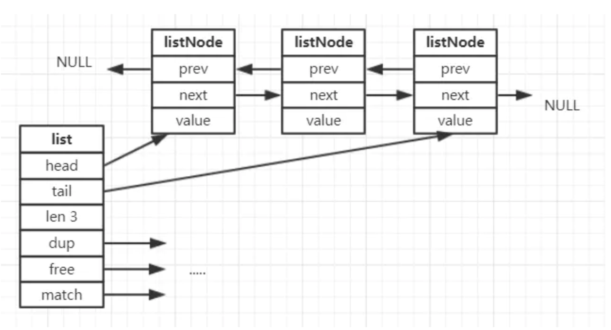
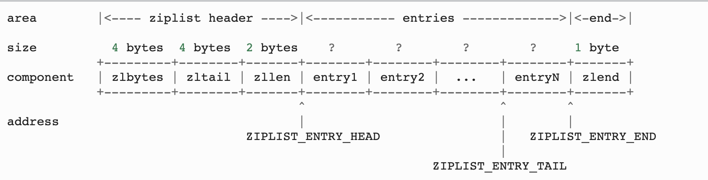
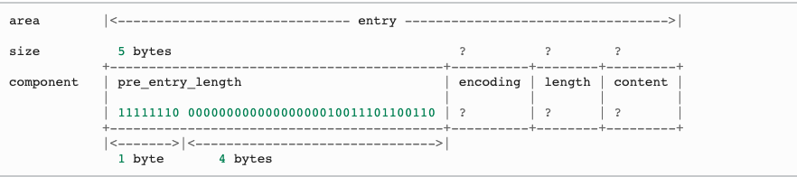
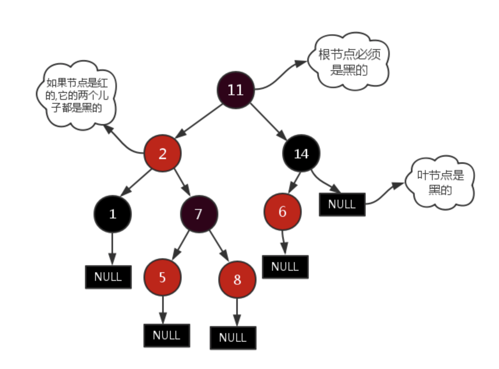
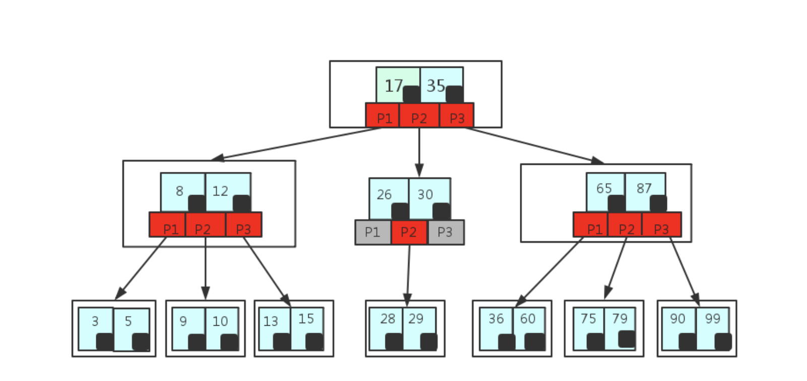
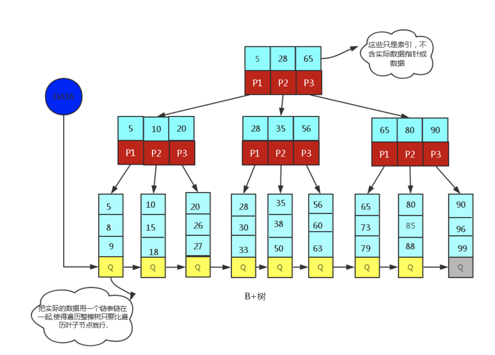

---

+ **MyISAM 和 InnoDB的区别**
  
  + MyISAM不支持事务，InnoDB支持事务，这是Mysql将默认的存储引擎从MyISAM变成InnoDB的重要原因
  
  + InnoBD支持外键，而MyISAM不支持
  
  + InnoDB是聚集索引，而MyISAM是非聚集索引
  
    + 聚集索引：
      + 聚集索引的文件存放在主键索引的叶子结点上，所以InnoDB必须要有主键，主键的索引效率很高
      + 如果用**辅助索引**，**则需要两次查询**，**先查询到主键**，然后再**通过主键查询到数据**，因此主键不能够太大。因为如果主键太大，那么其他的索引也都会很大。
      + **数据和索引是紧密捆绑**的，没有使用压缩从而会造成**InnoDB比MyISAM体积庞大了不少**
    + 非聚集索引：
      + **数据文件是分离**的，**索引保存的是数据文件的指针**，主键索引和辅助索引是独立的，并且**索引是有压缩**的，内存的使用率就相对的提高了不少，**能够加载更多的索引**
      + 每个MyISAM在磁盘上存储三个文件：
        + 名字以表的名字开始，扩展名指出文件类型，.frm文件存储表的定义
        + .MYD(MYData) 数据文件
        + .MYI(MYIndex) 索引文件
  
  + InnoDB不保存表的具体行数，执行 `select count(*) from table `时，是需要全表扫描的，而MyISAM用一个变量保存了整个表的行数，执行上述的语句时，主需要独处该变量即可
  
  + 是否支持**MVCC（Multiversion concurrency control）**
  
    + MVCC意图解决读写锁造成的多个，长时间的读操作饿死写操作问题。每个事务**所读到的数据项都是一个历史快照并依赖于实现的隔离级别**。
    + 写操作不覆盖已有的数据项，而是创建一个新的版本，直至所在操作提交时才变为可见。快照隔离使得事物可以看到它启动时的数据状态。
    + 算法：
      + MVCC使用**时间戳**或**自动增加的事务ID**实现事务的一致性。
      + MVCC可以确保每个事务通常**不必读等待**数据库对象，这通过对象有多个版本，每个版本有创见时间戳与废止时间戳做到的
      + 事务Ti 读取对象P时，只有比事务Ti的时间戳早，但是时间上最接近事务Ti的对象版本可见，且该版本应该没有被废止
      + 事务Ti写入对象P时，如果还有事务Tk要写入同一个对象，则Ti必须早于Tk 才能成功
  
  + InnoDB最小的锁粒度是行锁，MyISAM最小的锁粒度是表锁。一个更新语句会锁住整张的表，导致其他查询和更新都会被阻塞。因此并发访问受限，这也是mysql将默认引擎从MyISAM变成InnoDB的重要原因之一。但是只有在where对他 的主键的时候才是有效的，非主键的时候也会锁全表。
  
  + DELETE FROM TABLE 时，InnoDB不会重新建立表，而是一行一行的删除
  
  + MyISAM类型的表更加的注重性能
  
  + 存储空间
  
    + MyISAM：
      + 可被压缩，支持三种存储格式：静态表，动态表，压缩表
    + InnoDB：
      + 需要更多的内存和存储，会在主存中建立起专用的缓冲池，用于高速缓冲数据和索引
  
    
  
+ 对于MyISAM和InnoDB的抉择

  + 事务则选择InnoDB，非事务则可以考虑MyISAM
  + 如果表中大多数都是只读查询，可以考虑MyISAM，如果既有读写并且比较的频繁，请使用InnoDB
  + 系统崩溃后，MyISAM恢复起来更加的困难

<!--more-->

---

+ **事务特性ACID**
  + 事务：一系列数据库操作组成的一个完整的逻辑过程。例如银行转帐
  + A(Atomicity)原子性
    + 一个事务中的操作，要么全部完成，要么全部不完成
  + C(Consistency)一致性
    + 在事务开始以及事务结束以后，**数据库的完整性**没有被破坏。这表示写入的资料必须**完全符合**所有的**预设约束**，**触发器**，**级联回滚**等
  + I(Isolation)隔离性
    + 数据库允许**多个并发事务同时**对其数据进行**读写和修改**的能力。隔离性可以防止多个事务并发执行时由于交叉执行而导致数据的不一致。
  + D(Durability)持久性

---

+ **并发事务产生的问题**

  + 丢失更新
    + 第一类丢失更新
      + 定义：A**事务撤销**后，把已经提交的B事物的**更新数据覆盖**了
    + 第二类丢失更新
      + 定义：A**事务提交**后，把已经提交的B事物的**更新数据覆盖**了
  + 脏读
    + 定于：读到未提交更新的数据
    + 可能**更新之后**，被其他的事务**读了以后**，然后其他事务**撤回**了
  + 不可重复读
    + 定义：**读到已经提交更新**的数据，但一个事务范围内**两个相同的查询**却**返回了不同的数据**
    + 顾名思义，同一个事物的两次读到的结果不同
  + 幻读
    + 定义：**读到已提交插入**数据，幻读与不可重复读类似，**幻读**是查询到了另一个事务**已提交**的**新插入**数据，而**不可重复读**是**查询**到了另一个事务已提交的**更新**数据
    + 顾名思义，同一个事物的两次读到的结果不同
  + 幻读针对的是一个范围，可能两次读出来的数据多了或者少了。而不可重复读针对的是一条记录，两次的读看到的是不一样的值。

+ **事务的隔离级别**

  + 未提交读(READ UNCOMMITTED)

    + 一个事务在执行过程中，可以看到其他事务没有提交的新插入的记录，而且还能看到其他事务没有提交的对已有记录的更新

  + 提交读 (READ COMMITTED)

    + 一个事务在执行过程中，可以看到其他事物已经提交的新插入的记录，而且能看到其他事物已经提交的对已有记录的更新

  + 可重复读 (REPEATABLE READ)

    + 事务执行过程中，只能看到其他事务已经提交的新插入的记录，而不能看到其他事物对已有记录的更新

  + 串行化 (SERIALIZABLE)

    + 一个事务在执行过程中完全看不到其他事务对数据库所做的更新，如果两个事务同时操作数据库中的相同字段时，若第一个事务已经访问了该数据，则第二个事务只能停下来等待。

      | 隔离级别 | 第一类丢失更新 | 第二类丢失更新 | 脏读 | 不可重复读 | 幻读 |
      | :------: | :------------: | :------------: | :--: | :--------: | ---- |
      |  串行化  |      避免      |      避免      | 避免 |    避免    | 避免 |
      | 可重复读 |      避免      |      避免      | 避免 |    避免    | 允许 |
      | 读已提交 |      避免      |      允许      | 避免 |    允许    | 允许 |
      | 读为提交 |      避免      |      允许      | 允许 |    允许    | 允许 |

  

---

+ **索引**
  + 定义：存储数据表中特定列的数据结构，并且在类似的B树 B+树当中，都是排好序的，更加的方便查找。
  + 基本原理
    + 减少搜索的次数，如果没有索引，在db上搜索的时候，即使搜索到了目标行，还需要将剩下的所有记录给遍历完。
  + 引入索引的原因
    + 数据一般是存储在大容量的磁盘当中。在数据量特别庞大的时候，需要对数据进行查询是一个十分耗时的动作。如果是对所有的数据进行遍历将会造成相当大的耗时，而索引则会帮忙定位区域，减少操作的数量集。
  + 数据结构：MySql中采用了B+树
  + 索引存储了指向某一行的指针，可以类似的联想为[索引key，key所对应的记录的指针]
  + 类型
    + 两大类：聚簇索引和非聚簇索引
      + 聚簇索引：
        + **按照存放的物理位置为顺序**
        + 提高多行检索的速度
      + 非聚簇索引
        + 与按照存放的物理位置不同
        + 对单行的检索速度很快
    + 普通索引
      + 没有任何限制，是我们大多数情况下使用到的索引
    + 唯一索引
      + 必须唯一，但可以为空
    + 全文索引
      + 作用于CHAR，VARCHAR，TEXT数据类型的列
    + 组合索引
      + **将几个列作为一条索引进行检索，使用最左匹配原则**
  + 建立索引的原则：
    + 最左前缀匹配原则
      + MySql会一直向右匹配直到遇到范围检查
    + = 和 in 可以乱序
    + 计量选择区分度高的列作为索引（区分度 = 不重复的比率）
    + 索引列不参与计算
      + 尽量保持列的干净
      + FROM_UNIXTIME(create_time) = '2020-08-08'，就不能使用索引，B+树中存储的都是数据表中的字段值，但是进行检索时，需要把所有的元素都应用函数才能比较。所以create_time = UNIX_TIMESTAMP('2020-08-08')
    + 尽可能拓展索引，而不是新增索引
    + 单个多列组合索引和多个单列索引的检查查询效果是不同的。
  + 优化方法：
    + 索引字段不能有null，组合索引只要有一列由NULL值，则整个组合索引失效
    + 使用短索引
    + 经常出现在关键字order by， group by， distinct后面的字段，建立索引。
    + LIKE语句操作：
      + 一般情况不建议使用like模糊查询
    + 不在索引列上进行运算
  + 使用索引的代价
    + 索引是一个数据结构，需哟额外的空间进行维护
    + 性能损失，在进行值的更新，添加，删除时，在索引中也有相同的操作。

---

+ **聚簇索引和非聚簇索引**
  + 区别：
    + 聚簇索引
      + 一个表只能有**一个聚簇索引**
      + **叶子结点**存放**整行记录**
      + **表数据和主键一起存储**
      + **叶节点**存储**整行数据**
      + 二级索引叶节点**存储行的值（主键）**，减小了移动数据或者数据页面分裂时维护二级索引的开销。非聚簇索引存放的是地址，如果地址变了就得重新维护。
      + 使用B+树作为索引的存储结构
      + 非叶子结点都是**索引关键字**
      + 但是非叶子结点中的关键字**中不存储对应记录的具体内容**或内容地址
      + **叶子结点**上的数据是**主键与具体内容**
      + **主键相邻**的两个记录，**物理位置也是相邻**的，所以使用递增的id（int）型可以很方便插入
    + 非聚簇索引
      + **叶子结点**不是存放整行记录，而是存放指向**存放实际数据物理地址的指针**
      + **数据与索引分开存储**
      + 使用B+树作为索引的存储结构
      + **所有的结点都是索引**
      + 叶子节点存储的是索引+索引所对应的物理结构
  + InnoDB主键使用的是聚簇索引，而MyISAM不管是主键还是二级索引使用的都是非聚簇索引
  + 优缺点
    + 通过**聚簇索引查找目标数据理论上比非聚簇索引要快**，因为非聚簇索引定位到对应的主键需要多一次目标记录寻址，需要多一次IO
    + 使用覆盖索引扫描的查询时，可以直接使用也结点中的主键值
    + 按照主键的顺序插入时最快的方式，否则会出现页分裂，严重影响性能。所以对于InnoDB表，一般定义一个字增的ID列为主键
    + **二级索引**访问需要**两次索引查找**，第一次找到主键值，第二次根据主键值找到行数据。
    + 更新主键的代价很高
    + **插入记录**时，需要**判断主键是否重复**，这个时候需要遍历整个索引，但是因为叶子节点包括了整个的记录，所以在判断主键是否重复的时候，需要大量的I/O开销

---

+ **为什么不对每一列创建索引**
  + 增删查改维护需要大量的开销
  + 存放需要消耗空间

---

+ **Sql语句优化，Sql题目**
  + where子句不使用!=, or 或<>操作符，还有字段对null进行判断，引擎会放弃索引而使用全表扫描
  + 避免使用select *
  + 在where 与order by 涉及的列上需要建立索引
  + 避免操作索引
  + in 与 not in 也要慎用，否则会导致全表扫描

---

+ **expain中rows type key extra 字段的含义**
  + type
    + 重要的列，显示链接使用了何种类型
  + key
    + 实际使用的索引，如果为null 则没有使用索引
  + rows
    + mysql认为必须检查以后用来返回请求数据的行数
  + extra
    + 如何解析查询的额外信息

---

+ **count（1)count(*)count(列)的区别**
  + count（1）
  + count（*）
    + **count(*)**与**count（1）**基本没有差别，因为mysql在使用**count(*)**会进行优化
  + count（列）
    + 不统计列中为null的数
    + 若列为主键，则count（列）比count（1）快

---

- **Mysql的left join 和right join**
  - left join
    - 返回左表中所有记录，以及和右表中的连接字段相等的记录
  - right join
    - 返回右表中所有记录以及和左表中连接字段相等的记录

---

- **Redis(Remote Dictionary Server)** 

  - 定义：
    
    - 使用ANSI C便携的开源，支持网络，基于内存，可选持久性的**键值对存储数据库**
    - 基于内存运行，性能高效
    - 支持分布式
    
  - 跳表

    - 与跳表对标的就是AVL树，是**一种插入/删除/搜索都是O(logn)的数据结构**，最大的优点就是原理简单，容易实现，方便拓展，效率更高。
  - 一般k级索引树的节点数为k-1级索引树节点数的二分之一
    - 跳表是通过不断的元素的插入与删除动态形成的，不强制做上层索引节点数一定要是当前层索引节点数的二分之一。一个节点要不要建立索引，建立多少层索引，都在节点插入时抛硬币决定。
    - 是一种基于有序链表的拓展
    - 增加索引，用空间换时间

  - 数据类型

    - 字符串

      - 底层实现：**简单动态字符串(simple dynamic string SDS)**
        - 类似于go中的slice 结构体，包含了**长度，容量以及实际存储的字符串**。
        - 不同于C字符串需要遍历获取长度，SDS**可以直接读取len获取字符串长度**
        - SDS通过未使用空间解除长度和底层数据长度的关联。
        - SDS的API会**以二进制的方式处理存放在buf中的数据**，**不像c语言的字符串一样以'\0'结束**，限制了字符串的表达形式。

      - ```redis
        SET runoob "菜鸟教程"
        GET runoob
        "菜鸟教程"
        ```

        

      - 二进制安全

      - 可以包含任何数据，比如jpg图片或者是序列化的对象，一个键最多能存储512MB

    - **列表(quicklist 作为列表的底层数据结构)**

      - 底层实现：链表

        - 
        - 每个节点有一个指向前一个节点的指针以及一个指向后一个节点的指针
        - 链表有指向头部的指针也有指向尾部的指针
        - `dup`：用于复制链表节点所保存的值
        - `free`：用于释放链表节点所保存的值
        - `match`用于对比链表节点锁保存的值和另一个值是否相同
        
      - ```
        lpush runoob redis
        (integer) 1
        lpush runoob mongodb
        (integer) 2
        lpush runoob rabitmq
        (integer) 3
        lrange runoob 0 10
        1) "rabitmq"
        2) "mongodb"
        3) "redis"
        redis 127.0.0.1:6379>
        ```

        

      - 增删快，提供操作某一元素的API

      - 一般用于最新消息的排行等功能，消息队列

    - 哈希

        - ```
          HMSET runoob field1 "Hello" field2 "World"
          "OK"
            HGET runoob field1
          "Hello"
            HGET runoob field2
          "World"
          ```

          

        - 键值对集合，Map

        - 适合存储对象，并且可以想数据库中update一个属性一样，可以修改某一项属性(Memcached中需要取出整个字符串反序列化成对象后在序列化存回去)

        - 适用于存储，读取修改用户属性

    - 集合

      - ```
        sadd runoob redis
        (integer) 1
        sadd runoob mongodb
        (integer) 1
        sadd runoob rabitmq
        (integer) 1
      sadd runoob rabitmq
        (integer) 0
      smembers runoob
        
        ```

      1) "redis"
        2) "rabitmq"
    3) "mongodb"
      
    - 哈希表实现，元素不重复
      
    - 添加，删除，查找的时间复杂度都是O(1)
      
      - 为集合提供了交集，并集，差集等操作
      
      - 使用场景：共同好友，利用唯一性统计访问网站的所有独立ip
        
      
    - 有序集合
    
      - **底层实现(ziplist || skiplist)**
      
      - ziplist(压缩链表)
      
        - 
        - `zlbytes` 整个ziplist**占用的字节数**
        - `zltail`ziplist**表尾节点的偏移量**
        - `zllen`ziplist中**节点的数量**
      - 包含多个节点(entry)，**每个节点保存一个长度受限的字符数组**(不以\0结束)，或者**整数**。
        - 每个**集合的元素**是用两个紧挨在一起的**压缩列表节点**来保存，第一个节点保存**元素的成员**，第二个节点保存**元素的分值**。压缩列表内的集合元素按分值从小到大的顺序进行排列，小的放置在靠近表头的位置。
        - 当保存的元素少于128个并且保存的所有元素大小都小于64字节
          - 节点的构成
        - 
          - `encoding` && `length`决定了content的类型
        - `content`保存着节点的内容。
      
    - ```
        zadd runoob 0 redis
      (integer) 1
        zadd runoob 0 mongodb
        (integer) 1
        zadd runoob 0 rabitmq
        (integer) 1
        zadd runoob 0 rabitmq
        (integer) 0
        ZRANGEBYSCORE runoob 0 1000
        1) "mongodb"
        2) "rabitmq"
        3) "redis"
      ```
      
        
      
      - 将Set中的元素增加一个权重参数score，元素按score排序
      
      - 适用于排行榜
    
  - 如何保证高可用（基于哨兵的高可用性）
  
    - **哨兵集群**
      - **集群监控**
        - 负责**监控**redis master 和 slave进程**是否正常工作**
      - **消息通知**
      - 如果某个redis实例故障，那么哨兵负责发送消息作为报警**通知给管理员**
      - **故障转移**
      - 如果**master node挂掉**了，会**自动转移到slave node**上
      - 配置中心
      - 如果故障转移，会将client客户端新的master地址
      - 哨兵本身也是分布式，需要一个哨兵集群互相协同工作
      - 故障转移时，需要大部分的哨兵都同意才行，涉及到了分布式枚举的问题
        - 有哨兵结点挂掉，哨兵集群还是能正常工作
    - 单机而言，很难达到较高的qbs
    - redis实现高并发主要是依靠**主从架构**，一主多从，**单主用来写入数据**，单机几万QPS，**多从用来查询数据**，多个实例可以提供每秒10w的QPS
  - 如果需要实现高并发的同时，容纳大量的数据，那么就需要redis集群
  
- 如果做主从架构部署，那么加上哨兵监控，如果一个实例当即，可以进行主备切换
  
  - 做缓存如何设计
  
    - Redis缓存原理
      - 把**表中经常被访问的记录放到Redis**中，然后用户查询时**先查询Redis**再去查询MySql，确实实现了读写分离，也就是**Redis只做读操作**，由于缓存在内存当中，所以查询会很快
      - 对于一个sql格式的数据请求，首先计算该语句的MD5并据此得到结果集标识符，通过该标识符在Redis中查找该结果集。如果结果集标识符不再Redis中，在使用MySql进行查询
  
  - **持久化比较**，**aof重写过程**
  - 背景：由于redis的数据是**存放在内存**当中的，当redis重启的时候，数据会丢失，于是需要开启redis的持久化功能。
    - 方式：**RDB持久化，AOF持久化**
      - **RDB**
        - 将Redis在内存中的**数据库记录**定时dump到磁盘上做RDB持久化
        - 优点
          - **只会保存一份文件**
          - 对于灾难恢复，可以轻松的将一个单独的文件压缩在转移到其他的介质上
          - 性能最大化，对于Redis服务进程，只需要fork出一个子进程来进行相关的dump操作即可
          - 相比于AOF，如果数据集很大，则RDB启动效率更高
        - 缺点
          - **不能很好的保证避免数据的丢失**，因为系统可能会出现宕机，**会有数据没有来的及写入磁盘**，这部分数据会丢失
          - 由于是通过**fork出子进程**进行相关的dump操作，所以当数据集较大时，可能会导致服务停止
      - AOF
        - 将**Reids的操作日志**追加的
        - 优点
          - 可以保证更高的数据安全性，即数据持久型。Redis提供了三种同步策略，每秒同步（异步完成），每修改同步，不同步。每修改同步是真正意义上的同步。
          - 写入操作采用的是append模式，所以在写入的时候如果出现了宕机，也不会影响原有的内容。
        - 如果**日志过大**，则Redis**自动采用rewrite**机制，Redis以append模式不断的将**修改数据**写入到老的磁盘文件中。同时Redis还会**创建一个新的文件**用于记录此期间有哪些**修改命令被执行**。所以在rewrite切换时可以更好的保证数据安全性
          - AOF包含一个格式清晰，易于理解的日志文件用于记录所有的修改操作
      - 缺点
          - 对于相同数据量的数据集，AOF文件通常大于RDB文件，恢复速度也不如RDB
        - 同步策略的不同，AOF也会慢于RDB
      - AOF 的 Rewrite
      - 当AOF的**文件大小超过了锁定的阈值**时，Redis就会对AOF文件的内容进行他所
      - Redis会fork出一条新进程，**读取内存中的内容**，并重新写到一个临时文件中。并不会读取旧的AOF文件，以后替换旧的AOF文件。
  
- rehash过程
  
    - Redis中，键值对存储方式是由字典(Dict)保存的，而字典底层是通过哈希表来实现的
    
    - 在redis的具体实现中，使用了一种叫做**渐进式哈希**的机制来提高字典的缩放效率，避免rehash对服务器性能所造成的影响。渐进式哈希采用了**分而治之**的方式，将**reahsh键值对**所需的计算时间**均摊**到字典的**每个添加，删除，查找和更新操作**上，从而避免了集中时哈希带来的庞大计算量。
    
    - 在Redis当中存在太多数据，并且需要扩容是，如果想Java一样的HashMap一次性扩容的话，对单线程的Redis的性能是毁灭性的打击，所以就有了渐进式哈希的方法。
    
    - Redis中字典的定义：
    
      - ```c
        /* 哈希表节点 */
        typedef struct dictEntry {
            // 键
            void *key;
            // 值
            union {
                void *val;
                uint64_t u64;
                int64_t s64;
            } v;
            // 指向下个哈希表节点，形成链表
            struct dictEntry *next;
        } dictEntry;
        
        /* This is our hash table structure. Every dictionary has two of this as we
         * implement incremental rehashing, for the old to the new table. */
        /* 哈希表
         * 每个字典都使用两个哈希表，以实现渐进式 rehash 。
         */
        typedef struct dictht {
            // 哈希表数组
            // 可以看作是：一个哈希表数组，数组的每个项是entry链表的头结点（链地址法解决哈希冲突）
            dictEntry **table;
            // 哈希表大小
            unsigned long size;
            // 哈希表大小掩码，用于计算索引值
            // 总是等于 size - 1
            unsigned long sizemask;
            // 该哈希表已有节点的数量
            unsigned long used;
        } dictht;
        /* 字典 */
        typedef struct dict {
            // 类型特定函数
            dictType *type;
            // 私有数据
            void *privdata;
            // 哈希表
          dictht ht[2];
            // rehash 索引
          // 当 rehash 不在进行时，值为 -1
            int rehashidx; /* rehashing not in progress if rehashidx == -1 */
            // 目前正在运行的安全迭代器的数量
            int iterators; /* number of iterators currently running */
        } dict;
        ```
    
      - 由结构定义我们可以看出，对于每一个字典，其**维护了一个dictht的数组**，其中包含了**两个哈希表**的，平时只使用ht[0],当ht[0]的容量需要扩容是，这时候就需要将内容迁到ht[1]当中，而如果一次性将所有的数据拷贝过来，这对于单线程模型的redis的性能是毁灭性的打击。所以需要在每次的插入，删除，更新的时候，执行`dictRehash()`方法，最小化数据迁移的代价。
    
      - ```c
        /* Performs N steps of incremental rehashing. Returns 1 if there are still
         * keys to move from the old to the new hash table, otherwise 0 is returned.
         *
         * Note that a rehashing step consists in moving a bucket (that may have more
         * than one key as we use chaining) from the old to the new hash table, however
         * since part of the hash table may be composed of empty spaces, it is not
         * guaranteed that this function will rehash even a single bucket, since it
         * will visit at max N*10 empty buckets in total, otherwise the amount of
         * work it does would be unbound and the function may block for a long time. */
        int dictRehash(dict *d, int n) {
            int empty_visits = n*10; /* Max number of empty buckets to visit. */
            if (!dictIsRehashing(d)) return 0;
        
            while(n-- && d->ht[0].used != 0) {
                dictEntry *de, *nextde;
        
                /* Note that rehashidx can't overflow as we are sure there are more
                 * elements because ht[0].used != 0 */
                assert(d->ht[0].size > (unsigned long)d->rehashidx);
                while(d->ht[0].table[d->rehashidx] == NULL) {
                    d->rehashidx++;
                    if (--empty_visits == 0) return 1;
                }
                de = d->ht[0].table[d->rehashidx];
                /* Move all the keys in this bucket from the old to the new hash HT */
                while(de) {
                    uint64_t h;
        
                    nextde = de->next;
                    /* Get the index in the new hash table */
                    h = dictHashKey(d, de->key) & d->ht[1].sizemask;
                    de->next = d->ht[1].table[h];
                    d->ht[1].table[h] = de;
                    d->ht[0].used--;
                    d->ht[1].used++;
                    de = nextde;
                }
                d->ht[0].table[d->rehashidx] = NULL;
                d->rehashidx++;
            }
        
            /* Check if we already rehashed the whole table... */
            if (d->ht[0].used == 0) {
                zfree(d->ht[0].table);
                d->ht[0] = d->ht[1];
                _dictReset(&d->ht[1]);
              d->rehashidx = -1;
                return 0;
            }
        
            /* More to rehash... */
            return 1;
        }
        ```
    
        

---

- **mysql容灾备份**
  - 主从DB
    - 以日志形式将主DB的操作分发给从DB
  - 操作系统实时数据复制

---

- **B树 B+树 红黑树，avl树的区别**

  - **AVL 树**

    - 简介：
      - 带有**平衡条件的二叉搜索树**，一般是平衡因子差值判断是否平衡并通过旋转来实现平衡，左右子树的树高差不超过1，是一个**严格的平衡二叉树**。
    - 平衡条件：
      - 每个节点的所有子树高度差不能超过1。
    - 局限性：
      - 对AVL树进行操作的时候，**只要不满足平衡的条件，那么就要通过旋转来进行平衡，**而旋转极其的耗时。
      - AVL树适合对插入和删除不频繁，但是对查找要求较高的场景。这时候比红黑树更加的优秀

  - **红黑树**

    - 简介：

      - 一种**二叉搜索树**，但在每个节点增加一个存储位来表示节点的颜色：red /black。通过对任何一条从根到叶子的路径上各个节点的着色限制，红黑树**确保没有一条路径会比其他路径长出两倍**，他是一种弱平衡的二叉树。相比于AVL，更加适合搜索，插入，删除操作多的场景。

    - 性质

      - **每个节点非红即黑**
      - **根结点是黑**的

      - 如果**一个节点是红**的，那么他的**两个儿子都是黑**的
      - 对于任意节点而言，其到叶子结点NIL指针的每条路径都**包含相同数目的黑节点**
      - **每一条路径都包含相同数目的黑节点**

      - 

    - 应用

      - C++中的map和set都是用红黑树实现的
      - Linux的**进程调度**，使用**红黑树管理进程控制块**，进程的虚拟内存区域都存储在一颗红黑树上，每个虚拟地址区域都对应红黑树的一个节点，左指针指向了相邻的地址虚拟存储区域，右指针指向相邻的高地址虚拟地址空间。
      - IO多路复用**epoll实现红黑树组织管理sockfd**，以支持快速的增删改查
      - ngnix，用红黑树管理timer，因为红黑树是有序的，可以很快找到距离当前最小的定时器
      - java中的TreeMap

  - B树与B+树

    - 简介
      - B/B+树是为**了磁盘或者其他的存储设备和设计**的一种**平衡多路查找树**(相比于二叉，B树的每个内节点会有多个分支)， 再有相同节点的情况下，B/B+树的**高度远远小于红黑树的高度。**B/B+树操作的时间通常由存取磁盘的时间和CPU计算时间这两部分构成，由于CPU 速率一般不会是瓶颈，B树的操作效率往往取决于访问磁盘的次数，关键字总数相同的情况下B树的高度越小，磁盘I/O所花的时间越少
    - B树的性质
      - 定义任意非叶子结点，**最多只有M个儿子**，且M>2
      - 根结点的儿子数为[2,M]
      - 除了根结点以外的非叶子结点的儿子数为[M/2, M]
      - 每个结点存放至少(M/2) - 1 向上取整，和至多M-1个关键字 ， 至少两个
      - 非叶子结点中的关键字个数 = 指向儿子的指针个数 - 1
      - 非叶子结点中的关键字： K[1], K[2], ... , K[M-1]; 且K[i] < K[i - 1]
      - 非叶子结点的指针：P[1], P[2], ..., P[M]， 其中P[1]指向关键字小于K[1] 的子树， P[M]指向关键字大于K[M-1]的子树，其中P[i] 指向关键字属于(K[i-1], K[i])的子树
      - 所有的叶子结点在同一层
      - 
      - 上图所示35结点，35代表一个key，而小黑块表示这个key所指向的内容在内存中实际存储的位置，是一个指针
    - B+树
      - 应文件系统产生的一种B树的变形(文件的目录一级一级索引，只有最底层的叶子结点(文件)保存数据)， 而**非叶子结点只保存索引**，**不保存实际的数据**，数据**都保存在叶子结点**当中。
      - 性质(与B树不同的性质)
        - 非叶子结点的子树指针与关键字个数相同
        - 非叶子结点的子树指针p[i]， 指向关键字值属于[k[i], k[i + 1]]的子树，B树不允许关键字重复，B+树允许重复
        - 为所有的叶子结点增加一个链指针
        - 所有关键字都是在叶子结点出现的，且链表的关键字恰好是有序的
        - 非叶子结点的相当于是叶子结点的索引(稀疏索引)，叶子结点相当于存储数据的数据层
        - 
    - B/B+树性能分析
      - n个结点的平衡二叉树高度为H(即logn)，而n个节点的B/B+树的高度为logt((n + 1) / 2) + 1
      - 若要作为内存中的查找表，B树不一定比平衡二叉树好，尤其是当m较大时更是如此。
    - B+树为什么比B树更加的适合作为操作系统中的文件索引或者是数据索引
      - B+树**内部节点没有指向关键信息的指针**，所以内部的节点相对B树**更小**(仅仅存放了索引信息)，如果把同一个内部节点的关键字存放在统一盘块中，那么盘块所能容纳的关键字数量与越多，一次读如内存需要查找的关键字也越多，磁盘IO次数也就降低了
      - 由于非叶子结点中并不是指向文件内容的节点，而只是叶子结点中关键字的索引。所以任何关键字的查找必须走一条从根节点到叶子结点的路，所以查询的路径长度是相同的，所以每个数据的查询效率也就相同
      - B树虽然提高了IO性能，但是并没有解决元素便利的低效率问题，而B+树**只需要遍历叶子结点就可以完成树的遍历**。

---

- **MongoDB**
  - 简介
    - MongoDB是一个通用的，面向文档的分布式数据库。
    - 使用BSON作为其数据结构模型结构，其结构是**面向对象**而不是二维表。
  - 优点
    - 文档数据类型
      - 面向对象类型的数据库，更加的符合客观世界
    - 及时查询能力
      - 保留了索引的能力
    - 复制能力
      - 自身提供了副本集能将数据分布在多台机器上实现冗余，目的是提供自动故障转移，扩展读能力。
    - 数据拓展
      - 使用分片技术对数据进行拓展，MongoDB能自动分片，自动转移分片里面的数据块。
  - 为什么使用B树
    - 对于mongodb而言，需要组织者组织者靠良好设计，才能发挥好mangodb的效果
    - MongoDB作为非关系型数据库，对于**遍历数据的需求不高**，追求的是**读写单个记录的性能**。所以在查询数据的时候，平均的查询速率会比B+树稍微低一点，因为B树的非叶子结点也包含了数据存放的地址。

---

- **三范式与反三范式**
  - 第一范式
    - 列属性不可再分
  - 第二范式
    - 每一个非主属性完全函数依赖于候选键
  - 第三范式
    - 不存在传递依赖
  - 反三范式
    - 允许冗余，将空间换取时间

---

- **DBProxy 好处，如何提升管理**
  - 支持多语言的MySQL客户端
  - 读写分离
  - 负载均衡
  - Slave故障感知与摘除
  - 后端链接池
  - 自定义SQL拦截与过滤
  - 流量分组与控制
  - 丰富的监控状态
  - 支持分表
  - Client IP限制

---

- **组合索引**
  - 又称为复合索引组合索引为(a,b,c)时，可以支持使用a|a,b|a,b,c这三种组合进行查找，但是不支持b，c这种查找。
  - 在执行查询的时候，一次只能使用一个索引，如果是三个单列索引，Mysql会试图选择一个限制最严格个索引。

---

- **更新数据的时候，先更新硬盘还是先更新内存**

---

- **Mysql中int长度仅表示显示的长度，但是内部的大小都是四个字节**

---

- **MySql与redis**
  - 一般的应用场景为mysql作为主存储，而redis作为缓冲增加访问速度，高性能需要用redis，而低性能使用MySql，数据在这两者之间进行同步。
  - 缓存出现的原因
    - 在网络处理和访问非常大的时候，数据库的压力就会变大，数据库的连接池，数据库同时处理数据的能力就会收到很大的挑战。而高并发处理，分布式，负载均衡的数据库又比较的耗费人力以及财力。
  - 实际流程
    - 在实际的流程当中，**Redis与mysql进行了读写分离**。在执行查询语句的时候，首先会**计算该语句的MD5并且根据这个来获取结果集的标识符**，然后利用**标识符去redis中查找该结果集**。若redis中没有相应的存储内容，则会去查找mysql。并且**将结果集中的元素在写入到redis中**去。
  - 其他的缓存策略
    - Memcache与redis
      - 性能上
        - redis只是用单核，memcache使用的是多核，所以平均每个核上redis在存储小数据时比memcache性能更高。而在100k以上的数据，memcache性能要高于redis，虽然redis也在存储大数据上面进行了优化，但是比起memcache还是稍有逊色。
      - 内存空间和数据量大小
        - memcache**可以修改最大内存，采用LRU算法。而Redis增加了VM的特性，突破了物理内存的限制。**
      - 操作便利
        - memcache数据结构单一，仅仅用来缓存数据。而redis支持更加丰富的数据类型，也可以在服务端直接对数据进行丰富的操作，这样可以减少网络IO次数和数据提及。
      - 可靠性
        - memcache不支持数据持久化，断电或者重启数据将会流失，但是稳定性有保障。而redis支持数据持久化和数据恢复，允许单点故障，但是同时会付出性能的代价。
      - 应用场景
        - memcache动态系统中减少数据库负载，提升性能。做缓存，适合多读少写的情况。
        - redis：适用于对读写效率都很高的情境中，数据处理业务复杂和对安全性要求较高的系统。
  - 如何同步
    - mysql同步到redis:解析mysql的binlog，然后做同步处理。
    - redis数据到mysql


---

- **redis的大key问题**
  - 每个简单的key存储的value很大
  - hash，set，zset，list结构中存储过多的元素
  - 大key大危害
    - OPS低也会导致内存占用多，流量大，比如一次取走100K的数据，OPS为1000时，就会产生100M/s的流量
    - list，hash等数据结构，大量的elements需要多次遍历，多次系统调用拷贝数据需要消耗大量的时间。
  - 如何解决大key
    - 对于需要**整取value的key**，可以尝试将对象分拆成多个key-value，**使用multiGet获取值**，这样分析的意义在于**拆分单次操作的压力**，将操作的压力分摊到多个实例中，降低对单个实例的IO影响。
    - 对于每次需要取部分value的key，同样**可以拆成几个key-value**，也可以将这些存储在一个hash中，每个field代表具体属性，使用hget，hmget来获取部分value，使用hset，hmset来更新部分属性。

---

- **redis的分布式锁**

---

- **redis缓存雪崩，击穿**
  - 击穿
    - **没有在缓存中找到对应的数据**，请求直接穿透到DB
    - 解决方案
      - 布隆过滤器
        - 足够大的bigmap，**用于存储可能访问的key，不存在的key直接被过滤。**
        - 访问key未在DB查询到值，也将空值写入缓存，但可以设置较短过期时间。
  - 雪崩
    - **大量的key同时过期**。导致在**缓存在同一时刻全部失效**，造成瞬时DB请求量大。
    - 解决方案
      - 设置过期时间加上一个随机值时间，使得每个key过期时间分布开来，不会集中失效
      - 限流算法
      - 分布式锁，加锁访问。