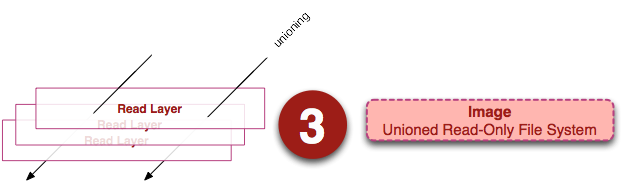

[TOC]

# GO服务端

## 通用后台分层


### 框架

- **gRPC**

  - 

  - Google发起的一个开源远程过程调用系统。系统基于HTTP/2协议传输，使用Protocol Buffers作为借口描述语言。gRPC利用一种简单的方法来精确定位服务和为IOS，Android和后台支持服务自动生成可靠性很强的客户端功能库。

  - 特性

    - 使用ProtoBuf来定义服务，ProtoBuf是由Google开发的一种数据序列户协议，性能出众。
    - 支持多种语言
    - 基于HTTP/2标准协议

  - 定义服务接口

    - `service`关键字定义接口，内部可以有多个方法。

    - ```protobuf
      service HelloService {
        rpc SayHello (HelloRequest) returns (HelloResponse);
      }
      
      message HelloRequest {
        string greeting = 1;
      }
      
      message HelloResponse {
        string reply = 1;
      }
      ```

  - 定义四种类型的rpc方法

    - 简单的rpc方法

      - ```protobuf
        rpc SayHello(HelloRequest) returns (HelloResponse){
        }
        ```

      - 过程像是一个本地的方法调用

    - 服务端流式相应的rpc方法

      - ```protobuf
        rpc LotsOfReplies(HelloRequest) returns (stream HelloResponse){
        }
        ```

      - 客户端发送一个请求，从服务端获得一个流。服务端可以往流中写入N个消息作为相应，并且每个消息可以单独发送，客户端可以从流中按顺序读取这些消息。

    - 客户端流式请求的rpc方法

      - ```protobuf
        rpc LotsOfGreetings(stream HelloRequest) returns (HelloResponse) {
        }
        ```

      - 通过流发送一连串的多个请求，并从服务端获取一个相应。

    - 双向流式rpc方法

      - ```protobuf
        rpc BidiHello(stream HelloRequest) returns (stream HelloResponse){
        }
        ```

      - 客户端通过流发送N个请求,服务端通过流发送N个响应,彼此相互独立,并且读写没有特定的次序要求,比如服务端可以收到所有请求后再返回响应,也可以每读取一个或K个请求会返回响应。

    

- **Go-Micro**

  - 

  - 服务间数据传输格式为protobuf。

  - 服务注册和发现是多种多样的。

  - 主要的功能都有相应的接口，只要实现相应的接口，就可以根据自己的需要定制插件。

  - 通信流程

    - 
    - Server监听客户端的调用，和Brocker推送过来的信息进行处理。并且Server端需要向Register注册自己的存在或消亡，这样Client才能知道自己的状态。Register服务的注册的发现。
    - Client端从Register中得到Server的信息，然后每次调用根据算法选择一个的Server进行通信，通信要经过编码/解码，选择传输协议等一系列的过程。如果有需要通知所有的Server端可以使用Brocker进行信息的推送。
    - Brocker 信息队列进行信息的接受和发布。

  - go-micro的八个关键接口

    - 

    - Transort 用于同步消息

      - 该接口是服务与服务之间同步请求/相应的通信接口。传输支持双向流。

      - ```go
        type Socket interface {
            Recv(*Message) error
            Send(*Message) error
            Close() error
        }
        
        type Client interface {
            Socket
        }
        
        type Listener interface {
            Addr() string
            Close() error
            Accept(func(Socket)) error
        }
        
        type Transport interface {
            Dial(addr string, opts ...DialOption) (Client, error) //客户端进行链接服务的方法
            Listen(addr string, opts ...ListenOption) (Listener, error)  //监听
            String() string
        }
        ```

        

    - Codec 用于消息编码

      - Codec编码包用于在消息传输到两端时进行编码与解码，可以是json、protobuf、bson、msgpack等等。与其它编码方式不同，我们支持RPC格式。所以我们有JSON-RPC、PROTO-RPC、BSON-RPC等格式。编码包把客户端与服务端的编码隔离开来，并提供强大的方法来集成其它系统，比如gRPC、Vanadium等等。

      - ```go
        type Codec interface {
            ReadHeader(*Message, MessageType) error
            ReadBody(interface{}) error
            Write(*Message, interface{}) error //编码
            Close() error
            String() string
        }
        
        type Message struct {
            Id     uint64
            Type   MessageType
            Target string
            Method string
            Error  string
            Header map[string]string
        }
        ```

        

    - Registry 用于服务发现

      - 提供了服务发现机制来解析服务名到地址上。它可以使用Consul、etcd、zookeeper、dns、gossip等等提供支持。服务使用启动注册关机卸载的方式注册。服务可以选择性提供过期TTL和定时重注册来保证服务在线，以及在服务不在线时把它清理掉。

      - ```go
        type Registry interface {
            Register(*Service, ...RegisterOption) error
            Deregister(*Service) error
            GetService(string) ([]*Service, error)
            ListServices() ([]*Service, error)
            Watch(...WatchOption) (Watcher, error)
            String() string
            Options() Options
        }
        ```

        

    - Selector 负载均衡

      - 允许服务被过滤函数过滤掉不提供的服务。也可以通过选择恰当的算法来选中提供服务，算法可以是随机，轮训或者最少链接等。选择器通过客户端创建语法时发生作用。客户端会选择选择器而不是注册表，因为它提供内置的负载均衡机制。

    - Broker 用于异步消息

      - 提供了异步通信的消息发布/订阅接口。对于微服务系统及事件驱动型的架构来说，发布/订阅是基础。一开始，默认我们使用收件箱方式的点到点HTTP系统来最小化依赖的数量。但是，在go-plugins是提供有消息代理实现的，比如RabbitMQ、NATS、NSQ、Google Cloud Pub Sub等等。
      - 默认实现方式是http方式。有很多成熟的消息队列实现方式:kafka, nsq, rabbitmq, redis等等

    - Client 用于发送请求

      - 提供接口创建向服务器的请求。构建在其他的包上，提供独立的接口，通过`注册中心`来基于名称`发现服务`，基于选择器来负载均衡，使用`tansport`，`broker`处理同步，异步消息。

    - Server 用于处理请求

      - 便携服务的构建包，可以命名服务，注册请求处理器，增加中间件等。服务构建在以上说的包之上，提供独立的接口来服务请求。现在的服务构建好似RPC系统。

    - Service

      - client和server的封装，包含了一系列方法使用初始值去初始化Server和client

- **ProtoBuf**

  - 是一种结构数据**序列化**方法，具有特点如下
    - 语言无关，平台无关。
    - 高效，比XML更小，更快，更为简单。
    - 拓展性，兼容性好
  - 服务定义
    - 客户端调用服务端提供的远程接口前，双方必须进行一些约定，比如接口的方法签名，请求和相应的数据结构等。
    - 服务定义需要特定的接口定义语言(IDL)来完成，gRPC中默认使用protocolBuf
  - 语法-----定义信息
    - `message`定义一个信息，类似于定义一个类
    - `repeat`相当于数组，可以有零个或者多个值。‘
  - 与JSON，XML的区别
    - XML，JSON，ProtoBuf都具有**数据结构化**和**数据序列化**的能力
    - XML，JSON更注重**数据结构化**，关注可读性和语义表达能力。ProtoBuf更注重数据**序列化**，关注效率，空间，速度，可读性差，语义表达能力不足。

- **Gin**

  - gin是基于net/http库开发的web框架。

  - 定义一个engine，实现`ServerHTTP`方法，这是，就可以将engin作为Handler传给http包的ListenAndServer函数。

    - ```go
      // ServeHTTP conforms to the http.Handler interface.
      func (engine *Engine) ServeHTTP(w http.ResponseWriter, req *http.Request) {
         c := engine.pool.Get().(*Context)
         c.writermem.reset(w)
         c.Request = req
         c.reset()
      
         engine.handleHTTPRequest(c)
      
         engine.pool.Put(c)
      }
      ```

    - 一个请求对应了一个context，为了防止频繁的GC。gin框架提供了一个Pool池缓存Context对象。

  - `gin.Default`返回Engine对象，而`gin.Context`则几乎包含了http请求中的几乎所有的信息.

    - ```go
      // Context is the most important part of gin. It allows us to pass variables between middleware,
      // manage the flow, validate the JSON of a request and render a JSON response for example.
      type Context struct {
      	writermem responseWriter
      	Request   *http.Request
      	Writer    ResponseWriter
      
      	Params   Params
      	handlers HandlersChain
      	index    int8
      	fullPath string
      
      	engine *Engine
      	params *Params
      
      	// This mutex protect Keys map
      	mu sync.RWMutex
      
      	// Keys is a key/value pair exclusively for the context of each request.
      	Keys map[string]interface{}
      
      	// Errors is a list of errors attached to all the handlers/middlewares who used this context.
      	Errors errorMsgs
      
      	// Accepted defines a list of manually accepted formats for content negotiation.
      	Accepted []string
      
      	// queryCache use url.ParseQuery cached the param query result from c.Request.URL.Query()
      	queryCache url.Values
      
      	// formCache use url.ParseQuery cached PostForm contains the parsed form data from POST, PATCH,
      	// or PUT body parameters.
      	formCache url.Values
      
      	// SameSite allows a server to define a cookie attribute making it impossible for
      	// the browser to send this cookie along with cross-site requests.
      	sameSite http.SameSite
      }
      ```

  - 路由分组

    - ```go
      router := gin.Default()
      
          // Simple group: v1
          v1 := router.Group("/v1")
          {
              v1.POST("/login", loginEndpoint)
              v1.POST("/submit", submitEndpoint)
              v1.POST("/read", readEndpoint)
          }
      
          // Simple group: v2
          v2 := router.Group("/v2")
          {
              v2.POST("/login", loginEndpoint)
              v2.POST("/submit", submitEndpoint)
              v2.POST("/read", readEndpoint)
          }
      
          router.Run(":8080")
      ```

  - POST

    - ```go
      router := gin.Default()
      
      v1 := router.POST("/form_post", func(c *gin.Context){
      			message := c.PostForm("message")
      })
      ```

  - GET

    - ```go
      router := gin.Default()
      v1 := router.GET("/from_get", func(c *gin.Context){
      			message := c.Param("message")
      })
      ```

- **Gorm**

  - `db.Table("")...`
    - Table中写入db的表名
  - `db.Model()...`
    - Model中加入某个表的struct定义
  - CRUD
    - `db.Create(...)`
    - `db.Delete(...)`
    - `db.Model().Update`
    - `db.Where().Find()`

### 中间件

- **Kafka**  框架相关中
- **Redis** db相关中
- **MySQL** db相关中
- **MongoDB** db相关中
- **Consul/Etcd/zookeeper/goosip/dns**
  - **Consul**
    - 由来
      - 随着分布式服务的出现，一个分布式系统中有两个服务，(在服务很少的时候)服务之间请求是通过接口来调用的，在数量少的时候比较好维护。但是当服务多了起来，不能用简单的写在本地来调用服务，这时就有了nginx来负责调度服务。而nginx不能够很好的拓展，当有服务宕机或者增加新的服务的时候，就需要重启nginx。
    - 功能
      - 服务发现
        - Consul的某些客户端可以提供一个服务，例如api或者mysql，其它客户端可以使用Consul去**发现这个服务的提供者**。使用**DNS或者HTTP**，应用可以很容易的找到他们所依赖的服务。
      - 健康检查
        - Consul客户端可以提供一些健康检查，这些健康检查可以关联到一个指定的服务，也可以关联到本地节点(内存使用率是否在90%以下)。这些信息可以被一个操作员用来监控集群的健康状态。被服务发现组件路由时用来远离不健康的主机
      - 键值存储
        - 应用可以用Consul提供的分层键值存储用于一些目的，包括动态配置，特征标记，协作，leader选举等等。通过简单的HTTP API即可实现
      - 多数据中心
        - Consul对多数据中心非常友好，意味着Consul用户不必担心由于创建更多抽象层而产生多个区域。Consul被设计为对DevOps群体和应用开发者友好。
    - 构成
      - 

### 容器化与平台

- **Docker**

  - 基于统一文件系统(the union file system)的知识
  - 操作系统层面的虚拟化技术。由于隔离的进程独立于宿主和其他的隔离的进程，因此称之为容器。
  - 相较于传统虚拟机虚拟一套硬件，在其上运行操作系统不同。容器内的应用程序直接运行于宿主的内核上，容器内没有自己的内核，而且也没有进行硬件虚拟。
  - 优势
    - **更高效的利用系统资源**，容器不需要进行硬件虚拟以及运行完整操作系统的额外开销，系统资源的利用率更高，一个相同配置的主机，相比传统虚拟机技术，往往可以运行更多数量的应用。
    - **更快速的启动时间**，docker容器直接运行于宿主内核，无需启动完整的操作系统，往往可以做到秒级或者毫秒级的启动时间。
    - **一致的运行环境**，docker镜像提供了除内核外的完整的运行时环境，确保了应用的运行环境一致。
    - **持续的交付和部署**，使用dockerfile使得镜像构建透明化，方便运维团队在生产环境部署镜像。
    - **更方便的迁移**，docker确保了应用运行环境的一致性，用户可以轻易将应用迁移到另一个平台上。
    - **更轻松的维护和扩展**，docker使用的分层存储以及镜像技术，使得应用的重复部分的复用更加容易。
  - 基本概念
    - **`Cgroups`与`Namespace`**
      - `Namespace`
        - Linux下创建一个新的进程所需要的新的参数
        - 容器的本质
          - 一个特殊的进程，但是在创建进程的时候，加上了一系列需要的`Namespace`参数
        - 从`Namespace`角度看容器劣势
          - **隔离的不够彻底**，多个容器之间使用的还是同一个宿主机的操作系统内核，导致了低版本Linux宿主机无法运行高版本Linux内核的容器。
          - 在Linux中，很多的资源不能够被`Namespace`化，最典型的就是时间。只要一个宿主机上的一个容器修改了时间，就会影响整个宿主机的时间。
        - 从`Namespca`角度看容器优势
          - 相较于虚拟机技术的需要运行于一个真实存在的操作系统不同，`Namspace`可以避免虚拟化带来的损耗，也不需要单独的操作系统，容器额外占用资源忽略不计。
        - **单进程模型**
          - 容器本质就是一个进程，用户的应用进程实际上就是容器里`pid=1`的进程，也是其他后续创建的所有进程的父进程。在一个容器，无法运行两个不同的应用，除非进程是一个公共的`pid=1`的程序，充当两个不同应用的父进程。
          - 推荐容器和容器内的应用同生命周期
      - `Cgroup(Linux Control Group)`
        - 主要的作用就是限制一个进程组能够使用的资源上限，包括CPU，内存，磁盘，网络等。
        - 从`Cgroup`看容器劣势
          - 使用的内存仍然是宿主机的内存
          - Linux系统/proc这个目录记录了系统运行的状态信息，也是top和free主要的信息来源。而/proc这个目录不知道Cgroup给容器做的限制。
    - **镜像(Image)**
      - 是一堆只读层(read-only layer)的统一视角
        - 
        - 多个只读层堆叠在一起，除了最下面的一层，每一层都有一个指针指向下一层。这些层是Docker的内部实现细节，并且能够在主机的文件系统上进行访问。同一文件系统技术能够将不同的层整合成一个文件系统，为这些层提供一个统一的视角，隐藏了多层的存在，在用户的视角当中只有一个文件系统。
      - OS分为内核空间和用户空间，对于linux而言，内核启动后，会**挂载root文件系统为其提供用户空间支持**。而**docker镜像**就相当于一个**root文件系统**。docker镜像是一个特殊的文件系统，除了提供容器**运行时所需的程序、库、资源、配置等文件**外，还包含了一些为**运行时准备**的**配置参数（匿名卷、环境变量、用户等）**。镜像**不包含任何动态数据**，其内容在构建之后也不会改变。
      - 分层存储
        - 因为镜像包含操作系统的完整root文件系统，其体积往往是庞大的，因此docker在设计时就使用了Union FS技术，将其设计为分层存储的架构。严格来说，镜像并非是像一个ISO那样的打包文件，镜像只是一个虚拟的概念，其实际体现并非由一个文件组成，而是由一组文件系统组成，或者说有多层文件系统联合组成。
        - 构建镜像时，会一层层构建，前一层是后一层的基础。每一层构建完就不会发生变化，后一层上的任何改变只发生在自己这一层。比如删除前一层的文件，仅仅在当前层标记为文件已删除。最终文件运行时虽然**不会看见这个文件**，但是该**文件一直跟随着镜像**。因此，在构建镜像的时候，需要额外小心，每一层尽量只包含该层需要添加的东西，额外的东西应该在该层构建结束前清理掉。
        - 分层存储的特征还使得镜像复用、定制变得更加容易。甚至可以用之前构建好的镜像作为基础层，然后进一步添加新的层，以定制自己需要的内容，构建新的镜像。
    - **容器(Container)**
      - 与镜像定义基本一致，唯一区别是容器的最上面一层是可读可写的
        - 
        - 容器 = 镜像 + 读写层。
      - 容器与镜像。就是对象与类的关系。镜像是一个静态的定义，容器是镜像运行时的实体。容器可以被创建，启动，停止，删除，暂停等。**容器的实质**就是一个**进程**。但是与直接在宿主执行的进程不同，容器进程运行于**自己独立的命名空间**内。因此容器可以**拥有自己的root文件系统**，自己的**进程空间**，甚至自己的**用户ID空间**。容器内的进程运行在一个隔离的环境中，使用起来就好像一个独立于宿主的操作系统一样。这种特性使得容器封装的应用的应用比直接运行在宿主机上更安全。
      - 每个容器运行时，是以镜像为基础层，在其上创建一个当前容器的存储层，可以称容器运行时读写而准备的存储层为容器存储层。容器存储层的生存周期和容器一样，容器消亡时，容器存储层也随之消亡，因此任何保存与容器存储层的信息都会碎容器删除而丢失。
      - 容器不应该向容器存储层写入任何数据，容器存储层要保持无状态化。所有的文件写入操作，都应该使用数据卷(Volume)，或者绑定宿主目录，在这些位置的读写会跳过容器存储层，直接对宿主(或网络存储)发生读写，其性能和稳定性更高。
    - **仓库(Repository)**
      - 集中的存储，分发镜像的服务，Docker Registry。
      - 一个Docker Repository可以包含多个仓库，每个仓库包含了多个tag，每个tag对应着一个image
      - 通常，一个仓库会包含同一软件的不同版本镜像，而标签常用于指定软件的各个版本。可以通过<仓库名：标签>的格式指定是哪一个版本的镜像，如果没有tag则默认latest
    - **公开服务**
      - 开放给用户使用，允许用户管理镜像的Registry服务。一般允许用户免费上传，下载公开的镜像，并可能提供收费服务供用户管理私有镜像。
    - **运行态容器**
      - 一个可读写的同一文件系统加上隔离的进程空间和包括其中的进程。
      - 

- **Kubernetes**

  - 

  - 

  - **基本控件**

    - 

    - **Pod**

      - 一个pod里面包含着多个容器，是k8s里面的基本构件模块，它是在K8S集群里能创建或部署的最小和最简单的单位。

      - **Pod里的容器共用相同的网络和存储资源。**每个Pod会被分配唯一的IP地址，里面的容器都会共享着这个网络空间，这个网络空间包含了IP地址和网络端口。Pod容器里面的通信用的是localhost，与外界通信就需要用到pod的ip和端口

      - Pod指定共享的存储Volume，然后Pod里的所有容器都有权限访问这个Volume。Volume是持久化数据用的，Pod的重启都会影响Volumn里的数据。

      - 一般会将有强关联的容器都放在一个pod中

      - **实现原理**

        - 
          - 通过一个叫pause的容器完成机制组合起来。K8S在初始化一个Pod的时候会先启动一个叫Pause的容器，然后再启动用户自动移的业务容器。这个Pause可以理解为一个根容器。跟容器的作用有：
            - 扮演pid 1 的角色，处理僵尸进程
            - 在Pod里为其他容器共享Linux namespace的基础
          - Pause作为PID为1的进程存在与一个pod里，其他的业务容器都挂载这个Pause进程下面。这样，一个Namespace下的进程就会以Pause作为根，呈树状结构存在一个pod下。
          - **僵尸进程**是指子进程由父进程fork创建出来后，子进程退出后，父进程没有来得及调用wait或waitpid获取其子进程的状态信息，那么这个子进程的描述符仍然保存在系统中，其进程号会一直存在被占用，这种进程称之为僵尸进程。
          - Pause容器中有一个无限循环的函数，函数里面执行`pause()`函数，`pause()`函数本身是在睡眠状态，直到被信号所中断。

      - Pod的生命状态，状态值变化

      - | 阶段      | 描述                                                         |
        | --------- | ------------------------------------------------------------ |
        | pending   | K8S集群里已经发起创建Pod请求，里面的Pod还没有容器。这个阶段一般是发生在Pod被调度之前或者Pod里的镜像正在下载。 |
        | running   | Pod已经调度落地在了一个Node里，并且里面的容器已经创建好了。里面至少一个容器正在运行或者正在启动或者重新启动。 |
        | succeeded | Pod里面的所有容器成功运行，也没发生重启等行为。              |
        | failed    | Pod里面的所有容器终止，至少有一个容器以失败方式终止。也就是说，这个容器要么已非 0 状态退出，要么被系统终止。 |
        | unknown   | 由于一些原因，Pod 的状态无法获取，通常是与 Pod 通信时有出错。 |

      - **etcd**

        - 保证了整个集群的状态，是一个数据库

      - **网络插件**

      - **Node节点关键进程**

      - **kube-proxy**

        - 负责为Service提供cluster内部的服务实现和负载均衡

      - **CNI网络组件**

      - **master**

        - 
        - master节点是**k8s集群**的**控制节点**，负责**整个集群的管理和控制**。master节点上包括以下组件
        - **etcd**
          - 在k8s系统中，主要有两个服务需要用到etcd存储
            - 网络插件：如flannel等需要存储网络配置信息
            - k8s本身，包括各种对象的状态和原信息配置
        - **kube-apiserver**
          - 提供了资源操作的唯一入口，并提供认证，授权，访问控制，API注册和发现等机制
        - **kube-controller-manger**
          - 负责维护集群的状态，比如故障检测，自动扩展，滚动更新等
        - **kube-scheduler**
          - 负责资源的调度，按照预定的调度策略将pod调度到相应的机器上
        - **Node**
          - 
          - node节点是k8s集群中的**工作节点**，node上的工作**负载由master节点分配**，工作负载主要运行在容器应用。Node节点包含以下组件：
          - **kubelet**
            - 负责 Pod 的创建、启动、监控、重启、销毁等工作，同时与 Master 节点协作，实现集群管理的基本功能。
          - **kube-proxy**
            - 实现k8s Service的通信和负载均衡
          - 运行容器化(Pod)应用
        - **Pod**
        - **ReplicaSet**
          - Pod副本的抽象，用于解决Pod的扩容和伸缩
        - **Deployment**
          - Deployment 表示部署，在内部使用ReplicaSet 来实现。可以通过 Deployment 来生成相应的 ReplicaSet 完成 Pod 副本的创建
        - **Service**
          - Service 是 Kubernetes 最重要的资源对象。Kubernetes 中的 Service 对象可以对应微服务架构中的微服务。Service 定义了服务的访问入口，服务的调用者**通过这个地址访问 Service 后端的 Pod 副本实例**。Service 通过 Label Selector 同后端的 Pod 副本建立关系，Deployment 保证后端Pod 副本的数量，也就是保证服务的伸缩性。

### 消息系统与持续集成

- **Jenkins**
- **IM**


### 接入层

### 逻辑层

### 数据访问层

### 存储层

### 服务治理手段

考虑多接触下通用的服务端后台开发涉及到的各个组件，比如通用后台的分层，接入层，逻辑层，数据访问层，存储层都怎么设计，以及他们涉及到的组件，相关的服务治理手段

