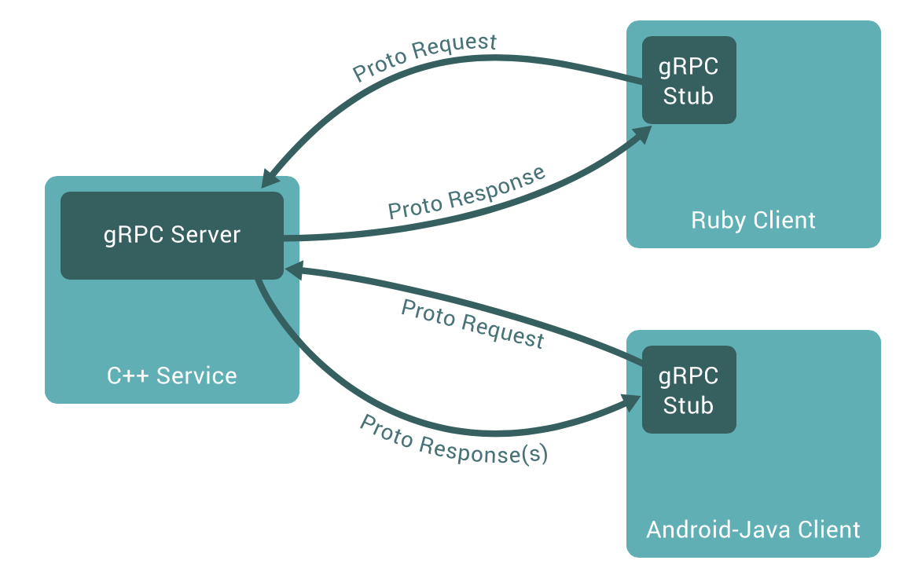

[TOC]

[Golang知识总结 精品](https://blog.csdn.net/weixin_34128839/article/details/94488565?utm_medium=distribute.pc_relevant.none-task-blog-BlogCommendFromMachineLearnPai2-5.channel_param&depth_1-utm_source=distribute.pc_relevant.none-task-blog-BlogCommendFromMachineLearnPai2-5.channel_param)

## 通用后台分层


### 框架

- **gRPC**

  - 

  - Google发起的一个**开源远程过程调用系统**。系统基于**HTTP/2协议**传输，使用**Protocol Buffers作为接口描述语言(Interface Describtion Language)**。gRPC利用一种简单的方法来精确定位服务和为IOS，Android和后台支持服务自动生成可靠性很强的客户端功能库。

  - 特性

    - 使用ProtoBuf来定义服务，ProtoBuf是由Google开发的一种数据序列化协议，性能出众。
    - 支持多种语言
    - 基于**HTTP/2标准协议**

  - 定义服务接口

    - `service`关键字定义接口，内部可以有多个方法。

    - ```protobuf
      service HelloService {
        rpc SayHello (HelloRequest) returns (HelloResponse);
      }
      
      message HelloRequest {
        string greeting = 1;
      }
      
      message HelloResponse {
        string reply = 1;
      }
      ```

  - 定义四种类型的rpc方法

    - 简单的rpc方法

      - ```protobuf
        rpc SayHello(HelloRequest) returns (HelloResponse){
        }
        ```

      - 过程像是一个本地的方法调用

    - 服务端流式相应的rpc方法

      - ```protobuf
        rpc LotsOfReplies(HelloRequest) returns (stream HelloResponse){
        }
        ```

      - 客户端发送一个请求，从服务端获得一个流。服务端可以往流中写入N个消息作为相应，并且每个消息可以单独发送，客户端可以从流中按顺序读取这些消息。

    - 客户端流式请求的rpc方法

      - ```protobuf
        rpc LotsOfGreetings(stream HelloRequest) returns (HelloResponse) {
        }
        ```

      - 通过流发送一连串的多个请求，并从服务端获取一个相应。

    - 双向流式rpc方法

      - ```protobuf
        rpc BidiHello(stream HelloRequest) returns (stream HelloResponse){
        }
        ```

      - 客户端通过流发送N个请求,服务端通过流发送N个响应,彼此相互独立,并且读写没有特定的次序要求,比如服务端可以收到所有请求后再返回响应,也可以每读取一个或K个请求会返回响应。

    

- **Go-Micro**

  - 

  - 服务间数据**传输格式为protobuf**。

  - 服务注册和发现是多种多样的。

  - 主要的功能都有相应的接口，只要实现相应的接口，就可以根据自己的需要定制插件。

  - 通信流程

    - 
    - **Server监听客户端的调用**，和**Brocker推送过来的信息进行处理**。并且**Server端需要向Register注册自己的存在或消亡**，这样Client才能知道自己的状态。Register服务的注册的发现。
    - Client端从Register中得到Server的信息，然后每次调用**根据算法选择一个的Server进行通信**，通信要经过编码/解码，选择传输协议等一系列的过程。如果有需要通知所有的Server端可以使用Brocker进行信息的推送。
    - **Brocker 信息队列进行信息的接受和发布**。

  - go-micro的八个关键接口

    - 

    - **Transort 用于同步消息**

      - 该接口是**服务与服务之间同步请求/相应的通信接口**。传输支持双向流。

      - ```go
        type Socket interface {
            Recv(*Message) error
            Send(*Message) error
            Close() error
        }
        
        type Client interface {
            Socket
        }
        
        type Listener interface {
            Addr() string
            Close() error
            Accept(func(Socket)) error
        }
        
        type Transport interface {
            Dial(addr string, opts ...DialOption) (Client, error) //客户端进行链接服务的方法
            Listen(addr string, opts ...ListenOption) (Listener, error)  //监听
            String() string
        }
        ```

        

    - **Codec用于消息编码**

      - Codec编码包**用于在消息传输到两端时进行编码与解码**，可以是json、protobuf、bson、msgpack等等。与其它编码方式不同，同时还支持RPC格式。所以我们有JSON-RPC、PROTO-RPC、BSON-RPC等格式。编码包把客户端与服务端的编码隔离开来，并提供强大的方法来集成其它系统，比如gRPC、Vanadium等等。

      - ```go
        type Codec interface {
            ReadHeader(*Message, MessageType) error
            ReadBody(interface{}) error
            Write(*Message, interface{}) error //编码
            Close() error
            String() string
        }
        
        type Message struct {
            Id     uint64
            Type   MessageType
            Target string
            Method string
            Error  string
            Header map[string]string
        }
        ```

        

    - **Registry 用于服务发现**

      - 提供了**服务发现机制来解析服务名到地址**上。它可以使用**Consul、etcd、zookeeper、dns、gossip等等提供支持**。服务使用启动注册关机卸载的方式注册。服务可以选择性提供过期TTL和定时重注册来保证服务在线，以及在服务不在线时把它清理掉。

      - ```go
        type Registry interface {
            Register(*Service, ...RegisterOption) error
            Deregister(*Service) error
            GetService(string) ([]*Service, error)
            ListServices() ([]*Service, error)
            Watch(...WatchOption) (Watcher, error)
            String() string
            Options() Options
        }
        ```

        

    - **Selector 负载均衡**

      - 允许服务被过滤函数过滤掉不提供的服务。也可以通过选择恰当的算法来选中提供服务，算法可以是随机，轮训或者最少链接等。选择器通过客户端创建语法时发生作用。客户端会选择选择器而不是注册表，因为它提供内置的负载均衡机制。

    - **Broker 用于异步消息**

      - 提供了**异步通信的消息发布/订阅接口**。对于**微服务系统及事件驱动型的架构**来说，**发布/订阅是基础**。一开始，默认使用收件箱方式的点到点HTTP系统来最小化依赖的数量。但是，在go-plugins是提供有消息代理实现的，比如RabbitMQ、NATS、NSQ、Google Cloud Pub Sub等等。
      - **默认实现方式是http方式**。有很多成熟的消息队列实现方式:kafka, nsq, rabbitmq, redis等等

    - **Client 用于发送请求**

      - 提供接口创建向服务器的请求。构建在其他的包上，提供独立的接口，通过`注册中心`来基于名称`发现服务`，基于选择器来负载均衡，使用`tansport`，`broker`处理同步，异步消息。

    - **Server 用于处理请求**

      - 便携服务的构建包，可以命名服务，注册请求处理器，增加中间件等。服务构建在以上说的包之上，提供独立的接口来服务请求。现在的服务构建好似RPC系统。

    - **Service**

      - client和server的封装，包含了一系列方法使用初始值去初始化Server和client

- **ProtoBuf**

  - 是一种结构数据**序列化**方法，具有特点如下
    - 语言无关，平台无关。
    - 高效，比XML更小，更快，更为简单。
    - 拓展性，兼容性好
  - 服务定义
    - 客户端调用服务端提供的远程接口前，双方必须进行一些约定，比如接口的方法签名，请求和相应的数据结构等。
    - 服务定义需要特定的接口定义语言(IDL)来完成，gRPC中默认使用protocolBuf
  - 语法-----定义信息
    - `message`定义一个信息，类似于定义一个类
    - `repeat`相当于数组，可以有零个或者多个值。‘
  - 与JSON，XML的区别
    - XML，JSON，ProtoBuf都具有**数据结构化**和**数据序列化**的能力
    - XML，JSON更注重**数据结构化**，关注可读性和语义表达能力。ProtoBuf更注重数据**序列化**，关注效率，空间，速度，可读性差，语义表达能力不足。

- **Gin**

  - gin是基于net/http库开发的web框架。

  - 定义一个engine，实现`ServerHTTP`方法，这是，就可以将engin作为Handler传给http包的ListenAndServer函数。

    - ```go
      // ServeHTTP conforms to the http.Handler interface.
      func (engine *Engine) ServeHTTP(w http.ResponseWriter, req *http.Request) {
         c := engine.pool.Get().(*Context)
         c.writermem.reset(w)
         c.Request = req
         c.reset()
      
         engine.handleHTTPRequest(c)
      
         engine.pool.Put(c)
      }
      ```

    - 一个请求对应了一个context，为了防止频繁的GC。gin框架**提供了一个Pool池缓存Context对象**。

  - `gin.Default`返回Engine对象，而`gin.Context`则几乎包含了http请求中的几乎所有的信息.

    - ```go
      // Context is the most important part of gin. It allows us to pass variables between middleware,
      // manage the flow, validate the JSON of a request and render a JSON response for example.
      type Context struct {
      	writermem responseWriter
      	Request   *http.Request
      	Writer    ResponseWriter
      
      	Params   Params
      	handlers HandlersChain
      	index    int8
      	fullPath string
      
      	engine *Engine
      	params *Params
      
      	// This mutex protect Keys map
      	mu sync.RWMutex
      
      	// Keys is a key/value pair exclusively for the context of each request.
      	Keys map[string]interface{}
      
      	// Errors is a list of errors attached to all the handlers/middlewares who used this context.
      	Errors errorMsgs
      
      	// Accepted defines a list of manually accepted formats for content negotiation.
      	Accepted []string
      
      	// queryCache use url.ParseQuery cached the param query result from c.Request.URL.Query()
      	queryCache url.Values
      
      	// formCache use url.ParseQuery cached PostForm contains the parsed form data from POST, PATCH,
      	// or PUT body parameters.
      	formCache url.Values
      
      	// SameSite allows a server to define a cookie attribute making it impossible for
      	// the browser to send this cookie along with cross-site requests.
      	sameSite http.SameSite
      }
      ```

  - 路由分组

    - ```go
      router := gin.Default()
      
          // Simple group: v1
          v1 := router.Group("/v1")
          {
              v1.POST("/login", loginEndpoint)
              v1.POST("/submit", submitEndpoint)
              v1.POST("/read", readEndpoint)
          }
      
          // Simple group: v2
          v2 := router.Group("/v2")
          {
              v2.POST("/login", loginEndpoint)
              v2.POST("/submit", submitEndpoint)
              v2.POST("/read", readEndpoint)
          }
      
          router.Run(":8080")
      ```

  - POST

    - ```go
      router := gin.Default()
      
      v1 := router.POST("/form_post", func(c *gin.Context){
      			message := c.PostForm("message")
      })
      ```

  - GET

    - ```go
      router := gin.Default()
      v1 := router.GET("/from_get", func(c *gin.Context){
      			message := c.Param("message")
      })
      ```

- **Gorm**

  - `db.Table("")...`
    - Table中写入db的表名
  - `db.Model()...`
    - Model中加入某个表的struct定义
  - CRUD
    - `db.Create(...)`
    - `db.Delete(...)`
    - `db.Model().Update`
    - `db.Where().Find()`

### 中间件

- **消息队列**
  - 功能
    - **解耦**
      - 生产者只管生产数据，不关心被谁消费。消费者只管消费数据，不管是谁生产。
    - **异步**
      - 生产者可以向消息队列同时放多个数据。类似于缓存的channel
    - **限流**
      - 缓存数据，防止打垮处理方。
- 可能带来的问题
    - 系统可用性降低
      - 消息队列的出错可能会导致系统的不可用
    - 系统复杂性提高
      - 需要考虑数据的一致性问题，数据是否被重复消费问题，如何保证信息可靠性传输等。
    - 一致性问题
      - 分布式系统当中可能出现数据的不一致问题。
  
- **Kafka**  框架相关中
- **Redis** db相关中
- **MySQL** db相关中
- **MongoDB** db相关中
- **Consul/Etcd/zookeeper/goosip/dns** 框架相关中

### 容器化与平台

- **Docker**

  - 基于 **统一文件系统(the union file system)** 的知识

  - 操作系统层面的虚拟化技术。由于**隔离的进程独立于宿主和其他的隔离的进程**，因此称之为**容器**。

  - 相较于传统虚拟机虚拟一套硬件，在其上运行操作系统不同。**容器内的应用程序直接运行于宿主的内核上**，**容器内没有自己的内核**，而且**也没有进行硬件虚拟**。

  - 优势
    - **更高效的利用系统资源**，容器**不需要进行硬件虚拟以及运行完整操作系统的额外开销**，系统资源的利用率更高，一个相同配置的主机，相比传统虚拟机技术，往往可以运行更多数量的应用。
    - **更快速的启动时间**，docker容器直接运行于宿主内核，无需启动完整的操作系统，往往可以做到秒级或者毫秒级的启动时间。
    - **一致的运行环境**，docker**镜像提供了除内核外的完整的运行时环境**，确保了应用的运行环境一致。
    - **持续的交付和部署**，使用**dockerfile**使得**镜像构建透明化**，方便运维团队在生产环境部署镜像。
    - **更方便的迁移**，docker确保了应用运行环境的一致性，用户可以轻易将应用迁移到另一个平台上。
    - **更轻松的维护和扩展**，docker使用的**分层存储以及镜像技术**，使得应用的重复部分的复用更加容易。
    
  - Docker命令

    - `docker help` 可用命令
    - `docker attach`将本地输入，输出，错误流附加到正在运行的容器
    - `docker commit`：从当前更改的容器中运行命令
    - `docker exec`：在一个活动或正在运行的容器中运行命令
    - `docker histroy`：镜像历史记录
    - `docker info`：显示系统范围信息
    - `docker pull`从本地注册表或者Docker Hub中提取镜像或者存储库
    - `docker ps`列出容器的属性
    - `docker rm`移除容器
    - `docker rmi`删除镜像
    - `docker run`在隔离容器中运行命令
    - `docker start`启动容器
    - `docker stop`停止容器
    - `docker version`

  - 基本概念
    - **`Cgroups`与`Namespace`**
      - `Namespace`
        - Linux下创建一个新的进程所需要的新的参数，**隔离了文件系统，网络，并且与宿主及其之间的进程相互隔离**。
        - 容器的本质
          - 一个**特殊的进程**，但是在创建进程的时候，加上了一系列需要的`Namespace`参数
        - 从`Namespace`角度看容器劣势
          - **隔离的不够彻底**，多个容器之间使用的**还是同一个宿主机的操作系统内核**，导致了低版本Linux宿主机无法运行高版本Linux内核的容器。
          - 在Linux中，**很多的资源不能够被`Namespace`化**，最典型的就是时间。只要一个宿主机上的一个容器修改了时间，就会影响整个宿主机的时间。
        - 从`Namespca`角度看容器优势
          - 相较于虚拟机技术的需要运行于一个真实存在的操作系统不同，`Namspace`可以避免虚拟化带来的损耗，也不需要单独的操作系统，容器额外占用资源忽略不计。
        - **单进程模型**
          - 容器本质就是一个进程，用户的应用进程实际上就是容器里`pid=1`的进程，也是其他后续创建的所有进程的父进程。在一个容器，无法运行两个不同的应用，除非进程是一个公共的`pid=1`的程序，充当两个不同应用的父进程。
          - 推荐容器和容器内的应用同生命周期
      - `Cgroup(Linux Control Group)`
        - 主要的作用就是**限制一个进程组能够使用的资源上限**，包括CPU，内存，磁盘，网络等。
        - 从`Cgroup`看容器劣势
          - 使**用的内存仍然是宿主机的内存**
          - Linux系统/proc这个目录记录了系统运行的状态信息，也是top和free主要的信息来源。而/proc这个目录不知道Cgroup给容器做的限制。
    
    - **镜像(Image)**
      - 是一 **堆只读层(read-only layer)** 的统一视角
        - 
        - 多个只读层堆叠在一起，除了最下面的一层，**每一层都有一个指针指向下一层**。这些层是Docker的内部实现细节，并且**能够在主机的文件系统上进行访问**。同一文件系统技术能够将不同的层整合成一个文件系统，为这些层提供一个统一的视角，隐藏了多层的存在，在用户的视角当中只有一个文件系统。
      - OS分为内核空间和用户空间，对于linux而言，内核启动后，会**挂载root文件系统为其提供用户空间支持**。而**docker镜像**就相当于一个**root文件系统**。docker镜像是一个特殊的文件系统，除了提供容器**运行时所需的程序、库、资源、配置等文件**外，还包含了一些为**运行时准备**的**配置参数（匿名卷、环境变量、用户等）**。镜像**不包含任何动态数据**，其内容在构建之后也不会改变。
      - 分层存储
        - 因为**镜像包含操作系统的完整root文件系统**，其体积往往是庞大的，因此docker在设计时就使用了**Union FS技术**，将其设计为**分层存储的架构**。严格来说，镜像并非是像一个ISO那样的打包文件，镜像只是一个虚拟的概念，其**实际体现并非由一个文件组成**，而是**由一组文件系统组成**，或者说有**多层文件系统联合组成**。
        - 构建镜像时，**会一层层构建**，**前一层是后一层的基础**。每一层构建完就不会发生变化，后一层上的任何改变只发生在自己这一层。比如删除前一层的文件，仅仅在当前层标记为文件已删除。最终文件运行时虽然**不会看见这个文件**，但是该**文件一直跟随着镜像**。因此，在构建镜像的时候，需要额外小心，**每一层尽量只包含该层需要添加的东西**，额外的东西应该在该层构建结束前清理掉。
        - **分层存储的特征还使得镜像复用**、定制变得更加容易。甚至可以**用之前构建好的镜像作为基础层，然后进一步添加新的层**，以**定制自己需要的内容**，构建新的镜像。
    - **容器(Container)**
      - 与镜像定义基本一致，唯一区别是**容器的最上面一层是可读可写**的
        - 
        - 容器 = 镜像 + 读写层。
      - 容器与镜像。就是对象与类的关系。镜像是一个静态的定义，容器是镜像运行时的实体。容器可以被创建，启动，停止，删除，暂停等。**容器的实质**就是一个**进程**。但是与直接在宿主执行的进程不同，容器进程运行于**自己独立的命名空间**内。因此容器可以**拥有自己的root文件系统**，自己的**进程空间**，甚至自己的**用户ID空间**。容器内的进程运行在一个隔离的环境中，使用起来就好像一个独立于宿主的操作系统一样。这种特性使得容器封装的应用的应用比直接运行在宿主机上更安全。
      - 每个容器运行时，是**以镜像为基础层**，在**其上创建一个当前容器的存储层**，可以称容器运行时**为读写而准备的存储层为容器存储层**。 **容器存储层的生存周期和容器一样，** 容器消亡时，容器存储层也随之消亡，因此任何保存与容器存储层的信息都会因容器删除而丢失。
      - 容器**不应该向容器存储层写入任何数据**，容器存储层要**保持无状态化**。所有的**文件写入操作**，都**应该使用数据卷(Volume)**，或者绑定宿主目录，在**这些位置的读写会跳过容器存储层**，直接对宿主(或网络存储)发生读写，其性能和稳定性更高。
    - **仓库(Repository)**
      - 集中的存储，分发镜像的服务，Docker Registry。
      - 一个Docker Repository可以**包含多个仓库**，**每个仓库包含了多个tag**，**每个tag对应着一个image**
      - 通常，一个仓库会包含同一软件的不同版本镜像，而标签常用于指定软件的各个版本。可以通过<仓库名：标签>的格式指定是哪一个版本的镜像，如果没有tag则默认latest
    - **公开服务**
      - 开放给用户使用，允许用户管理镜像的Registry服务。一般允许用户免费上传，下载公开的镜像，并可能提供收费服务供用户管理私有镜像。
    - **运行态容器**
      - 一个可读写的同一文件系统加上隔离的进程空间和包括其中的进程。
      - 

- **Kubernetes**

  - 两大依赖

    - 微服务
    - 容器

  - 设计理念

    - **声明式**
      - (类似SQL语句)k8s可以**直接使用yaml文件定义服务的拓扑机构以及状态**。
    - **显式接口**
      - 不存在内部接口，**所有的接口显示定义**。可以方便使用接口来实现更加复杂的需求。
    - **无侵入性**
      - 每一个应用或者服务**一旦被打包成了镜像就可以直接在k8s中无缝使用**，不需要修改应用程序中的任何代码。
    - **可移植性**
      - 对于微服务架构而言，有状态的服务是无法避免的。k8s引用了`PersistentVolume` 和 `PersistentVolumeClaim` 的概念用来**屏蔽底层存储的差异性**。

  - 

  - **基本控件**

    - 

    - **Pod**

      - 一个pod里面**包含着多个容器**，是k8s里面的基本构件模块，它是在K8S集群里能**创建或部署的最小和最简单的单位**。

      - **Pod里的容器共用相同的网络和存储资源**。**每个Pod会被分配唯一的IP地址**，里面的容器都会共享着这个网络空间，这个网络空间包含了IP地址和网络端口。Pod容器里面的通信用的是localhost，与外界通信就需要用到pod的ip和端口

      - Pod**指定共享的存储Volume**，然后**Pod里的所有容器都有权限访问这个Volume**。Volume是持久化数据用的，Pod的重启都会影响Volumn里的数据。

      - 一般会将有强关联的容器都放在一个pod中

      - **实现原理**

        - 
          - 通过一个叫pause的容器完成机制组合起来。K8S在**初始化一个Pod的时候会先启动一个叫Pause的容器**，然后再启动用户自身的业务容器。这个Pause可以理解为一个**根容器**。根容器的作用有：
            - 扮演pid 1 的角色，处理僵尸进程
            - 在Pod里为其他容器共享Linux namespace的基础
          - Pause作为PID为1的进程存在与一个pod里，其他的业务容器都挂载这个Pause进程下面。这样，一个Namespace下的进程就会**以Pause作为根**，**呈树状结构存在一个pod下**。
          - **僵尸进程**是指子进程由父进程fork创建出来后，子进程退出后，父进程没有来得及调用wait或waitpid获取其子进程的状态信息，那么这个子进程的描述符仍然保存在系统中，其进程号会一直存在被占用，这种进程称之为僵尸进程。
          - Pause容器中有一个无限循环的函数，函数里面执行`pause()`函数，`pause()`函数本身是在睡眠状态，直到被信号所中断。

      - Pod的生命状态，状态值变化

      - | 阶段      | 描述                                                         |
        | --------- | ------------------------------------------------------------ |
        | pending   | K8S集群里已经**发起创建Pod请求**，里面的**Pod还没有容器**。这个阶段一般是发生在**Pod被调度之前**或者**Pod里的镜像正在下载**。 |
        | running   | Pod已经**调度落地在了一个Node**里，并且**里面的容器已经创建好**了。里面**至少一个容器正在运行或者正在启动或者重新启动**。 |
        | succeeded | Pod里面的所有容器成功运行，也没发生重启等行为。              |
        | failed    | Pod里面的所有容器终止，至少有一个容器以失败方式终止。也就是说，这个容器要么已非 0 状态退出，要么被系统终止。 |
        | unknown   | 由于一些原因，Pod 的状态无法获取，通常是与 Pod 通信时有出错。 |

      - **etcd**

        - 保证了整个集群的状态，是一个数据库

      - **网络插件**

      - **Node节点关键进程**

      - **kube-proxy**

        - 负责为Service提供cluster内部的**服务实现和负载均衡**

      - **CNI网络组件**

      - **master**

        - 
        - master节点是**k8s集群**的**控制节点**，负责**整个集群的管理和控制**。master节点上包括以下组件
        - **etcd**
          - 高可用强一致性的键值仓库
          - 基于HTTP+JSON的API
          - 可选SSL客户认证机制
          - 使用一致性raft算法充分实现分布式。
          - 主要是存放服务中的配置信息
          - 在k8s系统中，主要有两个服务需要用到etcd存储
            - 网络插件：如flannel等需要存储网络配置信息
            - k8s本身，包括各种对象的状态和原信息配置
        - **kube-apiserver**
          - 提供kubernetes**所有资源增删改查的唯一入口**，也是**集群控制的入口**，提供http Restful接口，完成集群管理，资源配额，访问控制，认证授权，以及对etcd的操作。
        - **kube-controller-manger**
          - 主节点上运行控制器的组件。
          - 从逻辑上讲，**每个控制器都是一个单独的进程**，但是为了降低复杂性，他们都被编译到同一个可执行文件，并在一个进程中运行
          - 节点控制器
            - 负责在节点出现故障时进行通知和相应
          - 副本控制器
            - 负责为系统的每个副本控制器对象维护正确数量的Pod
          - 端点控制器
            - 填充端点对象
          - 服务账号和令牌控制器
            - 为新的命名空间创建默认账户和API访问令牌
          - 是集群内所有资源对象的自动化控制中心，负责pod和node的管理，节点控制器，服务控制器，副本控制器，服务账户和令牌控制器等
        - **kube-scheduler**
          - **负责资源的调度**，按照预定的调度策略将pod调度到相应的机器上。该组件监视那些**新创建的未指定运行节点的Pod**，并选择节点让pod在上面运行。调度决策考虑的因素包括单个Pod和Pod集合的资源需求。
        - **Node**
          - 
          - node节点是k8s集群中的**工作节点**，node上的工作**负载由master节点分配**，工作负载主要运行在容器应用。**一个Node可以是VM或物理机**，每个Node**具有运行pod的一些必要服务**。Node节点包含以下组件：
          - **kubelet**
            - 负责 **Pod 的创建、启动、监控、重启、销毁等工作**，同时**与 Master 节点协作**，实现集群管理的基本功能。
            - **处理Master下发到本节点的任务**，管理pod及pod的容器，**每个kubelet在Apiserver上注册自身信息，定期向Master汇报节点的资源使用情况**，并通过cAdvisor**监控容器和节点信息**。
            - 周期性从APIServer**接受新的或者修改的Pod规范**，并且**保证节点上的Pod和其中容器的正常运行**，并且保证节点**会向目标状态迁移**，该节点仍然会**向Master节点发送宿主机的健康状况**。
          - **kube-proxy**
            - 是集群中每个节点上运行的**网络代理**
            - 维护节点上的网络规则
            - 实现k8s Service的通信和**负载均衡**
            - 将到service的访问转发到后端的多个pod实例上，维护路由信息，对于每一个TCP类型的k8s service，kube-proxy会在本地建立一个sockerserver来负责均衡算法，使用rr负载均衡算法。
          - 运行容器化(Pod)应用
          - **Pod**
          - **ReplicaSet**
            - Pod副本的抽象，用于解决Pod的扩容和伸缩
          - **Deployment**
            - 在pod这个抽象上更为上层的一个抽象，它可以**定义一组pod的副本数目，以及这个pod的版本**。**一般用deploment这个抽象来做应用的真正的管理**，而pod是组成deployment最小的单元。
            - k8s是通过Controller来维护deployment中pod的数目，帮助deployment自动恢复失败的pod。
            - **Deployment 表示部署**，在内部使用ReplicaSet 来实现。可以通过 Deployment 来生成相应的 ReplicaSet 完成 Pod 副本的创建。
          - **Service**
            - Type
              - ClusterIP
                - (k8s集群内部)一个可调用的IP
              - NodePort
                - 一组NodeIP及其端口号
              - LoadBalancer
                - 外部负载均衡的IP
              - ExternalName
                - 一个名字
            - Service 是 Kubernetes 最重要的资源对象。Kubernetes 中的 **Service 对象**可以对应微服务架构中的**微服务**。Service **定义了服务的访问入口**，服务的调用者**通过这个地址访问 Service 后端的 Pod 副本实例**。Service 通过 Label Selector 同后端的 Pod 副本建立关系，Deployment 保证后端Pod 副本的数量，也就是保证服务的伸缩性。

  - 为什么选择pod而不是docker

    - 更利于拓展
      - k8s**不仅仅支持Docker容器**，也支持**rkt甚至用户自定义容器**。因为容器并不是真正的虚拟机，docker的一些概念和误区总结，此外，Kubernetes不依赖于底层某一种具体的规则去实现容器技术，而是通过CRI这个抽象层操作容器，这样就会需要pod这样一个东西，pod内部再管理多个业务上紧密相关的用户业务容器，就会更有利用业务扩展pod而不是扩展容器。
    - 更容易定义一组容器的状态
    - 利于容器见的文件共享，以及通信

  - 滚动升级

    - 一次仅升级一个pod，并且逐个进行更新，而不是同一时刻下该service下面所有的pod都shutdown，避免将业务中断的尴尬。

- **k8s的四大对象**
  - **pod**
    - 容器：
      - 每个pod由两种不同的容器，一个是**初始化容器**，会在pod启动时运行，主要用于初始化配置。另一种是Pod在running状态时内部存在的container。
    - 卷(Volume)
      - 每个pod下的容器**通过卷来共享文件目录**。这些Volume 能够**存储持久化的数据**；在当前 Pod 出现**故障或者滚动更新时**，对应 **Volume 中的数据并不会被清除**，而是会在 **Pod 重启后重新挂载到期望的文件目录**中。
    - 网络
      - **同一个Pod下**的多个容器会被共同分配到同一个Host上并且共享网络栈。每一个Pod的容器之间可以通过localhost来访问彼此。如果使用了相同的端口也会发生冲突，同一个 Pod 上的所有容器会连接到同一个网络设备上。
    - Pod的生命周期
      - 创建
        - 计算 Pod 中沙盒和容器的变更；
        - 强制停止 Pod 对应的沙盒；
        - 强制停止所有不应该运行的容器；
        - 为 Pod 创建新的沙盒；
        - 创建 Pod 规格中指定的初始化容器；
        - 依次创建 Pod 规格中指定的常规容器；
      - 健康检查
        - 在Pod启动后，等待pod的启动和初始化，在这之后会开始健康检查。
      - 删除
        - 通过一个deletePod的私有方法中的Channel将删除时间传递给PodKiller进行处理。Kubelet 除了将事件通知给 PodKiller 之外，还需要将当前 Pod 对应的 Worker 从持有的 `podWorkers` 中删除；PodKiller 其实就是 Kubelet 持有的一个 Goroutine，它会在后台持续运行并监听来自 `podKillingCh` 的事件。
  - **service**
    - 每一个k8s的Service**都是一组Pod的逻辑集合和访问方式的抽象**。
    - 创建服务
      - k8s创建一个新的Service对象需要两大模块同时协作，其中一个模块就是**控制器(Controller)**，它需要在每次客户端创建新的 Service 对象时，生成其他用于暴露一组 Pod 的 Kubernetes 对象，也就是 Endpoint 对象。另一个模块是 **kube-proxy**，它运行在 Kubernetes 集群中的**每一个节点上**，会根据 Service 和 Endpoint 的变动改变节点上 iptables 或者 ipvs 中保存的规则。
    - Controller
      - ServiceController
        - **处理负载均衡类型的Service**
      - EndpointController
        - 同时订阅Service和Pod资源的增删事件
    - 代理
      - **每一个节点**都运行着一个**kube-proxy进程**。
      - 三种代理模式
        - **userspace：**运行在用户空间代理。
          - 如果当前节点上的 kube-proxy 在启动时选择了 userspace 模式，那么每当有新的 Service 被创建时，kube-proxy 就会增加一条 iptables 记录并启动一个 Goroutine，前者用于将节点中服务对外发出的流量转发给 kube-proxy，再由后者持有的一系列 Goroutine 将流量转发到目标的 Pod 上。
        - **iptable**：运行在内核空间
          - 直接转发当前节点上的全部流量。当集群中的Service数量过多时，会导致增加一条规则需要消耗大量的时间，不适用于大规模集群。
        - **ipvs**：运行在内核空间
          - 使用哈希表作为底层数据结构
  - **Volume**
    - 集群中的每一个卷在被 Pod 使用时都会经历四个操作，也就是附着（Attach）、挂载（Mount）、卸载（Unmount）和分离（Detach）。
    - 生命周期与Pod相同
  - **ReplicaSet**
    - 主要作用
      - **维持一组pod副本的运行**，并且**持续监听这些pod的状态**，在**pod发生故障重启数量减少时重新运行新的pod副本**。
  - **Depolyment**
    - 提供了一种**对Pod和ReplicaSet的管理方式**，每一个Depolyment都**对应了集群中的一次部署**。
    - Deployment的资源控制器在启动时会同时监听Pod，ReplicaSet和Deployment三种资源。
    - 滚动更新
      - maxUnavailable 表示更新过程中进入不可用状态的Pod的最大值
      - maxSurge表示能够额外创建的Pod个数。
      - 通过不断对新的ReplicaSet进行扩容，并且对旧的ReplicaSet进行缩容从而达到集群的期望状态。
    - 回滚
      - 每一个Deployment资源都包含有revision这个概念，版本的引入帮助我们在更新发现问题的时候及时通过Deployment的版本对其进行回滚。当我们在更新 Deployment 时，之前 Deployment 持有的 ReplicaSet 其实会被 `cleanupDeployment` 方法清理。

---

### 消息系统与持续集成

- **Jenkins**
- **IM**

### 分布式协调服务

- **zookeeper**
  - 它是一个针对大型应用提供高可用的数据管理、应用程序协调服务的分布式服务框架，基于对Paxos算法的实现，使该框架保证了分布式环境中数据的强一致性，提供的功能包括：配置维护、统一命名服务、状态同步服务、集群管理等。
  - Zookeeper 的目的是为客户端构建复杂的协调功能提供简单、高效的核心 API，相比于 Chubby 对外提供已经封装好的更上层的功能，Zookeeper 提供了更抽象的接口以便于客户端自行实现想要完成的功能。
  - 使用Zookeeper时会连接到**集群中的任意节点**，**所有的节点都能够直接对外提供读操作**，但是**写操作都会被节点路由到主节点**，由主节点处理。
  - 两大基本顺序保证
    - 线性写
    - 先进先出
  - Zab协议
    - Zookeeper为了解决一致性而设计出的一种协议，它的全称是**zookeeper原子广播协议，能够快速恢复服务**，达到高可用。
    - 当主节点崩溃时，其他的 Replica 节点会进入**崩溃恢复模式并重新进行选举**，Zab 协议必须**确保提交已经被 Leader 提交的事务提案**，同时**舍弃被跳过的提案**。但是在正式对外提供服务之前，**新的 Leader 也需要先与 Follower 中的数据进行同步**，确保所有节点拥有完全相同的提案列表。
  - Zab与Paxos
    - 相似
      - 主节点会**向所有的从节点发出提案**；
      - 主节点在接收到一组**从节点中 50% 以上节点的确认**后，才会**认为当前提案被提交**了；
      - Zab 协议中的每一个提案都包含一个 epoch 值，与 Paxos 中的 Ballot 非常相似；
    - 区别
      - Zab**主要为构建高可用的主备系统而设计**。
      - Paxos能够帮助工程师搭建具有**一致性的状态机系统**。
  - 文件系统
    - 是一个精简文件系统，它**提供一些简单的操作例如排序和通知**。只有**Znode**的概念，既**可以存储数据，也可以存储其他的Znode**。
      - 节点类型
        - 临时节点是客户端在连接 Zookeeper 时才会保持存在的节点，一旦客户端和服务端之间的连接中断，当前连接持有的所有节点都会被删除
        - 持久的节点不会随着会话连接的中断而删除，它们需要被客户端主动删除；
      - Zookeeper 中另一种节点的特性就是顺序和非顺序，如果我们使用 Zookeeper 创建了顺序的节点，那么所有节点就会在名字的末尾附加一个序列号，序列号是一个由父节点维护的单调递增计数器。
  - 通知
    - 常见的通知类型通常有：1⃣️**客户端轮询**拉取服务端数据 2⃣️**客户端订阅**对应节点，由服务端向所有的订阅者推送该节点的变化，相比于客户端主动获取数据，**服务端主动推送更加具有实时性**。
    - Zookeeper实现了服务端**主动推送请求**的机制。也就是 `Watch`，当客户端使用 `getData` 等接口获取 Znode 状态时传入了一个用于处理节点变更的回调，那么服务端就会主动向客户端推送节点的变更。
    - Zookeeper 中的所有数据其实都是由一个名为 `DataTree` 的数据结构管理的，**所有的读写数据的请求最终都会改变这颗树的内容**，在发出读请求时可能会传入 `Watcher` 注册一个回调函数，而写请求就可能会触发相应的回调，由 `WatchManager` 通知客户端数据的变化。
  - 会话
    - 客户端与服务端之间的**任何操作都与Zookeeper中的会话概念有关**。
    - 每一个Session都包含四种基本属性。**会话唯一ID，会话超时时间，下次会话的超时时间，表示会话是否关闭的标记**。
    - `SessionTracker` 是 Zookeeper 中的会话管理器，它负责所有会话的创建、管理以及清理工作，但是它本身只是一个 Java 的接口，定义了一系列用于管理会话的相关接口。
  - 分布式锁
    - 保持独占锁：**最终只有一个可以成功获得这把锁的**。
    - 控制时序锁：**所有试图控制这个锁的客户端，最终都会被安排执行**。
  - 与Chubby的区别
    - Chubby 直接为用户提供封装好的锁和解锁的功能，内部完成了锁的实现，只是将 API 直接暴露给用户，而 Zookeeper 却需要用户自己实现分布式锁；总的来说，使用 Zookeeper 往往需要客户端做更多的事情，但是也享有更多的自由。
- **Chubby**，分布式锁服务
  - **目的：**允许多个客户端对它们的行为进行同步，同时也能够解决客户端的环境相关信息的分发和粗粒度的同步问题。
  - **系统框架**：
    - 一部分是用于提供数据的读写接口并管理相关的配置数据的服务端，另一部分就是客户端使用的SDK。每一个chubby但愿都由一组服务组成，使用共识算法从集群中选举出来主节点。


### 接入层

### 逻辑层

### 数据访问层

### 存储层

### 服务治理手段

### CI(Continuous Integration)/CD(Continuous Delivery/Contious Deployment)

- 持续集成
  - 可以帮助开发人员更加频繁地（有时甚至每天）将代码更改合并到共享分支或“主干”中。一旦开发人员对应用所做的更改被合并，系统就会通过自动构建应用并运行不同级别的自动化测试（通常是单元测试和集成测试）来验证这些更改，确保这些更改没有对应用造成破坏。

- 持续交付
  - 开发对应用的更改会自动经行错误测试并上传到存储库(Gitlab,github),然后由运维团队将其部署到实时生产环境中。这旨在解决开发和运维团队之间可见性及沟通较差的问题。因此，持续交付的目的就是确保尽可能减少部署新代码时所需的工作量。
- 持续部署
  - 自动将开发人员的更改从存储库发布到生产环境，以供客户使用。它主要为了解决因手动流程降低应用交付速度，从而使运维团队超负荷的问题。持续部署以持续交付的优势为根基，实现了管道后续阶段的自动化。(TCE + SCM)

考虑多接触下通用的服务端后台开发涉及到的各个组件，比如通用后台的分层，接入层，逻辑层，数据访问层，存储层都怎么设计，以及他们涉及到的组件，相关的服务治理手段

