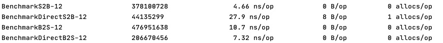

# bench学习

## 命令

`go test -bench =. -benmem -benchmem`   

- -bench 表示测试的函数
- -benchmem 显示测试函数的内存分配大小，内存分配次数的统计
- -count 次数

## 结果

- -12表线程数
- 第二列表示函数运行次数
- 第三列表示平均每次操作耗费时间
- 第四列表示每次操作分配多少Byte内存
- 第五列表示每次操作申请了多少次内存

