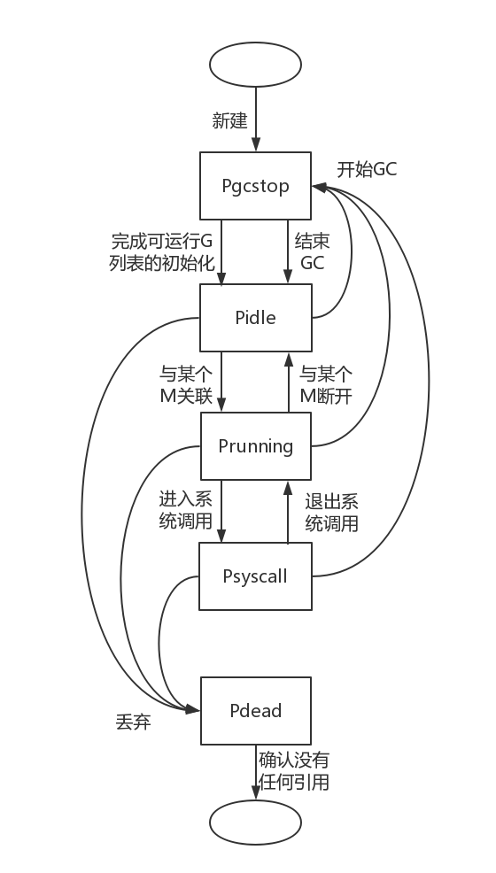
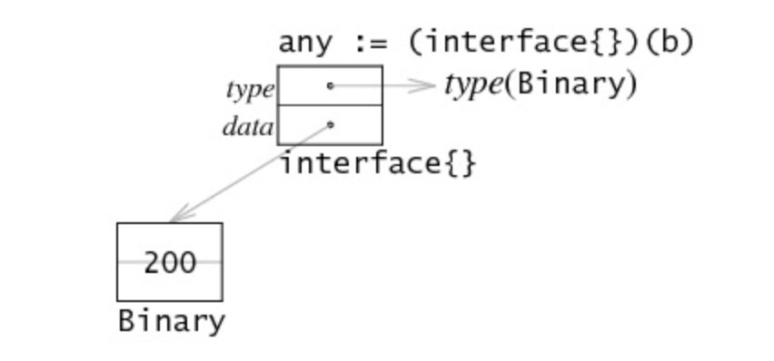
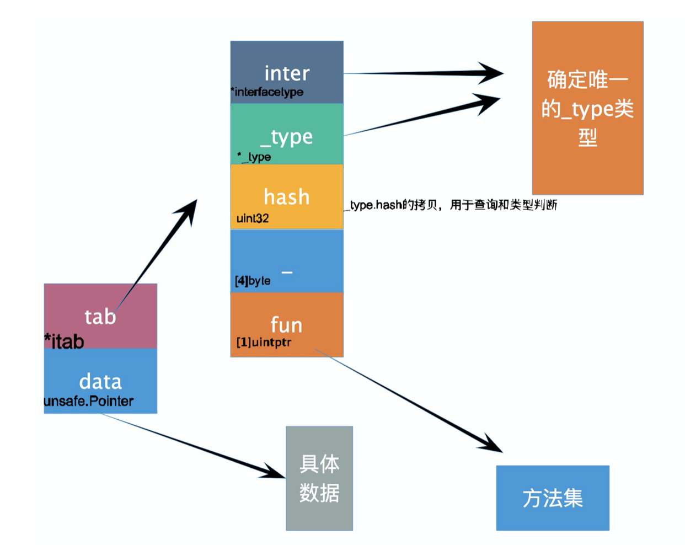
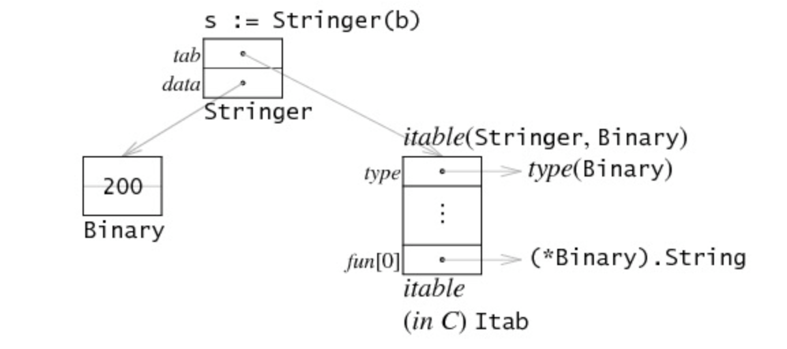
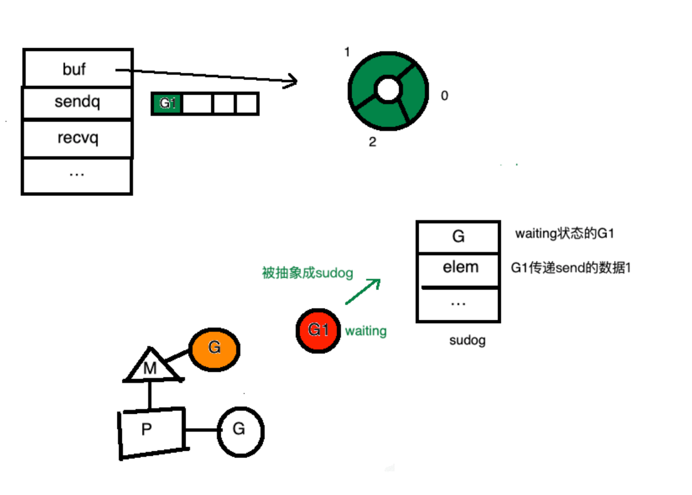
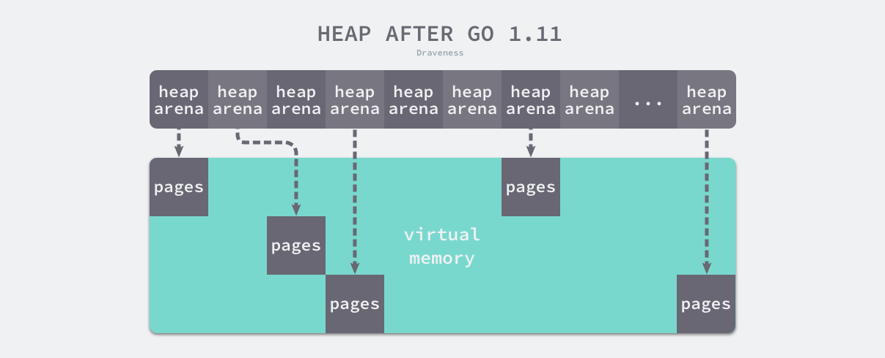

- goroutine里面panic了会怎么样

  - `panic`
    - `panic`能够改变程序的控制流，函数调用`panic`时会立刻停止执行函数的其他代码，并在执行结束后在当前goroutine中递归执行调用方的延迟函数调用`defer`
    - 当函数发生panic时函数执行会中止，函数内的所有defer将照常进行，然后函数返回给到他的调用者
  - `recover`
    - `recover`可以终止`panic`造成的程序崩溃。它是一个只能在`defer`中发挥作用的函数，在其他作用域中调用不会发挥任何作用。
    - 仅仅在defer语句当中才能起作用，在程序的正常运行当中，调用recover会返回nil

- map是否并发安全

  - 不是并发安全的

  - Q&A当中，开发者决定不给map上锁的原因是，因为map通常会存在与一个很大的数据结构或者是计算当中，增加锁不会带来太多的安全性，但是会大大的降低运行的效率。

  - 1.9以后，Go增加了并发安全的Map，sync.Map，他在尽可能的避免使用锁，以避免对性能有过多的损耗。

  - ```go
    type Map struct {
       mu Mutex
    
       // read contains the portion of the map's contents that are safe for
       // concurrent access (with or without mu held).
       //
       // The read field itself is always safe to load, but must only be stored with
       // mu held.
       //
       // Entries stored in read may be updated concurrently without mu, but updating
       // a previously-expunged entry requires that the entry be copied to the dirty
       // map and unexpunged with mu held.
       read atomic.Value // readOnly
    
       // dirty contains the portion of the map's contents that require mu to be
       // held. To ensure that the dirty map can be promoted to the read map quickly,
       // it also includes all of the non-expunged entries in the read map.
       //
       // Expunged entries are not stored in the dirty map. An expunged entry in the
       // clean map must be unexpunged and added to the dirty map before a new value
       // can be stored to it.
       //
       // If the dirty map is nil, the next write to the map will initialize it by
       // making a shallow copy of the clean map, omitting stale entries.
       dirty map[interface{}]*entry
    
       // misses counts the number of loads since the read map was last updated that
       // needed to lock mu to determine whether the key was present.
       //
       // Once enough misses have occurred to cover the cost of copying the dirty
       // map, the dirty map will be promoted to the read map (in the unamended
       // state) and the next store to the map will make a new dirty copy.
       misses int
    }
    ```

  - 在只读的时候，Map并不要上锁

  - miss次数上升以后，将dirty升级为read，dirty变为nil

  - 删除一个记录只是对其进行记录，在dirty升级为read时才会将真正的数据进行删除

  - read字典

  - ```go
    // readOnly is an immutable struct stored atomically in the Map.read field.
    type readOnly struct {
       m       map[interface{}]*entry
       amended bool // true if the dirty map contains some key not in m.
    }
    ```

  - ```go
    // An entry is a slot in the map corresponding to a particular key.
    type entry struct {
       // p points to the interface{} value stored for the entry.
       //
       // If p == nil, the entry has been deleted and m.dirty == nil.
       //
       // If p == expunged, the entry has been deleted, m.dirty != nil, and the entry
       // is missing from m.dirty.
       //
       // Otherwise, the entry is valid and recorded in m.read.m[key] and, if m.dirty
       // != nil, in m.dirty[key].
       //
       // An entry can be deleted by atomic replacement with nil: when m.dirty is
       // next created, it will atomically replace nil with expunged and leave
       // m.dirty[key] unset.
       //
       // An entry's associated value can be updated by atomic replacement, provided
       // p != expunged. If p == expunged, an entry's associated value can be updated
       // only after first setting m.dirty[key] = e so that lookups using the dirty
       // map find the entry.
       p unsafe.Pointer // *interface{}
    }
    ```

  - ```go
    // expunged is an arbitrary pointer that marks entries which have been deleted
    // from the dirty map.
    var expunged = unsafe.Pointer(new(interface{}))
    ```

- 不加锁并发读写map会出现什么问题

  - fatal error : cncurrent map read and map write

- Channel 有缓冲和无缓冲的区别

  - 无缓冲
    - 发送与接收需要成对出现
    - 如果没有channel没有接受者，则向channel继续写入将会阻塞
  - 缓冲
    - 内部维护了一个缓冲区(队列)，即使channel中已经有了数据，只要没有超过缓冲区的大小，写入channel不会阻塞。

- interface不是一个好形式，会导致GC压力大，为什么？用什么形式会比较好

  - interface是在运行期间实现的，采用动态方法调用，性能会出现损耗。并且可能出现对象逃逸和无法内联的问题。
    - 无法内联
      - 接口调用方法是通过动态调用的方法进行调用的
      - 若直接使用结构进行调用，由于方法是内联于结构中，减少了内存调用stack的开销。是一种编译器的优化，在编译的过程中进行。用被调用函数的主题来替换函数调用，以消除函数调用的开销。
    - 内存逃逸
      - 内存分为堆内存与栈内存。栈内存由os管理，而对内存就需要程序员进行管理。
      - 如果一个函数返回了对变量的引用，那么它就会发生逃逸。因为在别的地方会用到该变量，如果放在栈中，函数退出后，内存就被回收了，所以就需要将该引用分配到堆中。
      - 由于接口类型的方法调度是动态调度的，在编译的阶段不能够确定，所以所有的类型结构转换成接口的过程中会涉及到内存逃逸的情况发生。

- golang 协程是如何实现的

  - goroutine是一个轻量级的线程--协程

  - 在创建一个goroutine的时候，调用`runtime`包中的`newproc()`方法

    - ```go
      // Create a new g running fn with siz bytes of arguments.
      // Put it on the queue of g's waiting to run.
      // The compiler turns a go statement into a call to this.
      // Cannot split the stack because it assumes that the arguments
      // are available sequentially after &fn; they would not be
      // copied if a stack split occurred.
      //go:nosplit
      func newproc(siz int32, fn *funcval) {
         argp := add(unsafe.Pointer(&fn), sys.PtrSize)  // 通过函数指针以及参数大小计算出参数位置的指针
         gp := getg()  // 获取当前执行goroutine的指针
         pc := getcallerpc()  // 获取调用者所在的pc值
         systemstack(func() {  // systemstack关键字 使得g0执行该函数，因为g0本身就是负责goroutine调度和创建的goroutine
            newproc1(fn, argp, siz, gp, pc)
         })
      }
      ```

  - 实际上是通过`g0`执行`newproc1()`

    - 首先获取当前的gouroutine，也就是g0

    - 上锁，因为下面的步骤会使用到p

    - 判断函数是否为空

    - 从当前的p获取空闲的g，若没有则去全局队列中找，如果依旧没有则生成一个goroutine

    - 将相关的参数给到新的goroutine的栈上

    - 更新G的状态

    - 将g推入当前p的队列当中，这里会优先将goroutine放到q.runnext当中，并且将q.runnext中的g放入到p的本地队列或者是全局队列当中。

    - 若当前有空余的P，但是自旋的m个数为零(所有的m都在工作，没有寻求P),则这个时候就需要新创建一个M

    - ```go
      // Create a new g running fn with narg bytes of arguments starting
      // at argp. callerpc is the address of the go statement that created
      // this. The new g is put on the queue of g's waiting to run.
      func newproc1(fn *funcval, argp unsafe.Pointer, narg int32, callergp *g, callerpc uintptr) {
         _g_ := getg()
      
         if fn == nil {
            _g_.m.throwing = -1 // do not dump full stacks
            throw("go of nil func value")
         }
         acquirem() // disable preemption because it can be holding p in a local var
         siz := narg
         siz = (siz + 7) &^ 7
      
         // We could allocate a larger initial stack if necessary.
         // Not worth it: this is almost always an error.
         // 4*sizeof(uintreg): extra space added below
         // sizeof(uintreg): caller's LR (arm) or return address (x86, in gostartcall).
         if siz >= _StackMin-4*sys.RegSize-sys.RegSize {
            throw("newproc: function arguments too large for new goroutine")
         }
      
         _p_ := _g_.m.p.ptr()  // 获取当前m所对应的p
         newg := gfget(_p_)  // 从p中获取一个GDEAD的G，或者从全局队列获取一个空闲的G
         if newg == nil {  // p中没有空闲的G，则直接初始化一个新的g
            newg = malg(_StackMin)  
            casgstatus(newg, _Gidle, _Gdead)
            allgadd(newg) // publishes with a g->status of Gdead so GC scanner doesn't look at uninitialized stack.
         }
         if newg.stack.hi == 0 {
            throw("newproc1: newg missing stack")
         }
      
         if readgstatus(newg) != _Gdead {
            throw("newproc1: new g is not Gdead")
         }
      
         totalSize := 4*sys.RegSize + uintptr(siz) + sys.MinFrameSize // extra space in case of reads slightly beyond frame
         totalSize += -totalSize & (sys.SpAlign - 1)                  // align to spAlign
         sp := newg.stack.hi - totalSize
         spArg := sp
         if usesLR {
            // caller's LR
            *(*uintptr)(unsafe.Pointer(sp)) = 0
            prepGoExitFrame(sp)
            spArg += sys.MinFrameSize
         }
         if narg > 0 {
            memmove(unsafe.Pointer(spArg), argp, uintptr(narg))
            // This is a stack-to-stack copy. If write barriers
            // are enabled and the source stack is grey (the
            // destination is always black), then perform a
            // barrier copy. We do this *after* the memmove
            // because the destination stack may have garbage on
            // it.
            if writeBarrier.needed && !_g_.m.curg.gcscandone {
               f := findfunc(fn.fn)
               stkmap := (*stackmap)(funcdata(f, _FUNCDATA_ArgsPointerMaps))
               if stkmap.nbit > 0 {
                  // We're in the prologue, so it's always stack map index 0.
                  bv := stackmapdata(stkmap, 0)
                  bulkBarrierBitmap(spArg, spArg, uintptr(bv.n)*sys.PtrSize, 0, bv.bytedata)
               }
            }
         }
      
         memclrNoHeapPointers(unsafe.Pointer(&newg.sched), unsafe.Sizeof(newg.sched))
         newg.sched.sp = sp
         newg.stktopsp = sp
         newg.sched.pc = funcPC(goexit) + sys.PCQuantum // +PCQuantum so that previous instruction is in same function
         newg.sched.g = guintptr(unsafe.Pointer(newg))
         gostartcallfn(&newg.sched, fn)
         newg.gopc = callerpc
         newg.ancestors = saveAncestors(callergp)
         newg.startpc = fn.fn
         if _g_.m.curg != nil {
            newg.labels = _g_.m.curg.labels
         }
         if isSystemGoroutine(newg, false) {
            atomic.Xadd(&sched.ngsys, +1)
         }
         casgstatus(newg, _Gdead, _Grunnable)
      
         if _p_.goidcache == _p_.goidcacheend {
            // Sched.goidgen is the last allocated id,
            // this batch must be [sched.goidgen+1, sched.goidgen+GoidCacheBatch].
            // At startup sched.goidgen=0, so main goroutine receives goid=1.
            _p_.goidcache = atomic.Xadd64(&sched.goidgen, _GoidCacheBatch)
            _p_.goidcache -= _GoidCacheBatch - 1
            _p_.goidcacheend = _p_.goidcache + _GoidCacheBatch
         }
         newg.goid = int64(_p_.goidcache)
         _p_.goidcache++
         if raceenabled {
            newg.racectx = racegostart(callerpc)
         }
         if trace.enabled {
            traceGoCreate(newg, newg.startpc)
         }
         runqput(_p_, newg, true)
      
         if atomic.Load(&sched.npidle) != 0 && atomic.Load(&sched.nmspinning) == 0 && mainStarted {
            wakep()  // 唤醒p，使得有更多的M来执行goroutine
         }
         releasem(_g_.m)
      }
      ```

- GMP模型（GMP）

  - M(Machine) 物理意义上的内核线程，是真正执行Goroutine的地方

    - 每个M至多只能绑定一个P，P负责调度G

    - 每次创建一个M时，都会**同步的创建一个属于该M的G0**，该G0也是一个goroutine(与其他的goroutine不同，这个goroutine使用的是**M的栈**的，并且**专注于分配其他goroutine**的goroutine。

    - ```go
      type m struct {
         g0      *g     // goroutine with scheduling stack
         morebuf gobuf  // gobuf arg to morestack
         divmod  uint32 // div/mod denominator for arm - known to liblink
      
         // Fields not known to debuggers.
         procid        uint64       // for debuggers, but offset not hard-coded
         gsignal       *g           // signal-handling g
         goSigStack    gsignalStack // Go-allocated signal handling stack
         sigmask       sigset       // storage for saved signal mask
         tls           [6]uintptr   // thread-local storage (for x86 extern register)
         mstartfn      func()
         curg          *g       // current running goroutine
         caughtsig     guintptr // goroutine running during fatal signal
         p             puintptr // attached p for executing go code (nil if not executing go code)
         nextp         puintptr
         oldp          puintptr // the p that was attached before executing a syscall
         id            int64
         mallocing     int32
         throwing      int32
         preemptoff    string // if != "", keep curg running on this m
         locks         int32
         dying         int32
         profilehz     int32
         spinning      bool // m is out of work and is actively looking for work
         blocked       bool // m is blocked on a note
         newSigstack   bool // minit on C thread called sigaltstack
         printlock     int8
         incgo         bool   // m is executing a cgo call
         freeWait      uint32 // if == 0, safe to free g0 and delete m (atomic)
         fastrand      [2]uint32
         needextram    bool
         traceback     uint8
         ncgocall      uint64      // number of cgo calls in total
         ncgo          int32       // number of cgo calls currently in progress
         cgoCallersUse uint32      // if non-zero, cgoCallers in use temporarily
         cgoCallers    *cgoCallers // cgo traceback if crashing in cgo call
         park          note
         alllink       *m // on allm
         schedlink     muintptr
         mcache        *mcache
         lockedg       guintptr
         createstack   [32]uintptr // stack that created this thread.
         lockedExt     uint32      // tracking for external LockOSThread
         lockedInt     uint32      // tracking for internal lockOSThread
         nextwaitm     muintptr    // next m waiting for lock
         waitunlockf   func(*g, unsafe.Pointer) bool
         waitlock      unsafe.Pointer
         waittraceev   byte
         waittraceskip int
         startingtrace bool
         syscalltick   uint32
         freelink      *m // on sched.freem
      
         // these are here because they are too large to be on the stack
         // of low-level NOSPLIT functions.
         libcall   libcall
         libcallpc uintptr // for cpu profiler
         libcallsp uintptr
         libcallg  guintptr
         syscall   libcall // stores syscall parameters on windows
      
         vdsoSP uintptr // SP for traceback while in VDSO call (0 if not in call)
         vdsoPC uintptr // PC for traceback while in VDSO call
      
         // preemptGen counts the number of completed preemption
         // signals. This is used to detect when a preemption is
         // requested, but fails. Accessed atomically.
         preemptGen uint32
      
         // Whether this is a pending preemption signal on this M.
         // Accessed atomically.
         signalPending uint32
      
         dlogPerM
      
         mOS
      }
      ```

  - P(Processor) 调度者 ，每一个P都会维护一个本地队列，本地goroutine产生的goroutine基本上放在本地goroutine所在的本地队列上，他能够**提供线程需要的上下文环境**，也会**负责调度线程上的等待队列**。

    - P的状态

      - _Pidle = iota	
        - 当前的p没有运行任何用户的code或者没用被用来调度，一般情况下，**该p会在空闲p队列当中**，并且准备被调度。但是也有可能转换为其他的状态。当前状态下的p被空闲p队列所拥有或者被所有的转变其状态的东西所拥有，其**local队列为空**。如果m没有任务进行，m可能会将p转化为空闲状态Pidle，如果当前执行系统调用，则将p转换为_Psyscall，M也有可能直接将当前的P转接给其他的M(当当前M执行的goroutine发生阻塞时)
      - _Prunning
        - 当前的**p被m所占有**，并且**正在运行用户code或者是调度**。仅仅只有拥有当前P的G才能够将_Prunning的P转换状态。
      - _Psyscall
        - 表示当前的P没有执行任何的用户code，他对正在进行系统调用的M有着亲和力，但是可能并不被该m拥有，并且很有可能被其他的M窃取。从_Psyscall状态中转移出来，必须需要有CAS来进行。不管是steal还是retake一个P。但是可能会出现ABA问题，因为当P被已经执行完系统调用的M所回收的时候，他有可能已经被其他的M所使用过了。
      - _Pgcstop
        - 当前的**P因为GC所中止**，并且**被STW的M所拥有**。STW的M依旧使用着该P，尽管当前的p处于_Pgcstop。p的状态从Prunning到Pgctop的转变，M会释放他的P并且park。P会保存当前的运行队列。当StarkTheWorld时，P上的调度这会重新的调度这个P。
      - _Pdead
        - P不再使用(GOMAXPROCS 缩容)， 我们会重用P如果GOMAXPROCS扩容，一个死掉的P很大概率上释放他的资源，尽管只占用了些许资源。

    - P的数量可以通过`GOMAXPROCS()`来设置

    - P会在当前队列为空的时候，去偷取别的P中的队列的任务，若偷不到则去全局的任务队列当中选取，若还是没有则控制M进行休眠

    - P模型是GM模型所遇到问题所增加的一个中间层调度者，因为在GM模型当中，当一个G发生系统调用时，会阻塞其他的goroutine的调度，在有了p之后，可以即使的解绑P和M，在当前M上等待的其余goroutine转移到另一个M，使得其可以执行

    - P的状态转移图

      - 

    - ```go
      type p struct {
         id          int32
         status      uint32 // one of pidle/prunning/...
         link        puintptr
         schedtick   uint32     // incremented on every scheduler call
         syscalltick uint32     // incremented on every system call
         sysmontick  sysmontick // last tick observed by sysmon
         m           muintptr   // back-link to associated m (nil if idle)
         mcache      *mcache
         pcache      pageCache
         raceprocctx uintptr
      
         deferpool    [5][]*_defer // pool of available defer structs of different sizes (see panic.go)
         deferpoolbuf [5][32]*_defer
      
         // Cache of goroutine ids, amortizes accesses to runtime·sched.goidgen.
         goidcache    uint64
         goidcacheend uint64
      
         // Queue of runnable goroutines. Accessed without lock.
         runqhead uint32
         runqtail uint32
         runq     [256]guintptr
         // runnext, if non-nil, is a runnable G that was ready'd by
         // the current G and should be run next instead of what's in
         // runq if there's time remaining in the running G's time
         // slice. It will inherit the time left in the current time
         // slice. If a set of goroutines is locked in a
         // communicate-and-wait pattern, this schedules that set as a
         // unit and eliminates the (potentially large) scheduling
         // latency that otherwise arises from adding the ready'd
         // goroutines to the end of the run queue.
         runnext guintptr
      
         // Available G's (status == Gdead)
         gFree struct {
            gList
            n int32
         }
      
         sudogcache []*sudog
         sudogbuf   [128]*sudog
      
         // Cache of mspan objects from the heap.
         mspancache struct {
            // We need an explicit length here because this field is used
            // in allocation codepaths where write barriers are not allowed,
            // and eliminating the write barrier/keeping it eliminated from
            // slice updates is tricky, moreso than just managing the length
            // ourselves.
            len int
            buf [128]*mspan
         }
      
         tracebuf traceBufPtr
      
         // traceSweep indicates the sweep events should be traced.
         // This is used to defer the sweep start event until a span
         // has actually been swept.
         traceSweep bool
         // traceSwept and traceReclaimed track the number of bytes
         // swept and reclaimed by sweeping in the current sweep loop.
         traceSwept, traceReclaimed uintptr
      
         palloc persistentAlloc // per-P to avoid mutex
      
         _ uint32 // Alignment for atomic fields below
      
         // The when field of the first entry on the timer heap.
         // This is updated using atomic functions.
         // This is 0 if the timer heap is empty.
         timer0When uint64
      
         // Per-P GC state
         gcAssistTime         int64    // Nanoseconds in assistAlloc
         gcFractionalMarkTime int64    // Nanoseconds in fractional mark worker (atomic)
         gcBgMarkWorker       guintptr // (atomic)
         gcMarkWorkerMode     gcMarkWorkerMode
      
         // gcMarkWorkerStartTime is the nanotime() at which this mark
         // worker started.
         gcMarkWorkerStartTime int64
      
         // gcw is this P's GC work buffer cache. The work buffer is
         // filled by write barriers, drained by mutator assists, and
         // disposed on certain GC state transitions.
         gcw gcWork
      
         // wbBuf is this P's GC write barrier buffer.
         //
         // TODO: Consider caching this in the running G.
         wbBuf wbBuf
      
         runSafePointFn uint32 // if 1, run sched.safePointFn at next safe point
      
         // Lock for timers. We normally access the timers while running
         // on this P, but the scheduler can also do it from a different P.
         timersLock mutex
      
         // Actions to take at some time. This is used to implement the
         // standard library's time package.
         // Must hold timersLock to access.
         timers []*timer
      
         // Number of timers in P's heap.
         // Modified using atomic instructions.
         numTimers uint32
      
         // Number of timerModifiedEarlier timers on P's heap.
         // This should only be modified while holding timersLock,
         // or while the timer status is in a transient state
         // such as timerModifying.
         adjustTimers uint32
      
         // Number of timerDeleted timers in P's heap.
         // Modified using atomic instructions.
         deletedTimers uint32
      
         // Race context used while executing timer functions.
         timerRaceCtx uintptr
      
         // preempt is set to indicate that this P should be enter the
         // scheduler ASAP (regardless of what G is running on it).
         preempt bool
      
         pad cpu.CacheLinePad
      }
      ```

  - G(Goroutine) 一个个的Goroutine，需要在M上面才能真正的执行

    - 

    - 对G而言，P就是他的CPU

    - G的状态有

      - _Gidle=itoa
        - goroutine刚刚分配，并没有初始化
      - _Grunnable
        - goroutine被放置在**执行队列**当中，但是并**没有执行用户的code**，也**没有分配栈**
      - _Grunning
        - goroutine**正在执行用户的code**，有**分配栈**，不再运行队列当中，而是**正在和M，P进行连接**
      - _Gsyscall
        - goroutine正在执行syscall
      - _Gwaiting
        - goroutine在runtime被阻塞，其**没有执行code**，也并**不在运行队列**当中，但是被保存在了某个地方，所以他随时可能处于就绪的状态。goroutine当前**并不具备stack**除非被channel所读写，
      - _Gmoribund_unsed
        - 当前还未使用
      - _Gdead
        - 指goroutine当前被**没有被使用**，他**可能是存在**的，在一个空闲列表当中，或者刚刚被初始化。不执行任何用户code，他可能有也可能没有分配到栈。goroutine和他的栈都被M所拥有。
      - _Genqueue_unused
        - 未使用
      - _GcopyStack
        - 当前goroutine的栈已经被移除，他并不运行任何用户code，他的栈被将当前goroutine转化到_Gcopystack状态的goroutine所占有
      - _Gpreempted
        - 当前goroutine自己因为一个g优先级的暂停，他类似_Gwaiting，但是没有一件事情是对这个ready()ing负责的

    - ```go
      type g struct {
         // Stack parameters.
         // stack describes the actual stack memory: [stack.lo, stack.hi).
         // stackguard0 is the stack pointer compared in the Go stack growth prologue.
         // It is stack.lo+StackGuard normally, but can be StackPreempt to trigger a preemption.
         // stackguard1 is the stack pointer compared in the C stack growth prologue.
         // It is stack.lo+StackGuard on g0 and gsignal stacks.
         // It is ~0 on other goroutine stacks, to trigger a call to morestackc (and crash).
         stack       stack   // offset known to runtime/cgo
         stackguard0 uintptr // offset known to liblink
         stackguard1 uintptr // offset known to liblink
      
         _panic       *_panic // innermost panic - offset known to liblink
         _defer       *_defer // innermost defer
         m            *m      // current m; offset known to arm liblink
         sched        gobuf
         syscallsp    uintptr        // if status==Gsyscall, syscallsp = sched.sp to use during gc
         syscallpc    uintptr        // if status==Gsyscall, syscallpc = sched.pc to use during gc
         stktopsp     uintptr        // expected sp at top of stack, to check in traceback
         param        unsafe.Pointer // passed parameter on wakeup
         atomicstatus uint32
         stackLock    uint32 // sigprof/scang lock; TODO: fold in to atomicstatus
         goid         int64
         schedlink    guintptr
         waitsince    int64      // approx time when the g become blocked
         waitreason   waitReason // if status==Gwaiting
      
         preempt       bool // preemption signal, duplicates stackguard0 = stackpreempt
         preemptStop   bool // transition to _Gpreempted on preemption; otherwise, just deschedule
         preemptShrink bool // shrink stack at synchronous safe point
      
         // asyncSafePoint is set if g is stopped at an asynchronous
         // safe point. This means there are frames on the stack
         // without precise pointer information.
         asyncSafePoint bool
      
         paniconfault bool // panic (instead of crash) on unexpected fault address
         gcscandone   bool // g has scanned stack; protected by _Gscan bit in status
         throwsplit   bool // must not split stack
         // activeStackChans indicates that there are unlocked channels
         // pointing into this goroutine's stack. If true, stack
         // copying needs to acquire channel locks to protect these
         // areas of the stack.
         activeStackChans bool
      
         raceignore     int8     // ignore race detection events
         sysblocktraced bool     // StartTrace has emitted EvGoInSyscall about this goroutine
         sysexitticks   int64    // cputicks when syscall has returned (for tracing)
         traceseq       uint64   // trace event sequencer
         tracelastp     puintptr // last P emitted an event for this goroutine
         lockedm        muintptr
         sig            uint32
         writebuf       []byte
         sigcode0       uintptr
         sigcode1       uintptr
         sigpc          uintptr
         gopc           uintptr         // pc of go statement that created this goroutine
         ancestors      *[]ancestorInfo // ancestor information goroutine(s) that created this goroutine (only used if debug.tracebackancestors)
         startpc        uintptr         // pc of goroutine function
         racectx        uintptr
         waiting        *sudog         // sudog structures this g is waiting on (that have a valid elem ptr); in lock order
         cgoCtxt        []uintptr      // cgo traceback context
         labels         unsafe.Pointer // profiler labels
         timer          *timer         // cached timer for time.Sleep
         selectDone     uint32         // are we participating in a select and did someone win the race?
      
         // Per-G GC state
      
         // gcAssistBytes is this G's GC assist credit in terms of
         // bytes allocated. If this is positive, then the G has credit
         // to allocate gcAssistBytes bytes without assisting. If this
         // is negative, then the G must correct this by performing
         // scan work. We track this in bytes to make it fast to update
         // and check for debt in the malloc hot path. The assist ratio
         // determines how this corresponds to scan work debt.
         gcAssistBytes int64
      }
      ```

  - 触发调度

    - 抢占调度
      - runtime在开始运行的时候，会创建一个监视线程sysmon()，该函数会在程序的生命周期中一直运行，负责监视各个gr的运行状态，sysmon会调用retake函数，retake遍历所有的p，如果p中**存在一个g运行超过10ms**，则触发调度。
    - **channel阻塞/network IO**
    - Syscall

  - 具体的调度流程

    - 获取**当前的g0**

    - 想要获得一个G:

      - A:尝试快速获得一个G, 按照顺序依次去尝试:
        - 如果在**GC阶段**, 尝试寻找**GC Worker**, 因为GCW也是一个G
        - 为了公平, 每**61次尝试从全局G队列中获得一个G**
        - 尝试从**P的本地G队列中获取一个G**, 调用`runqget`函数
      - B:以上步骤没有成功的话, 就依次继续下面的步骤, 这次尝试会**一直阻塞到成功获得G**为止
        - 从**P的本地运行队列**中获取G, 调用`runqget`函数，如果获取到就返回 
        - 从**全局运行队列获取G**, 调用`globrunqget`函数, 需要上锁，获取到就返回
        - 从**网络事件反应器**获取G, 函数`netpoll`会获取**哪些fd可读可写或已关闭**, 然后返回等待fd相关事件的G
        - 尝试一下**WorkStealing**: 调用`runqsteal`尝试从**其他P的本地运行队列盗取一半的G**
        - 如果都走到这一步**依旧无法获得G**, 则**M需要进入休眠状态**, 主要包含:
          - **释放P**, **P本身状态修改成_Pidle**
          - 将**P放入全局空闲P列表schedt.pidle**中
          - 令**M离开自旋状态**,代表**M不再尝试寻找G**
          - 减少表示当前**自旋中的M的数量的全局变量nmspinning**
          - **休眠**
          - 休眠唤醒以后, 重新执行事件B

      找到G了, execute函数开始执行G

      - **获取当前g0**, 因为执行函数需要**恢复上下文栈**, 这些都是要在g0中完成的
      - 将G的状态从**_Grunnable调整为__Grunning**
      - 设置**G的stackguard**, 栈空间不足时可以扩张 
        - 在Go1.3之后，采用了连续栈的技术
        - 每次执行函数调用时**Go的runtime都会进行检测**，若**当前栈的大小不够用**，则会**触发“中断”**，从当前函数进入到Go的运行时库，Go的**运行时库会保存此时的函数上下文环境**，然后**分配一个新的足够大的栈空间**，将**旧栈的内容拷贝到新栈中，并做一些设置**，使得当函数恢复运行时，函数会在新分配的栈中继续执行，仿佛整个过程都没发生过一样，这个函数会觉得自己使用的是一块大小“无限”的栈空间。
      - **自增P的调度次数**, 对应上面说的61次调度执行全局队列一次
    - **令 g.m.curg = g, gp.m = g0.m**
      - 调用`gogo`函数, 这个函数**能在M上执行G**, 主要做的事情包含**恢复上下文, 寄存器中的值, 随后开始运行**

      假设一个**G现在任务已经完成**了, 调用**goexit执行退出步骤**,包含:
    
      - 将G的状态从**__GRunning更新成__Gdead**
      - 调用`dropg`函数**解除M和G之间的关联**
    - 调用gfput函数**把G放到P的自由列表**中, 下次创建G时可以复用
      
    - 调用schedule函数继续调度
      
    - ```go
      // One round of scheduler: find a runnable goroutine and execute it.
      // Never returns.
      func schedule() {
         _g_ := getg()
      
         if _g_.m.locks != 0 {
            throw("schedule: holding locks")
         }
      
         if _g_.m.lockedg != 0 {
            stoplockedm()
            execute(_g_.m.lockedg.ptr(), false) // Never returns.
         }
      
         // We should not schedule away from a g that is executing a cgo call,
         // since the cgo call is using the m's g0 stack.
         if _g_.m.incgo {
            throw("schedule: in cgo")
         }
      
      top:
         pp := _g_.m.p.ptr()
         pp.preempt = false
      
         if sched.gcwaiting != 0 {
            gcstopm()
            goto top
         }
         if pp.runSafePointFn != 0 {
            runSafePointFn()
         }
      
         // Sanity check: if we are spinning, the run queue should be empty.
         // Check this before calling checkTimers, as that might call
         // goready to put a ready goroutine on the local run queue.
         if _g_.m.spinning && (pp.runnext != 0 || pp.runqhead != pp.runqtail) {
            throw("schedule: spinning with local work")
         }
      
         checkTimers(pp, 0)
      
         var gp *g
         var inheritTime bool
      
         // Normal goroutines will check for need to wakeP in ready,
         // but GCworkers and tracereaders will not, so the check must
         // be done here instead.
         tryWakeP := false
         if trace.enabled || trace.shutdown {
            gp = traceReader()
            if gp != nil {
               casgstatus(gp, _Gwaiting, _Grunnable)
               traceGoUnpark(gp, 0)
               tryWakeP = true
            }
         }
         if gp == nil && gcBlackenEnabled != 0 {
            gp = gcController.findRunnableGCWorker(_g_.m.p.ptr())
            tryWakeP = tryWakeP || gp != nil
         }
         if gp == nil {
            // Check the global runnable queue once in a while to ensure fairness.
            // Otherwise two goroutines can completely occupy the local runqueue
            // by constantly respawning each other.
            if _g_.m.p.ptr().schedtick%61 == 0 && sched.runqsize > 0 {
               lock(&sched.lock)
               gp = globrunqget(_g_.m.p.ptr(), 1)
               unlock(&sched.lock)
            }
         }
         if gp == nil {
            gp, inheritTime = runqget(_g_.m.p.ptr())
            // We can see gp != nil here even if the M is spinning,
            // if checkTimers added a local goroutine via goready.
         }
         if gp == nil {
            gp, inheritTime = findrunnable() // blocks until work is available
         }
      
         // This thread is going to run a goroutine and is not spinning anymore,
         // so if it was marked as spinning we need to reset it now and potentially
         // start a new spinning M.
         if _g_.m.spinning {
            resetspinning()
         }
      
         if sched.disable.user && !schedEnabled(gp) {
            // Scheduling of this goroutine is disabled. Put it on
            // the list of pending runnable goroutines for when we
            // re-enable user scheduling and look again.
            lock(&sched.lock)
            if schedEnabled(gp) {
               // Something re-enabled scheduling while we
               // were acquiring the lock.
               unlock(&sched.lock)
            } else {
               sched.disable.runnable.pushBack(gp)
               sched.disable.n++
               unlock(&sched.lock)
               goto top
            }
         }
      
         // If about to schedule a not-normal goroutine (a GCworker or tracereader),
         // wake a P if there is one.
         if tryWakeP {
            if atomic.Load(&sched.npidle) != 0 && atomic.Load(&sched.nmspinning) == 0 {
               wakep()
            }
         }
         if gp.lockedm != 0 {
            // Hands off own p to the locked m,
            // then blocks waiting for a new p.
            startlockedm(gp)
            goto top
         }
      
         execute(gp, inheritTime)
      }
      ```

- goroutine 和线程 的区别

  - **内存占用**
    - goroutine的栈**内存消耗为2kb**，时机运行过程中，如果**栈空间大小不足，会自动进行扩容**。而创建一个thread需要1MB的栈内存，并且需要一个“a guard page”的区域用于和其他的thread的栈空间进行隔离
  - **创建和销毁**
    - Thread的创建和销毁有**OS的内核进行参与**，对性能会有大量的损耗。而goroutine是由go runtime负责管理的，是用户级别的。
  - **切换**
    - Thread需要保存现场，需要保存各种的寄存器。
    - goroutine则仅仅需要保存三个寄存器，PC SP BP

- interface 底层实现

  - interface底层由两种类型来实现，`iface`和`eface`，`iface`代表了包含方法的interface，而eface代表了无方法的interface

  - eface具体结构

    - ```go
      type eface struct {
         _type *_type
         data  unsafe.Pointer  // 实际对象指针
      }
      ```

    - _type代表着**类型信息**，**data**代表了**数据信息**。__type可以认为是Go语言中所有类型的公共描述，可以表述Go中几乎所有的数据结构。data是指向**具体内容的指针**

    - _type源码表示

      - ```go
        // Needs to be in sync with ../cmd/link/internal/ld/decodesym.go:/^func.commonsize,
        // ../cmd/compile/internal/gc/reflect.go:/^func.dcommontype and
        // ../reflect/type.go:/^type.rtype.
        // ../internal/reflectlite/type.go:/^type.rtype.
        type _type struct {
        	size       uintptr
        	ptrdata    uintptr // size of memory prefix holding all pointers
        	hash       uint32
        	tflag      tflag
        	align      uint8
        	fieldAlign uint8
        	kind       uint8
        	// function for comparing objects of this type
        	// (ptr to object A, ptr to object B) -> ==?
        	equal func(unsafe.Pointer, unsafe.Pointer) bool
        	// gcdata stores the GC type data for the garbage collector.
        	// If the KindGCProg bit is set in kind, gcdata is a GC program.
        	// Otherwise it is a ptrmask bitmap. See mbitmap.go for details.
        	gcdata    *byte
        	str       nameOff
        	ptrToThis typeOff
        }
        ```

    - 假设将一个类型强制转换为interface{}

    - ```go
      b := Binary(200)
      any := (interface{})(b)
      fmt.Println(any)
      ```

    - 

  - iface的具体结构

    - 申明了一系列方法的interface{}

    - ```go
      type iface struct {
         tab  *itab
         data unsafe.Pointer
      }
      ```

    - itab结构源码声明如下

      - ```go
        // layout of Itab known to compilers
        // allocated in non-garbage-collected memory
        // Needs to be in sync with
        // ../cmd/compile/internal/gc/reflect.go:/^func.dumptabs.
        type itab struct {
           inter *interfacetype
           _type *_type
           hash  uint32 // copy of _type.hash. Used for type switches.
           _     [4]byte
           fun   [1]uintptr // variable sized. fun[0]==0 means _type does not implement inter.
        }
        ```

    - interfacetype源码声明如下，其为interface的外在表现信息

      - ```go
        type interfacetype struct {
           typ     _type
           pkgpath name  //包名
           mhdr    []imethod // 接口方法的声明列表
        }
        ```

    - iface的整体结构为

      - 

      - 假设讲一个方法类型转换为另一个方法类型

        - ```go
          type Binary uint64
          func (i Binary) String() string {
          	return strconv.FormatUint(i.Get(), 10)
          }
          
          func (i Binary) Get() uint64 {
          	return uint64(i)
          }
          
          b := Binary(200)
          any := fmt.Stringer(b)
          fmt.Println(any)
          ```

        - 

    - go通过`convT2E`与`convT2I`将编译器一直的类型赋值给接口

- channel 底层实现

  - 当使用`make(chan int)` 时，实际上是在**内存分配了一个hchan结构体**，并且**返回一个ch指针**，这就是为什么函数传递中无需使用channel的指针。

  - 每次向隧道传入或者从隧道读出数据时，都需要使用lock来将整个结构锁住。

  - 当G中的chan没有足够的缓存，并且还有数据写入时，会**主动触发一次调度**，**让G等待**，**让出M**。(阻塞)

  - 同时该**G会被抽象成含有G指针和send元素的`sudog`结构体**保存在**hchan结构中的`sendq`中**

  - 

  - 当有另一个G(称之为G2)来**接受数据**时，channel**会将`sendq`中的中的G推出**，将G中send 的数据**推到缓存中**，然后调用Go的scheduler唤醒G，并把**G放到可运行的Goroutine队列中**。

  - ```go
    type hchan struct {
    	qcount   uint           // total data in the queue
    	dataqsiz uint           // size of the circular queue
    	buf      unsafe.Pointer // points to an array of dataqsiz elements  环形缓冲区
    	elemsize uint16
    	closed   uint32
    	elemtype *_type // element type
    	sendx    uint   // send index
    	recvx    uint   // receive index
    	recvq    waitq  // list of recv waiters  接受的goroutine抽象出来的结构体队列，是一个双向链表
    	sendq    waitq  // list of send waiters  发送的goroutine抽象出来的结构体的队列，是一个双向链表
    
    	// lock protects all fields in hchan, as well as several
    	// fields in sudogs blocked on this channel.
    	//
    	// Do not change another G's status while holding this lock
    	// (in particular, do not ready a G), as this can deadlock
    	// with stack shrinking.
    	lock mutex
    }
    ```

- channel <- 与 <- channel的实现 

  - 向chan发送数据 channel <-  `chansend()`

    - 编译器在遇到语句 chan <- i时，会讲他解析成OSEDN并且将函数转换成了runtime.chansend1

    - 而`chansend1`内部仅仅调用了`chansend()`函数，**传入了chan以及需要发送的参数**，并且将block参数设置为true，表明这次是一个阻塞的操作。

    - chansend()函数可以分为三个阶段

      - 若**有等待的接受者**，通过rutnime.send**直接将数据发送给阻塞的接受者**。
      - 当**缓冲区存在空余空间**时，将发送的数据**写入chan的缓冲区**
      - 若**不存在缓冲区或者缓冲区已满**，**等待其他goroutine从chan中接受数据**

    - 若有**等待的接受者**，就将**数据发给最先陷入等待阻塞的接受者**(队列)

      - ```go
        if sg := c.recvq.dequeue(); sg != nil {
              // Found a waiting receiver. We pass the value we want to send
              // directly to the receiver, bypassing the channel buffer (if any).
              send(c, sg, ep, func() { unlock(&c.lock) }, 3)
              return true
           }
        ```

      - send当中有个两部分

        - `sendDirect()`将**发送的数据直接拷贝到接受者所在的内存空间上**
        - `goready()`把等待**接受该数据的goroutine标记成可运行状态**，并把goroutine发到发送方所在的处理器的`runnext`上等待执行，该**处理器在下一次调度就会立刻唤醒数据的接受方**

    - 若chan中有缓冲区，并且缓冲区并没有装满，则会执行以下操作

      - `chanbuf()`**计算出下一个可以存储数据的位置**

      - 通过`typedmemmove`将发送的**数据拷贝到缓冲区并增加索引和计数器**

      - ```go
        if c.qcount < c.dataqsiz {
           // Space is available in the channel buffer. Enqueue the element to send.
           qp := chanbuf(c, c.sendx)
           if raceenabled {
              raceacquire(qp)
              racerelease(qp)
           }
           typedmemmove(c.elemtype, qp, ep)
           c.sendx++
           if c.sendx == c.dataqsiz {
              c.sendx = 0
           }
           c.qcount++
           unlock(&c.lock)
           return true
        }
        ```

        

    - 阻塞发送

      - chan**没有接受者处理数据**，向chan发送数据将会被阻塞，使用`select`关键字可以向chan非阻塞的发送信息。向chan阻塞的发送信息会执行下面的代码。

      - `getg()`获取当前goroutine

      - `acquireSudog()`获取`sudog`结构体并且设置这**一次阻塞发送的相关信息**，例如**相关的chan**，**是否在select语句块**中，和**等待发送数据的内存地址**等。

      - 将刚刚获取并且初始化的`sudog`**加入到等待队列**，并且设置**当前的goroutine的waiting**上，表示goroutine正在等待该sudog准备就绪

      - `goparkunlock`将当前的goroutine陷入沉睡并且等待唤醒

      - ```go
        if !block {
           unlock(&c.lock)
           return false
        }
        
        // Block on the channel. Some receiver will complete our operation for us.
        gp := getg()
        mysg := acquireSudog()
        mysg.releasetime = 0
        if t0 != 0 {
           mysg.releasetime = -1
        }
        // No stack splits between assigning elem and enqueuing mysg
        // on gp.waiting where copystack can find it.
        mysg.elem = ep
        mysg.waitlink = nil
        mysg.g = gp
        mysg.isSelect = false
        mysg.c = c
        gp.waiting = mysg
        gp.param = nil
        c.sendq.enqueue(mysg)
        gopark(chanparkcommit, unsafe.Pointer(&c.lock), waitReasonChanSend, traceEvGoBlockSend, 2)
        // Ensure the value being sent is kept alive until the
        // receiver copies it out. The sudog has a pointer to the
        // stack object, but sudogs aren't considered as roots of the
        // stack tracer.
        KeepAlive(ep)
        
        // someone woke us up.
        if mysg != gp.waiting {
           throw("G waiting list is corrupted")
        }
        gp.waiting = nil
        gp.activeStackChans = false
        if gp.param == nil {
           if c.closed == 0 {
              throw("chansend: spurious wakeup")
           }
           panic(plainError("send on closed channel"))
        }
        gp.param = nil
        if mysg.releasetime > 0 {
           blockevent(mysg.releasetime-t0, 2)
        }
        mysg.c = nil
        releaseSudog(mysg)
        return true
        ```

  - ```go
    func chansend(c *hchan, ep unsafe.Pointer, block bool, callerpc uintptr) bool {
       if c == nil {
          if !block {
             return false
          }
          gopark(nil, nil, waitReasonChanSendNilChan, traceEvGoStop, 2)
          throw("unreachable")
       }
    
       if debugChan {
          print("chansend: chan=", c, "\n")
       }
    
       if raceenabled {
          racereadpc(c.raceaddr(), callerpc, funcPC(chansend))
       }
    
       // Fast path: check for failed non-blocking operation without acquiring the lock.
       //
       // After observing that the channel is not closed, we observe that the channel is
       // not ready for sending. Each of these observations is a single word-sized read
       // (first c.closed and second c.recvq.first or c.qcount depending on kind of channel).
       // Because a closed channel cannot transition from 'ready for sending' to
       // 'not ready for sending', even if the channel is closed between the two observations,
       // they imply a moment between the two when the channel was both not yet closed
       // and not ready for sending. We behave as if we observed the channel at that moment,
       // and report that the send cannot proceed.
       //
       // It is okay if the reads are reordered here: if we observe that the channel is not
       // ready for sending and then observe that it is not closed, that implies that the
       // channel wasn't closed during the first observation.
       if !block && c.closed == 0 && ((c.dataqsiz == 0 && c.recvq.first == nil) ||
          (c.dataqsiz > 0 && c.qcount == c.dataqsiz)) {
          return false
       }
    
       var t0 int64
       if blockprofilerate > 0 {
          t0 = cputicks()
       }
    
       lock(&c.lock)
    
       if c.closed != 0 {
          unlock(&c.lock)
          panic(plainError("send on closed channel"))
       }
    
       if sg := c.recvq.dequeue(); sg != nil {
          // Found a waiting receiver. We pass the value we want to send
          // directly to the receiver, bypassing the channel buffer (if any).
          send(c, sg, ep, func() { unlock(&c.lock) }, 3)
          return true
       }
    
       if c.qcount < c.dataqsiz {
          // Space is available in the channel buffer. Enqueue the element to send.
          qp := chanbuf(c, c.sendx)
          if raceenabled {
             raceacquire(qp)
             racerelease(qp)
          }
          typedmemmove(c.elemtype, qp, ep)
          c.sendx++
          if c.sendx == c.dataqsiz {
             c.sendx = 0
          }
          c.qcount++
          unlock(&c.lock)
          return true
       }
    
       if !block {
          unlock(&c.lock)
          return false
       }
    
       // Block on the channel. Some receiver will complete our operation for us.
       gp := getg()
       mysg := acquireSudog()
       mysg.releasetime = 0
       if t0 != 0 {
          mysg.releasetime = -1
       }
       // No stack splits between assigning elem and enqueuing mysg
       // on gp.waiting where copystack can find it.
       mysg.elem = ep
       mysg.waitlink = nil
       mysg.g = gp
       mysg.isSelect = false
       mysg.c = c
       gp.waiting = mysg
       gp.param = nil
       c.sendq.enqueue(mysg)
       gopark(chanparkcommit, unsafe.Pointer(&c.lock), waitReasonChanSend, traceEvGoBlockSend, 2)
       // Ensure the value being sent is kept alive until the
       // receiver copies it out. The sudog has a pointer to the
       // stack object, but sudogs aren't considered as roots of the
       // stack tracer.
       KeepAlive(ep)
    
       // someone woke us up.
       if mysg != gp.waiting {
          throw("G waiting list is corrupted")
       }
       gp.waiting = nil
       gp.activeStackChans = false
       if gp.param == nil {
          if c.closed == 0 {
             throw("chansend: spurious wakeup")
          }
          panic(plainError("send on closed channel"))
       }
       gp.param = nil
       if mysg.releasetime > 0 {
          blockevent(mysg.releasetime-t0, 2)
       }
       mysg.c = nil
       releaseSudog(mysg)
       return true
    }
    ```

  - 小结

    - 当前chan上**已经有阻塞的接受goroutine**，则会直接将数据发送到当前的goroutine(直接**将数据拷贝**到**接受者goroutine的内存**当中),并且将**接受者goroutine**置为**ready**，放到p中的**runnext**，下一个进行状态。
    - 如果chan中有缓存，并且还有缓存的容量，那么会直接将数据放入到缓存的后一个位置
    - 若两种情况都不满足，则会创建一个`sudog`结构，加入到当前chan的`sendq`队列中，当前goroutine也会陷入阻塞等待其他的goroutine接受数据。

  - 触发goroutine调度的时机

    - 发送数据时，发现存在等待接受数据的goroutine，立刻设置为处理器的`runnext`属性
    - 若发送数据没有找到接收方，或者是缓冲区已经满了，那么会立刻将自己加入到当前chan的`sendq`属性，并调度`goparkunlock`触发调度，让出处理器的使用权

  - <- chan 从chan接受数据。

    - 不同的接受方式会调用`chanrecv1()` or `chanrecv2()`,但是这两个函数内部都是调用的`chanrecv()`函数。

    -  从空的chan接受数据，直接调用`gopark`，让出处理器的使用权

      - ```go
        if c == nil {
        		if !block {
        			return
        		}
        		gopark(nil, nil, waitReasonChanReceiveNilChan, traceEvGoStop, 2)
        		throw("unreachable")
        	}
        ```

    - 除了chan为空以外，还有三种情况(与send类似)

      - **存在等待的发送者**，`recv`直接从**阻塞的发送者**或者**缓冲区**中获取数据
      - 缓冲区存放数据时，从chan的缓冲区直接获取数据
      - 缓冲区**不存在数据**，**等待其他的goroutine发送数据**

    - 直接接受

      - chan的`sendq`队列中包含处于等待状态的goroutine时，该函数会取出队列头等待的goroutine，处理的逻辑与⬆️类似

      - ```go
        if sg := c.sendq.dequeue(); sg != nil {
           // Found a waiting sender. If buffer is size 0, receive value
           // directly from sender. Otherwise, receive from head of queue
           // and add sender's value to the tail of the queue (both map to
           // the same buffer slot because the queue is full).
           recv(c, sg, ep, func() { unlock(&c.lock) }, 3)
           return true, true
        }
        ```

      - ```go
        // recv processes a receive operation on a full channel c.
        // There are 2 parts:
        // 1) The value sent by the sender sg is put into the channel
        //    and the sender is woken up to go on its merry way.
        // 2) The value received by the receiver (the current G) is
        //    written to ep.
        // For synchronous channels, both values are the same.
        // For asynchronous channels, the receiver gets its data from
        // the channel buffer and the sender's data is put in the
        // channel buffer.
        // Channel c must be full and locked. recv unlocks c with unlockf.
        // sg must already be dequeued from c.
        // A non-nil ep must point to the heap or the caller's stack.
        func recv(c *hchan, sg *sudog, ep unsafe.Pointer, unlockf func(), skip int) {
           if c.dataqsiz == 0 {
              if raceenabled {
                 racesync(c, sg)
              }
              if ep != nil {
                 // copy data from sender
                 recvDirect(c.elemtype, sg, ep)
              }
           } else {
              // Queue is full. Take the item at the
              // head of the queue. Make the sender enqueue
              // its item at the tail of the queue. Since the
              // queue is full, those are both the same slot.
              qp := chanbuf(c, c.recvx)
              if raceenabled {
                 raceacquire(qp)
                 racerelease(qp)
                 raceacquireg(sg.g, qp)
                 racereleaseg(sg.g, qp)
              }
              // copy data from queue to receiver
              if ep != nil {
                 typedmemmove(c.elemtype, ep, qp)
              }
              // copy data from sender to queue
              typedmemmove(c.elemtype, qp, sg.elem)
              c.recvx++
              if c.recvx == c.dataqsiz {
                 c.recvx = 0
              }
              c.sendx = c.recvx // c.sendx = (c.sendx+1) % c.dataqsiz
           }
           sg.elem = nil
           gp := sg.g
           unlockf()
           gp.param = unsafe.Pointer(sg)
           if sg.releasetime != 0 {
              sg.releasetime = cputicks()
           }
           goready(gp, skip+1)
        }
        ```

      - 该函数会根据缓冲区的大小处理不同的情况

        - 无缓冲区
          - `recvDirect`将chan发送队列中goroutine存储的elem值直接拷贝到目标内存地址
        - 有缓冲区
          - 将队列中的数据拷贝到接受方的内存地址
          - 将发送队列的**第一个数据拷贝到缓冲区**去，释放一个阻塞的发送方
        - both会调用`goready`，将**发送数据的goroutine**放到当前P的runnext中

      - 从发送队列中获取数据

        - 当前chan的缓冲区已经有数据，则直接将缓冲区中recvx的索引位置取出数据

        - ```go
          if c.qcount > 0 {
             // Receive directly from queue
             qp := chanbuf(c, c.recvx)
             if raceenabled {
                raceacquire(qp)
                racerelease(qp)
             }
             if ep != nil {
                typedmemmove(c.elemtype, ep, qp)
             }
             typedmemclr(c.elemtype, qp)
             c.recvx++
             if c.recvx == c.dataqsiz {
                c.recvx = 0
             }
             c.qcount--
             unlock(&c.lock)
             return true, true
          }
          ```

        - 若接受数据的内存地址不为空，则直接调用`typedmemmove`将缓冲区的数据直接拷贝到目的地，清除队列中的数据并且完成收尾工作。

        - 收尾工作包括增加`recvx`(循环队列的下标), 还会减少`qcount`，计数器，并且释放锁

      - 阻塞接受

        - 当前chan的发送队列不存在等待的goroutine，并且当前chan的缓存为零，或者缓存空间无数据。则从管道中接受数据的操作会变成阻塞操作，然而**不是所有的接受操作都是阻塞**的，`select`结合使用时，就**可能使用到非阻塞的接受操作**。

        - ```go
          if !block {
             unlock(&c.lock)
             return false, false
          }
          
          // no sender available: block on this channel.
          gp := getg()
          mysg := acquireSudog()
          mysg.releasetime = 0
          if t0 != 0 {
             mysg.releasetime = -1
          }
          // No stack splits between assigning elem and enqueuing mysg
          // on gp.waiting where copystack can find it.
          mysg.elem = ep
          mysg.waitlink = nil
          gp.waiting = mysg
          mysg.g = gp
          mysg.isSelect = false
          mysg.c = c
          gp.param = nil
          c.recvq.enqueue(mysg)
          gopark(chanparkcommit, unsafe.Pointer(&c.lock), waitReasonChanReceive, traceEvGoBlockRecv, 2)
          
          // someone woke us up
          if mysg != gp.waiting {
             throw("G waiting list is corrupted")
          }
          gp.waiting = nil
          gp.activeStackChans = false
          if mysg.releasetime > 0 {
             blockevent(mysg.releasetime-t0, 2)
          }
          closed := gp.param == nil
          gp.param = nil
          mysg.c = nil
          releaseSudog(mysg)
          return true, !closed
          ```

        - 正常的接收场景中，**会使用`sudog`结构体**，将**当前的goroutine**包装成一个**处于等待状态的goroutine**并将其加入到接受队列当中，完成入队后，还会调用`goparlunlock`函数立刻出发goroutine的调度，使得当前的goroutine让出m的使用权

    - 小结

      - chan为空，则直接`gopark`当前goroutine

      - chan关闭，并且缓冲区无数据，则直接返回

      - chan的`sendq`有挂起的goroutine，就会将`recvx`索引所在的数据拷贝到接受变量所在的内存空间上并将`sendq`队列中的数据拷贝到缓冲区

      - chan缓冲区有数据，则直接取`recvx`i索引对应的数据

      - 默认情况下挂起goroutine，并且将其包装到`sudog`中，加入到chan的recvq队列

      - ```go
        // chanrecv receives on channel c and writes the received data to ep.
        // ep may be nil, in which case received data is ignored.
        // If block == false and no elements are available, returns (false, false).
        // Otherwise, if c is closed, zeros *ep and returns (true, false).
        // Otherwise, fills in *ep with an element and returns (true, true).
        // A non-nil ep must point to the heap or the caller's stack.
        func chanrecv(c *hchan, ep unsafe.Pointer, block bool) (selected, received bool) {
           // raceenabled: don't need to check ep, as it is always on the stack
           // or is new memory allocated by reflect.
        
           if debugChan {
              print("chanrecv: chan=", c, "\n")
           }
        
           if c == nil {
              if !block {
                 return
              }
              gopark(nil, nil, waitReasonChanReceiveNilChan, traceEvGoStop, 2)
              throw("unreachable")
           }
        
           // Fast path: check for failed non-blocking operation without acquiring the lock.
           //
           // After observing that the channel is not ready for receiving, we observe that the
           // channel is not closed. Each of these observations is a single word-sized read
           // (first c.sendq.first or c.qcount, and second c.closed).
           // Because a channel cannot be reopened, the later observation of the channel
           // being not closed implies that it was also not closed at the moment of the
           // first observation. We behave as if we observed the channel at that moment
           // and report that the receive cannot proceed.
           //
           // The order of operations is important here: reversing the operations can lead to
           // incorrect behavior when racing with a close.
           if !block && (c.dataqsiz == 0 && c.sendq.first == nil ||
              c.dataqsiz > 0 && atomic.Loaduint(&c.qcount) == 0) &&
              atomic.Load(&c.closed) == 0 {
              return
           }
        
           var t0 int64
           if blockprofilerate > 0 {
              t0 = cputicks()
           }
        
           lock(&c.lock)
        
           if c.closed != 0 && c.qcount == 0 {
              if raceenabled {
                 raceacquire(c.raceaddr())
              }
              unlock(&c.lock)
              if ep != nil {
                 typedmemclr(c.elemtype, ep)
              }
              return true, false
           }
        
           if sg := c.sendq.dequeue(); sg != nil {
              // Found a waiting sender. If buffer is size 0, receive value
              // directly from sender. Otherwise, receive from head of queue
              // and add sender's value to the tail of the queue (both map to
              // the same buffer slot because the queue is full).
              recv(c, sg, ep, func() { unlock(&c.lock) }, 3)
              return true, true
           }
        
           if c.qcount > 0 {
              // Receive directly from queue
              qp := chanbuf(c, c.recvx)
              if raceenabled {
                 raceacquire(qp)
                 racerelease(qp)
              }
              if ep != nil {
                 typedmemmove(c.elemtype, ep, qp)
              }
              typedmemclr(c.elemtype, qp)
              c.recvx++
              if c.recvx == c.dataqsiz {
                 c.recvx = 0
              }
              c.qcount--
              unlock(&c.lock)
              return true, true
           }
        
           if !block {
              unlock(&c.lock)
              return false, false
           }
        
           // no sender available: block on this channel.
           gp := getg()
           mysg := acquireSudog()
           mysg.releasetime = 0
           if t0 != 0 {
              mysg.releasetime = -1
           }
           // No stack splits between assigning elem and enqueuing mysg
           // on gp.waiting where copystack can find it.
           mysg.elem = ep
           mysg.waitlink = nil
           gp.waiting = mysg
           mysg.g = gp
           mysg.isSelect = false
           mysg.c = c
           gp.param = nil
           c.recvq.enqueue(mysg)
           gopark(chanparkcommit, unsafe.Pointer(&c.lock), waitReasonChanReceive, traceEvGoBlockRecv, 2)
        
           // someone woke us up
           if mysg != gp.waiting {
              throw("G waiting list is corrupted")
           }
           gp.waiting = nil
           gp.activeStackChans = false
           if mysg.releasetime > 0 {
              blockevent(mysg.releasetime-t0, 2)
           }
           closed := gp.param == nil
           gp.param = nil
           mysg.c = nil
           releaseSudog(mysg)
           return true, !closed
        }
        ```

- go的闭包语法，内部函数对外层函数局部变量的引用， lambda

  - ```go
    func incr() func() int {
    	var x int
    	return func() int {
    		x++
    		return x
    	}
    }
    
    i := incr()
    fmt.Println(i()) // 1
    fmt.Println(i()) // 2
    fmt.Println(i()) //3
    ```

  - i 中**保存着incr中x的指针**，所以x会发生逃逸

  - **闭包对外层变量是会引用**

    - ```go
      x := 1
      f := func() {
      	println(x) // 1
      }()
      fn() // 1
      x = 2
      x = 3
      fn() // 3
      ```

- slice分配在堆上还是栈上

  - go的编译器会尽量的将所有的变量分配到栈中，但是如果某一个结构过大，或者是编译器不确定该变量的作用范围时，就会将其分配到堆上。
  - 若在申明slice的时候没有明确的说明slice的大小，那么slice的底层数组很有可能会分配到堆上。
  - 若底层元素是指针，那么也会被分配到堆上
  - slice是一个结构体，它包含了底层数组的指针，len以及cap这三个字段，大小固定为24个字节(64位的机器)

- reflect

  - go中的反射是用来检测存储在接口变量内部(值 value；类型 concrete type) pair对的一种机制。

  - 接口的三大法则

    - interface{} => object

      - reflect.TypeOf

      - 获取接口的Type

      - Type为一个接口，接口定义如下(简略)

        - ```go
          type Type interface {
            Align()	int
            FieldAlign()	int
            Method(int)	Method
            MethodByName(string)	(Method, bool)
            NumMethod()	int
            Implements(u Type) bool
          }
          ```

      - 动态获取输入参数接口中的值的类型，若接口为空则返回nil

      - reflect.ValueOf

        - 获取输入参数接口中的数据的值，如果接口为空则返回0

        - Value为一个结构题，结构定义如下

          - ```go
            type Value struct {
            	// empty
            }
            func (v Value) Addr() Value
            func (v Value) Bool() bool
            func (v Value) Bytes() bytes
            ```

      - 通过`reflect.TypeOf` 和 `reflect.ValueOf`能够获取Go语言中的变量对应的反射对象，一旦获取了反射对象，我们就能过的到跟当前类型相关数据和操作，并可以使用运行时获取的结构执行方法。

    - object => interface{}

      - 第二法则是我们能够通过反射对象回去`interface{}`的变量。
      - `reflect.Value.Interface`可以完成此项工作

    - 如果要修改一个反射时，值必须时settable的

- go的内存分配，和tcmalloc的区别

  - 编程语言的内存分配器一般包含两种分配方法，一种是线性分配器，一种是空闲链表分配器。

    - 线性分配器
      - 只需要在内存中维护一个**指定该内存特定位置**的指针，当用户程序申请内存时，分配器**只需要检查剩余的空闲内存**，返回分配的内存区域并修改指针在内存中的位置。
      - 线性分配器**无法重用在内存被释放的内存**。
      - 由于线性分配器无法重用已经释放的内存，所以就需要合适的垃圾回收算法(标记压缩，复制回收和分代回收)等算法通过拷贝的方式整理存活对象的随便，将空闲内存定期合并。
    - 空闲链表分配器
      - 可以重用已经释放的内存，在内部会维护一个类似链表的数据结构。当用户申请内存时，空闲链表分配器会一次遍历空间的内存块，找到足够大的内存，然后申请新的资源并且修改链表。
      - 选择内存块常见的有这四种算法
        - 首次适应
          - 链表头开始，选第一个大于申请内存的内存块
        - 循环首次适应
          - 从上次遍历的地方开始，选第一个大于申请内存的内存块
        - 最优适应
          - 遍历完一整遍表，选择大小最接近的一个内存块
        - 隔离适应
          - 将**内存分割成多个链表**，每个**链表中的大小相同**，申请内存时**先找到合适的链表**，**在找的合适的内存块**。

  - go中的**分配方法与隔离适应分配法类似**，以添加索引的类似方法，减少遍历内存块的数量。

  - 分级分配

    - **线程缓存分配(Thread-Caching Malloc,	TCMalloc)**是用于分配内存的机制，它比glibc中的`malloc`要更加的块。go的内存分配器就**借鉴了TCMalloc的设计**实现高速的内存分配。**核心理念是使用多级缓存根据对象大小分类**，并按照类别实施不同的分配策略。

    - | 类别   | 大小        |
      | ------ | ----------- |
      | 微对象 | (0, 16B)    |
      | 小对象 | [16B, 32KB] |
      | 大对象 | (32KB, +∞)  |

      程序中的绝大多数对象的大小都在32kb一下，而申请的内存大小影响go语言运行时分配内存的过程和开销，所以分别处理有利内存分配器的性能。

  - 多级缓存

    - 内存分配器不仅会区别对待大小不同的对象，还会将内存分为不同的级别分别管理。引进了**线程缓存**(thread cache)，**中心缓存**(central cache)，**页堆**(page heap)三级管理内存
    - **线程缓存属于每一个独立的线程**，它能够满足线程上绝大多数的内存分配需求，因为不涉及多线程，所以也不需要使用互斥锁来保护内存，这能够减少锁竞争带来的性能损耗。当**线程缓存不能满足需求**时，就会**使用中心缓存作为补充**解决小对象的内存分配问题；在遇到 32KB 以上的对象时，内存分配器就会选择页堆直接分配大量的内存。

  - 虚拟内存布局

    - 在1.10以前的版本，堆区的内存空间是连续的。在1.11版本，**go团队使用稀疏的对内存空间代替了连续的内存**。

    - 线性内存

      - 共分为三段`span`,`bitmap`, `arena`分别预留了512MB，16GB，512GB的内存空间，这些空间不是真正的物理内存，而是虚拟内存。
      - 
      - `spans`
        - **存储**了指向**内存管理单元`mspan`的指针**，每个**内存单元会管理几页的内存空间**，每页大小为8KB
      - `bitmap`
        - 用于**识别`arena`区域**中的**哪些地址保存了对象**，位图中的每个字节都会表示对去中的32字节是否为空闲
      - `arena`
        - **真正的堆区**，运行时会将 8KB 看做一页，这些内存页中**存储了所有在堆上初始化的对象**；
      - 对于任意一个地址，我们都可以根据 `arena` 的**基地址计算该地址所在的页数**并通过 **`spans` 数组获得管理该片内存的管理单元** [`runtime.mspan`](https://github.com/golang/go/blob/921ceadd2997f2c0267455e13f909df044234805/src/runtime/mheap.go#L358)，`spans` 数组中多个连续的位置可能对应同一个 [`runtime.mspan`](https://github.com/golang/go/blob/921ceadd2997f2c0267455e13f909df044234805/src/runtime/mheap.go#L358)。
      - go语言的垃圾回收会根据指针的地址判断对象是否在堆中，并通过上一段中介绍的过程找到管理该对象的`runtime.mspan`这些都建立在堆区的内存是连续这一假设上。

    - 稀疏内存

      - 使用稀疏的内存布局，不仅能移除堆大小的上线，还能解决C和go混合使用时的地址空间冲突问题。

      - 

      - 运行时使用二维的`runtime.heapArena`数组管理所有的内存，**每个单元都会管理64MG的内存空间**

        - ```go
          type heapArena struct {
          	bitmap [heapArenaBitmapBytes]byte
          	spans [pagesPerArena]*mspan
          	pageInUse [pagesPerArena / 8]uint8
          	pageMarks [pagesPerArena / 8]uint8
          	zeroedBase uintptr
          }
          ```

        - 其中`bitmap`与`spans`区域一一对应，`zeroedBase`字段指向了该结构体**管理的内存的基地址**。

  - 地址空间

    - 由于所有的内存最终需要向操作系统申请，所以go运行的时候构建了操作系统的内存管理抽象层。该抽象层运行的时候，将管理的地址空间分为了四种状态

    - | 状态     | 解释                                                         |
      | -------- | ------------------------------------------------------------ |
      | None     | 内存没有被保留或者映射，是地址空间的默认状态                 |
      | Reserved | 运行时持有该地址空间，但是访问该内存会导致错误               |
      | Prepared | 内存被保留，一般没有对应的物理内存访问该片内存的行为是未定义的可以快速转换成Ready状态 |
      | Ready    | 可以被安全访问                                               |

      [`runtime.sysAlloc`](https://github.com/golang/go/blob/383b447e0da5bd1fcdc2439230b5a1d3e3402117/src/runtime/mem_linux.go#L20) 会从操作系统中获取一大块可用的内存空间，可能为几百 KB 或者几 MB；

    - [`runtime.sysFree`](https://github.com/golang/go/blob/383b447e0da5bd1fcdc2439230b5a1d3e3402117/src/runtime/mem_linux.go#L147) 会在程序发生内存不足（Out-Of Memory，OOM）时调用并无条件地返回内存；

    - [`runtime.sysReserve`](https://github.com/golang/go/blob/383b447e0da5bd1fcdc2439230b5a1d3e3402117/src/runtime/mem_linux.go#L156) 会保留操作系统中的一片内存区域，对这片内存的访问会触发异常；

    - [`runtime.sysMap`](https://github.com/golang/go/blob/383b447e0da5bd1fcdc2439230b5a1d3e3402117/src/runtime/mem_linux.go#L164) 保证内存区域可以快速转换至准备就绪；

    - [`runtime.sysUsed`](https://github.com/golang/go/blob/383b447e0da5bd1fcdc2439230b5a1d3e3402117/src/runtime/mem_linux.go#L119) 通知操作系统应用程序需要使用该内存区域，需要保证内存区域可以安全访问；

    - [`runtime.sysUnused`](https://github.com/golang/go/blob/383b447e0da5bd1fcdc2439230b5a1d3e3402117/src/runtime/mem_linux.go#L39) 通知操作系统虚拟内存对应的物理内存已经不再需要了，它可以重用物理内存；

    - [`runtime.sysFault`](https://github.com/golang/go/blob/383b447e0da5bd1fcdc2439230b5a1d3e3402117/src/runtime/mem_linux.go#L152) 将内存区域转换成保留状态，主要用于运行时的调试；

  - 内存管理组建

    - Go 语言的内存分配器包含内存管理单元、线程缓存、中心缓存和页堆几个重要组件
    - 

  - 对于三种对象采用不同的分配策略

    - 微对象 `(0, 16B)` — 先使用**微型分配器**，再依次尝试**线程缓存**、**中心缓存**和**堆分配内存**；
    - 小对象 `[16B, 32KB]` — 依次尝试使用线程缓存、中心缓存和堆分配内存；
    - 大对象 `(32KB, +∞)` — 直接在堆上分配内存；
    - 微对象分配过程
      - 使用线程缓存上的微分配器提高微对象分配的性能，主要用来**分配小的字符串和逃逸的临时变量**。微分配器可以**将多个较小的内存分配请求合入同一个内存块中**，只有当**内存块中的所有对象**都需要被回收时，**整片内存才可能被回收**。
      - 微分配器管理的**对象不可以是指针类型**
      - 当内存块中不包含空闲的内存时，下面的这段代码会从先线程缓存找到跨度类对应的内存管理单元 [`runtime.mspan`](https://github.com/golang/go/blob/921ceadd2997f2c0267455e13f909df044234805/src/runtime/mheap.go#L358)，调用 [`runtime.nextFreeFast`](https://github.com/golang/go/blob/921ceadd2997f2c0267455e13f909df044234805/src/runtime/malloc.go#L831) 获取空闲的内存；当不存在空闲内存时，我们会调用 [`runtime.mcache.nextFree`](https://github.com/golang/go/blob/921ceadd2997f2c0267455e13f909df044234805/src/runtime/malloc.go#L858) 从中心缓存或者页堆中获取可分配的内存块。
    - 小对象分配过程
      - **大小在[16B,32KB]的对象**以及所有**小于16字节的指针类型的对象**。
      - 分配的三个步骤
        - 确定分配**对象的大小**以及**跨度类** [`runtime.spanClass`](https://github.com/golang/go/blob/921ceadd2997f2c0267455e13f909df044234805/src/runtime/mheap.go#L503)；
        - 从线程缓存、中心缓存或者堆中获取内存管理单元并从内存管理单元找到空闲的内存空间；
        - 调用 [`runtime.memclrNoHeapPointers`](https://github.com/golang/go/blob/05c02444eb2d8b8d3ecd949c4308d8e2323ae087/src/runtime/memclr_386.s#L13) 清空空闲内存中的所有数据；
    - 大对象
      - 直接**从系统的栈中调用`runtime.largeAlloc`函数分配大片的内存**。

- GC流程，虚拟内存是否影响GC

  - GC**引用了混合写屏障**，**Yuasa的删除写屏障**以及**Dijkstra的插入写屏障**。[混合写屏障讲解](https://studygolang.com/articles/27243)
    - 插入写屏障
      - 满足强三色不变式(不存在黑色对象引用白色对象的情况，白色对象会变成灰色)
      - 一般在堆区使用
      - 当在GC过程中，突然多了一个被黑对象所引用的对象，那么那个对象会直接变为灰色
      - 标记结束时，需要STW重新扫描栈，标记栈上引用的白色对象的存活。
    - 删除写屏障
      - 满足弱三色不变式(保护灰色对象到白色对象的路径不会断)
      - 被删除的对象，若本身为灰色或者白色，那么则被标记为灰色
    - 混合写屏障
      - GC将栈上的所有对象全部扫描并且标记为黑色
      - GC过程中，在栈上创建的新对象，均为黑色
      - 被删除的对象为灰色
      - 新添加的对象为灰色
  - golang的清除流程(三色并发标记)四阶段
    - **白色**对象-**潜在的垃圾**，内存**可能被垃圾收集器回收**
    - **黑色**对象-活跃的对象，包括**不存在任何引用外部指针的对象**以及**从根对象可达的对象**
    - **灰色**对象-活跃的对象，因为**存在指向白色对象的外部指针**，垃圾收集器**会扫描这些对象的子对象**
    - 清理终止阶段；
      1. **暂停程序**，所有的处理器在这时会进入安全点（Safe point）；
      2. 如果当前垃圾收集循环是强制触发的，我们还需要处理还未被清理的内存管理单元；
    - 标记阶段；
      1. 将**状态切换至 `_GCmark`**、**开启写屏障**、用户程序协助（Mutator Assiste）并将**根对象入队**；
      2. **恢复执行程序**，标记进程和用于协助的用户程序会开始并发标记内存中的对象**，写屏障会将被覆盖的指针和新指针都标记成灰色**，而所有**新创建的对象**都会被直接标记成**黑色**；
      3. 开始**扫描根对象**，包括**所有 Goroutine 的栈**、**全局对象**以及**不在堆中的运行时数据结构**，扫描 Goroutine **栈**期间会暂停当前处理器；
      4. 依次**处理灰色队列中的对象**，将**对象标记成黑色**并将它们**指向的对象标记成灰色**；
      5. 使用分布式的终止算法检查剩余的工作，发现标记阶段完成后进入标记终止阶段；
    - 标记终止阶段；
      1. **暂停程序**、**将状态切换至 `_GCmarktermination`** 并**关闭辅助标记的用户程序**；
      2. **清理处理器上的线程缓存**；
    - 清理阶段；
      1. 将**状态切换至 `_GCoff` 开始清理阶段**，初始化清理状态并**关闭写屏障**；
      2. **恢复用户程序**，所有**新创建的对象会标记成白色**；
      3. 后台并发清理所有的内存管理单元，当 Goroutine 申请新的内存管理单元时就会触发清理；
  - 触发时机
    - 2分钟
    - 触发内存阈值，内存达到上次gc后的两倍
    - 手动

- 扩容机制？

  - slice
    - `slice`在append的时候可能会触发扩容,调用`growslice`方法，即重新分配一个新的空间，将原本底层函数的内容都复制到新的空间当中。
    - 扩容策略
      - **期望容量大于当前容量的两倍**，**直接使用期望容量**
      - 当前**切片小于1024**，容量**翻倍**
      - 当前切片**大于1024**，**每次增加25%**，直到新容量大于期望容量

  - map
    - `mapassign	`会在一下两种情况发生时触发哈希的扩容：(哈希扩容并非是原子操作，需要判断map的状态以防止二次扩容)
      - 扩容期间访问**会访问到旧桶**
      - **装载因子超过6.5**
        - 翻倍
      - **哈希使用太多溢出桶**
        - 扩容为等量扩容`sameSizeGrow`
        - 扩容的入口为`hashGrow`
          - 扩容的过程通过`makeBucketArray`创建一组新桶和预创建的溢出桶，随后将原有的桶数组设置到`oldbuckets`上并将新的空桶设置到`buckets`上

- go的**select 多个通道同时可读**，会怎么处理

  - 随即响应

- 重复关闭通道会异常吗？

  - of course

- **从已经关闭的channel中进行读写**

  - 写 出错
  - 读
    - 若有缓存，则返回缓存中的值，并且返回true
    - 无缓存， 返回零值，并且返回false

- context的作用

  - `context.Context`时用**来截止日期，同步信号，传递请求相关值的一个结构体**。上下文与goroutine有着密切的关系

  - Go1.7后引入了`context.Context`,该接口定义了四个方法，其中包括

    - `Deadline`
      - 返回`context.Context`的**取消时间**，也就是工作完成的截止时间
    - `Done`
      - **返回一个channel**，这个channel会在**当前工作完成或者上下文被取消之后关闭**，多次调用`Done`方法**返回同一个channel**
    - `Err`
      - 返回`context.Context`**结束的原因**，他会在`Done`返回的**channel关闭时才会返回非空的值**。
        - 若`context.Context`被取消，则返回`Canceled`错误
        - 如果`context.Context`超时，则返回`Deadlineexceed`错误
    - `Value`
      - 从`context.Context`中获取键对应的值，对应同一个上下文来说，多次调用`Value`并传入相同的`KEy`会返回相同的效果

  - 设计原理

    - goroutine**构成的树形结构**中对**信号进行同步**以减少计算资源的浪费是`context.Context`的最大作用。我们可能会创建多个goroutine来处理一次请求，而`context.Context`的作用就是在**不同的goroutine之间同步请求特定数据**，**取消信号**以及处理请求的截止日期。
    - 每一个`context.Context`都会从最顶层的goroutine一层一层传递到最下层。`context.Context`可以在**上层goroutine执行出错**时，将**信号和时间同步到下层**。可以在上层出错的时候，**及时的停止下层goroutine 的执行**，以防止资源的浪费。
    - 通过设置多个goroutine**使用select对`context.Context`的`Done()`进行监听**，来**做到同步的效果**。

  - 默认上下文

    - `context`包中最常用的方法是`context.BackGround`以及`contexg.TODO`
    - `context.BackGround`与`contexg.TODO`函数其实也只是互为别名，没有太大的差别，他们只是在使用和语义上稍有不同
      - `context.BackGround`是上下文的默认值，所有其他上下文从他衍生
      - `contexg.TODO`应该只在不确定应该使用那种上下文时使用
    - 在多数的情况下，如果函数没有上下文作为入参，那么我们都会使用`context.BackGround`作为默认的其实上下文向下传递

  - 取消信号

    - `context.WithCancel`函数能够从`context.Context`中**衍生出一个新的子上下文**并返回用于取消该上下文的函数(CancelFunc)。一旦我们**执行返回的取消函数**，当前上下文以及**他的子上下文都会被取消**，所有的goroutine都会同步收到这一个取消信号。

      - ```go
        func WithCancel(parent Context) (ctx Context, cancel CancelFunc) {
           c := newCancelCtx(parent)
           propagateCancel(parent, &c)
           return &c, func() { c.cancel(true, Canceled) }
        }
        ```

      - `context.newCancelCtx`将传入的上下文包装成私有结构体

      - `context.cancelCtx`

      - `context.propagateCancel`构建父子上下文之间的关联，当父上下文被取消时，子上下文也会被取消

      - ```go
        func propagateCancel(parent Context, child canceler) {
           done := parent.Done()
           if done == nil {
              return // parent is never canceled
           }
        
           select {
           case <-done:
              // parent is already canceled
              child.cancel(false, parent.Err())
              return
           default:
           }
        
           if p, ok := parentCancelCtx(parent); ok {
              p.mu.Lock()
              if p.err != nil {
                 // parent has already been canceled
                 child.cancel(false, p.err)
              } else {
                 if p.children == nil {
                    p.children = make(map[canceler]struct{})
                 }
                 p.children[child] = struct{}{}
              }
              p.mu.Unlock()
           } else {
              atomic.AddInt32(&goroutines, +1)
              go func() {
                 select {
                 case <-parent.Done():
                    child.cancel(false, parent.Err())
                 case <-child.Done():
                 }
              }()
           }
        }
        ```

      - 当`parent.Done() == nil`时，也就是`parent`不会触发取消事件时，当前函数会直接返回

      - 当`child`的继承链包含可以取消的上下文时，会判断`parent`是否已经触发了取消信号

        - 如果被取消，则`child`立刻被取消
        - 如果没有被取消，`child`会加入到`parent`的`children`列表中，等待`parent`释放取消信号

      - 默认情况下

        - 启用一个goroutine监听`parent.Done()`与`children.Done()`两个channel
        - `parent.Done()`关闭时调用`child.cancel`取消上下文

  - 传值方法

    - `context`包中的`context.WithValue`函数能从父上下文中创建一个子上下文，传值的子上下文使用`context.valueCtx`类型

      - ```go
        // WithValue returns a copy of parent in which the value associated with key is
        // val.
        //
        // Use context Values only for request-scoped data that transits processes and
        // APIs, not for passing optional parameters to functions.
        //
        // The provided key must be comparable and should not be of type
        // string or any other built-in type to avoid collisions between
        // packages using context. Users of WithValue should define their own
        // types for keys. To avoid allocating when assigning to an
        // interface{}, context keys often have concrete type
        // struct{}. Alternatively, exported context key variables' static
        // type should be a pointer or interface.
        func WithValue(parent Context, key, val interface{}) Context {
           if key == nil {
              panic("nil key")
           }
           if !reflectlite.TypeOf(key).Comparable() {
              panic("key is not comparable")
           }
           return &valueCtx{parent, key, val}
        }
        ```

      - `context.valueCtx`将`Value`以外的`Err`，`Deadine`等方法代理父上下文中，它只会响应`context.valueCtx.Value`方法

        - ```go
          func (c *valueCtx) Value(key interface{}) interface{} {
             if c.key == key {
                return c.val
             }
             return c.Context.Value(key)
          }
          ```

        - 若兼职不匹配，就会从父上下文中查找该键对应的值，知道某个副上下文放回`nil`或者查找到对应的值

  - 小结

    - `context.Context`**主要作用**是在多个goroutine组成的树之间**同步取消信号以减少对资源的消耗和占用**。很少使用到他传值的功能。

- uintptr和unsafe.Pointer的区别 

  - unsafe.Pointer只是**单纯的通用指针类型**，用于**转换不同的类型指针**，不可以参与指针运算
  - **uintptr可以用于指针运算**，因为GC只认为他是一串数字，并**不认为他是一个指针**，也就是说**uintptr不会持有对象**，会被回收
  - **unsafe.Pointer**可以和**普通指针相互转换**
  - **unsafe.Pointer可以和uintptr进行相互转换**

- go的web 服务部署，如何优雅的退出

- 逃逸分析

  - 指针逃逸
    - 返回指针
  - 栈空间大小不足逃逸
    - 分配对象占用内存过大
  - 动态类型逃逸(接口)
    - 无法在编译时确定具体内容
  - 闭包引用逃逸
    - 局部变量由于闭包的引用，不得不将两者放到堆上。

- GMP并发模型 goroutine切换的时候上下文环境会放在哪里

  - goroutine不是线程，不需要在内核中实现上下文环境的切换，所以上下文的切换速度很快。
  - runtime包里面有一个g的struct，他是goroutine的底层实现，其中包括了一个sched类型，内部存放了其上下文，例如PC，SP。

---

- GO学习笔记

  - 底层实现

    - Go语言在运行的时候会动态的分配函数栈的大小
    - GO1.4 以前，GO的动态栈采用的是分段式的动态栈
      - 采用一个链表来实现动态栈，每个链表的节点内存位置不会发生变化。但是对于跨链表的不同节点的热点之间的调度的性能就影响很大。因为相邻链表的节点在内存上是不一定相联的，这会增加CPU 高速缓存的失败率
    - GO1.4以后，GO采用连续的动态栈，也就是采用一个类似动态数组的结构来表示栈
      - 问题：会导致连续栈动态增长时，可能会扩容，重新进行内存的分配，会导致之前全部变量的地址发生改变。所以GO语言中的变量不是固定不变的（但是编译器会自动更新引用了地质变化的栈变量的指针）

  - map

    - go中的map**采用拉链法来解决冲突**(在go中采用的是桶+链表的方法)，首先用键值计算hash值，并且膜上桶的长度从而计算出将值放在那个桶，然后再遍历桶中的元素

    - 数据结构

      - ```go
        // A header for a Go map.
        type hmap struct {
           // Note: the format of the hmap is also encoded in cmd/compile/internal/gc/reflect.go.
           // Make sure this stays in sync with the compiler's definition.
         	 count     int // # live cells == size of map.  Must be first (used by len() builtin)
           flags     uint8
         	 B         uint8  // log_2 of # of buckets (can hold up to loadFactor * 2^B items)
           noverflow uint16 // approximate number of overflow buckets; see incrnoverflow for details
         	 hash0     uint32 // hash seed
        
           buckets    unsafe.Pointer // array of 2^B Buckets. may be nil if count==0.
           oldbuckets unsafe.Pointer // previous bucket array of half the size, non-nil only when growing
           nevacuate  uintptr        // progress counter for evacuation (buckets less than this have been evacuated)
      
           extra *mapextra // optional fields
        }
        ```

      - 桶的数据结构就是bmap

        - 

        - 每个`bmap`会存储8个键值对，当哈希表中的存储的数据过多，单个桶无法装满时，会使用`extra.overflow`中桶溢出数据。由于溢出桶能够减少扩容的次数，所以一直保留至今。

        - ```go
          // A bucket for a Go map.
        type bmap struct {
             // tophash generally contains the top byte of the hash value
             // for each key in this bucket. If tophash[0] < minTopHash,
             // tophash[0] is a bucket evacuation state instead.
             tophash [bucketCnt]uint8
             // Followed by bucketCnt keys and then bucketCnt elems.
           // NOTE: packing all the keys together and then all the elems together makes the
             // code a bit more complicated than alternating key/elem/key/elem/... but it allows
           // us to eliminate padding which would be needed for, e.g., map[int64]int8.
             // Followed by an overflow pointer.
        }
          ```

        - 由于map中的键值类型需要编译时确定，所以实际上的`bmap`的类型如下

          - ```go
        type bmap struct {
                topbits  [8]uint8
            		keys     [8]keytype
                values   [8]valuetype
                pad      uintptr
                overflow uintptr
            }
            ```
        
            
        
        - tophash结构存储的是**键的哈希的高8位**，通过比较不同键的高8位能够减少访问键值对次数以提高性能
        
        - 在初始化的时候，如果哈希表中的元素数量少于或者等于25个时，编译器会直接调用`addMapEntries`将字面量初始化的结构体转换，将所有的键值对放入到哈希表中。
        
        - 若超过了25个，则就会在编译期间创建两个数组分别存储键和值的信息。
        
        - 当桶的数量小于 16 时，由于数据较少、使用溢出桶的可能性较低，这时就会省略创建的过程以减少额外开销；当桶的数量多于 16时，就会额外创建 2的B-4次方个溢出桶，根据上述代码，我们能确定在正常情况下，正常桶和溢出桶在内存中的存储空间是连续的，只是被 `hmap` 中的不同字段引用，当溢出桶数量较多时会通过 [`runtime.newobject`](https://github.com/golang/go/blob/921ceadd2997f2c0267455e13f909df044234805/src/runtime/malloc.go#L1164) 创建新的溢出桶。

  - slice

    - ```go
      slice := []int {1, 2, 3, 4}
      newSlice := slice[1:3] 
      ```

    - newSlice结构体中的指针也是指向slice结构体中的底层数组

    - ```go
      slice := []int {1, 2, 3, 4, 5, 6}
      	slice2 := slice[1:4]  // 底层的数组依然是slice的数组，所以再次append的时候会改变原来的地方
      	slice2 = append(slice2, 1)  // 1, 2, 3, 4, 1, 6
      	slice1 := slice[1:2:2]
      	fmt.Println(len(slice1), cap(slice1)) // 1， 1  使用了三索引的方法，固定了新切片的容量
      	slice1 = append(slice1, 1) //1, 2, 3, 4, 1, 6       2, 1 再次append的时候，会重新分配数组，所以不改变原来的值
      ```

    - **for range 会复制v的值**

  - 减小系统开销的方法

    - 防止系统总是重复的分配内存

    - ```go
        // 创建一个容量大的slice有一定的必要，防止slice不断的扩容，系统不断的分配内存
        a = []int{1, 2, 3}
        c = a[:0]  // cap = 3， len = 3
        ```

        

    - 防止内存泄漏，需要尽早地释放你所不需要用到的东西

      - ```go
        var a []*int{...}
        a = a[:len(a)-1]  // 被删除的最后一个元素依旧会被引用着
        ```

        ```go
        var a []*int{...}
        a[len(a)-1] = nil // 垃圾回收器会回收最后一个元素，仅针对于切片如果长期存活的情况，其他情况可能并不需要
        a = a[:len(a)-1]
        ```

    - 防止性能损耗，如果你弱水三千只取一瓢，将剩下的两千九百九十九瓢拿走

      - ```go
        b, _ := ioutil.ReadFile(filename)
        return regexp.MustCompile("[0-9]+").Find(b)  // 仅仅使用一个小内容，但是整个大文件都需要保存在内存当中
        ```

      - ```go
        b, _ := ioutil.ReadFile(filename)
        b =  regexp.MustCompile("[0-9]+").Find(b)
        return append([]byte{}, b...) //但是切断了对原始数据的依赖
        ```

  - 函数与方法

    - 可变参数 ... 对应的是一个slice

    - 闭包函数对于外部的访问是**通过引用访问**的

      - ```go
        func main() {
        	for i := 0; i < 3; i ++ {
            defer func() {println(i)} ()
        	}
          //3
          //3
          //3
        }
        ```

  - go的内存并发模型

    - go将基于CSP模型的并发编程内置到了语言当中，仅仅使用go这一关键字就可以打开一个goroutine并且goroutine之间是可以共享内存的

      - go 与 系统线程
        - 系统线程：会分配一个固定大小的栈（通常为2MB），可能会出现两种情况：
          - 对于一些只需要少量栈空间的线程来说，是一种浪费
          - 对于需要巨大栈空间的又可能会栈溢出
        - go：以很小的栈空间启动，并且会动态分配栈空间

- go本身带有调度器，类似于内核的调度，但是调度器仅关注单独go程序的Goroutine，goroutine采用半抢占式的协作调度，调度仅当出现阻塞的时候。
  
- **值的拷贝是昂贵的，所以要一个指针来代替**

  - 这句话并不绝对，**有时候值的拷贝要比指针廉价的多**
    
        - 编译器会在解指针时做检查
    
      - **指针可能为`nil`情况下直接`panic()`以避免内存泄漏**。这就必须在下运行时执行更多的代码。如果数据是按值传递，那么就不需要考虑这些。
        
        - 糟糕的局部引用
          - 一个**函数内部的所有值**都会在**栈空间上分配**。局部分配是编写高效代码的重要环节。它会使得变量数据在CPU Cache中的热度更高，进而减少指针与Cache不命中的几率。
        - 在Cache层拷贝一堆对象，可粗略地认为和拷贝一个指针效率时一样的。
          - CPU在各Cache层和驻内存中以固定大小的cache进行内存移动，x86机器上时64字节，而且，Go使用[**Duff“s device**](https://zh.wikipedia.org/wiki/达夫设备)技术来时的常规内存操作变得高效起来。
      - 实际项目中，应该要避免使用无必要的传指针的方法(除非需要修改值),这可以在某方面减少nil引起的安全问题
      - 如果证明某一个结构里面是没有指针的，垃圾回收器会直接越过这块内存。**否则则需要递归的检查下去是否被引用**，引起一部分的性能损耗。
      - 减少指针的使用不仅可以**降低GC的压力**，他会产生**对cache更加友好的代码**。读内存需要把贮存从主内存读到CPU的cache中。Cache内存有限，所以其他可能会用到的数据被抹出。产生一定的cache抖动
    
    - 调度器只会根据当前的函数保存必要的寄存器，切换的代价比系统线程要好很多
    
    - 锁
    
      - ```go
        var total struct {
    	sync.Mutex
          value int
    }
        
        ```
    
    func worker(wg *sync.WaitGroup) {
          defer wg.done()
        for i :=0 ; i <= 100; i++ {
            total.Lock()  //待实验
          ...
          }
        }
        ```
    
    ​    
    
    - 不同的goroutine并不保证顺序一致性的内存模型
    
      - 即对于一个goroutine，它内部的执行可以看作是有顺序的，但是对于另一个goroutine，他认为这个gotoutine的顺序是不一定的，甚至不可感知（可能始终在寄存器当中）。

  

- false sharing
  - 一个cache line 共有64字节，可能会有多个进程对其进行操作，这会导致cache line进行频繁的写锁，导致性能急剧下降。
  - 通过向缓存行填充，占满整个cache line 64字节，保证对于一个cache line只有他进行写操作。
  
- 接口中的方法集

  - 类型的指针可以调用 接受者为本身或者指针的方法。(若是调用方法，直接使用*操作符即可)
  - 类型的本身仅可以调用接受者为本身的方法，因为Go不允许内部获取复制品的指针。

- 并**不是什么时候都能获取到指针**

  - ```go
    type duration int
    a := & duration(1) // cannot take the address of duration(1)
    ```

  - 可寻址的类型

    - 变量
    - 指针
    - slice索引
    - 可寻址的struct字段
    - 可寻址数组的索引操作
    - composite literal 类型

  - 不可寻址的类型(不可变的，临时结果，不安全的)

    - 字符串 // 字符串不可改变
    - map对象中的元素 // map实现中的元素地址会改变，无意义
    - 常数
    - 接口对象中的动态值
    - package级别的函数
    - 方法 method
    - 中间值
      - 函数调用
      - 现实类型转换
      - 各种类型的操作

- 如何使用 ==

  - 只有类型相等才能使用== 
  - 基本类型
    - 类型相等，值相等
  - 复合类型
    - 逐元素/字段的比较
  - 引用类型
    - 是否指向同一份数据
  - 接口类型
    - 动态类型与动态值都相同
  - type定义的类型
  - 切片类型不可以比较

- 创建slice

  - 

  - | 序号 | 方式     | 实例                        |
    | ---- | -------- | --------------------------- |
    | 1    | 直接申明 | var slice []int             |
    | 2    | new      | Slice := *new([]int)        |
    | 3    | 字面量   | Slice := []int {1, 2, 3, 4} |
    | 4    | make     | slice := make([]int, 0)     |
    | 5    | 切片     | Slice := array[1:5]         |

    

    |           | nil切片            | 空切片                 |
    | --------- | ------------------ | ---------------------- |
    | 直接申明  | var s1 []int       | var s2 = []int{}       |
    | new       | var s2 *new([]int) | var s3  *new([]int, 0) |
    | 长度      | 0                  | 0                      |
    | 容量      | 0                  | 0                      |
    | 和nil比较 | true               | false                  |

  
  


- **for range**

  - ```go
    newArr := []*int{}
    nums := []int {1, 2, 3, 4}
    for _, v := range nums {
      newArr = append(newArr, &v)   //如果想要复制1234， 正确的做法应该是 &nums[i]
    }
    
    for _, v := range newArr {
      fmt.Println(*v)  // 4 4 4 4
    }
    ```

  - 实际上是用同一个变量v来获取nums的值

---

- 只要是类型转换，就会出现内存拷贝	

---

- 由于接口的结构体有两个属性

  - 类型
  - 值

  在与nil比较的时候，需要类型与值同时为nil时才能相等，而类型有时往往不等于nil。


