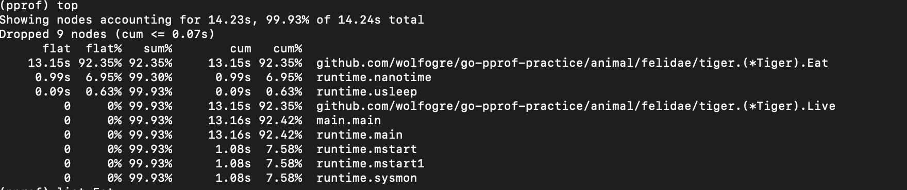

# pprof学习

## Web上使用pprof

- 只需要import`_ "net/http/pprof"`即可
- 可以在网页上打开`http://localhost:9876/debug/pprof`
- 可以输入`http://localhost:9876/debug/pprof/profile`来下载profile文件，然后通过命令`go tool pprof test profile`来打开文件
  - top指令 可以获取占用前10 的数据（cpu）
    
    
    
    - **flat、flat%** 表示函数在 CPU 上**运行的时间**以及**百分比**
    - **sum%** top命令当中**排在它上面的函数以及本函数的flat%之和**
    - **cum、cum%**表示该**函数在调用堆栈时采用的时间，包括等待子函数的返回的时间**，因此cum >= flat
    
  - Web 可以在网页上看到图形化的界面
  
  - List 函数源码行粒度进行分析
- 或者使用`go-torch`工具，可以看到火焰图。直接使用`go tool pprof http=: 127.0.0.1:8081 ~/pprof/pprof......` 可以在网页上看到火焰图
  - 火焰图中调用顺序从下往上
  - 图形**越长说明占用CPU时间越长**
  - 每一个方块代表一个函数
  - 上面一层表示当前层调用的函数
- 可以使用`/debug/pprof/heap`来获得程序的内存快照

## 正常程序使用pprof

- 引入`runtime/pprof`

- ```go
  // 生成 CPU 报告
  func cpuProfile() {
  	f, err := os.OpenFile("cpu.prof", os.O_RDWR|os.O_CREATE, 0644)
  	if err != nil {
  		log.Fatal(err)
  	}
  	defer f.Close()
  
  	log.Println("CPU Profile started")
  	pprof.StartCPUProfile(f)
  	defer pprof.StopCPUProfile()
  
  	time.Sleep(60 * time.Second)
  	fmt.Println("CPU Profile stopped")
  }
  
  // 生成堆内存报告
  func heapProfile() {
  	f, err := os.OpenFile("heap.prof", os.O_RDWR|os.O_CREATE, 0644)
  	if err != nil {
  		log.Fatal(err)
  	}
  	defer f.Close()
  
  	time.Sleep(30 * time.Second)
  
  	pprof.WriteHeapProfile(f)
  	fmt.Println("Heap Profile generated")
  }
  ```

  