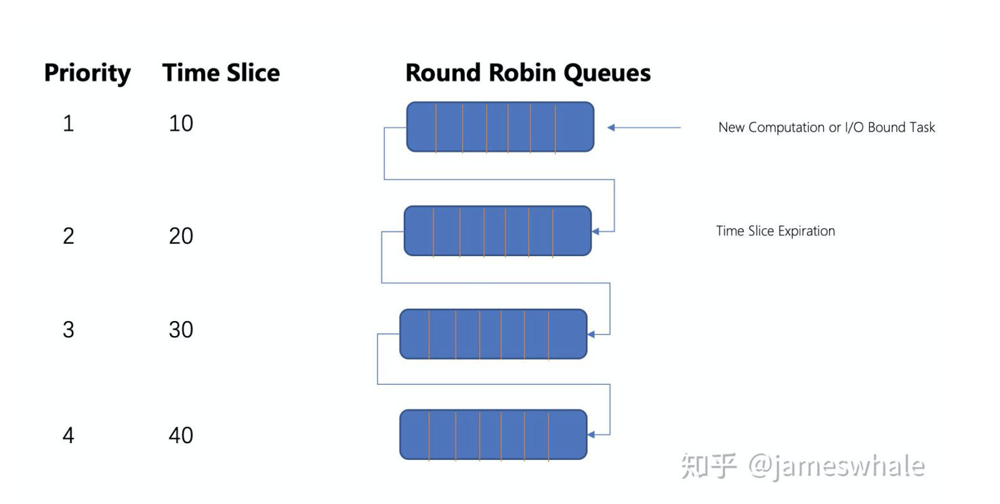
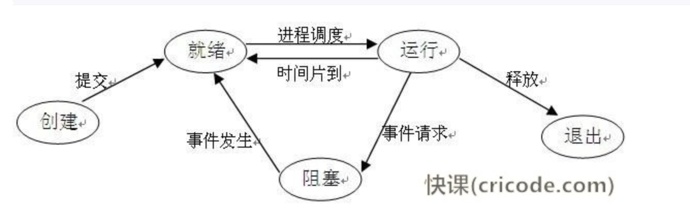

---

+ **用户态和核态**

<!--more-->

---

+ **fork()作用**
  + 调用`fork()`后，会返回两次；一次是返回到父进程(子进程pid)，一次是返回到新创建的子进程(0)，也有可能创建失败返回-1。
  + 每个进程处于相同但是独立的地址空间当中。
  + 内核的工作
    + 分配新的内存块和内核数据结构给子进程
    + 将父进程部分数据结构内容拷贝至子进程
    + 将子进程添加到系统进程表中
    + fork返回开始调度器，调度

---

+ **Select poll epoll的区别**
  + IO多路复用
    + 内核一旦发现进程制定的一个或者多个IO条件准备读取，它就通知该进程。一个进程可以监视多个描述符。一旦某个描述符就绪，就能够通知程序进行相应的读写操作。
  + **fd(file describer)** 文件描述符 形式上是一个非负常量，实际上是一个索引值。 内核利用其来访问文件
  + 三者均为IO多路复用的机制。I/O多路复用就通过一种机制，可以监视多个描述符，一旦某个描述符就绪，就能够通知程序进行相应的读写操作。
  + select poll epoll三者都是同步I/O，因为他们都需要在读写事件就绪后自己负责进行读写，也就是说读写过程是阻塞的。异步I/O则无序自己负责进行读写，异步I/O的实现会负责把数据从内核拷贝到用户空间。
  + select的实现
    + 本质上，select通过设置或者检查存放fd标志位的数据结构来进行下一步处理。select()方法仅仅知道有I/O事件的发生但是并不知道是哪个（可能有多个）流，所以只能无差别的轮询所有的流，找出能够读出的数据，或者写入的数据流。所以select具有O(n)的无差别轮轮询复杂度
    + select的缺点
      + 每次调用select，都需要把fd集合从用户态拷贝到内核态，这个开销在fd很多的时候会很大
      + 同时每次调用select都需要在内核遍历传递进来的所有fd，这个开销在fd很多的时候会很大
      + select支持的文件描述符数量太小了，默认是1024
  + poll的实现
    + 本质上与select无差别，他将用户传入的数据拷贝到了内核空间，然后查询每个fd对应的设备状态，但是他没有最大连接数的限制，因为其用链表实现
    + 缺点
      + 大量的fd的数组被整体复制于用户态和内核地址空间之间，而不管这样的复制是不是有意义的
      + poll还有一个特点是 水平触发， 如果报告了fd后，没有被处理，那么下次poll会在此报告该fd
  + epoll的实现
    + epoll可以理解为event poll。不用与忙轮询与无差别轮询，它会将哪个流发生什么样的I/O进行通知。所以epoll实际上是事件驱动的(每个事件关联上fd)，此时我们对这些流的操作都是有意义的，将复杂度降到了O(1)
    + epoll使用文件描述符管理多个描述符。将用户关系的文件描述符的事件存放到内核的一个事件表中，这样在用户控件和内核空间的copy只需要一次
    + epoll操作需要三个接口
      + `int epoll_create(int size)`
        + 创建一个epoll句柄，size用来告诉内核这个监听的数目一共有多大。并不是限定了epoll所能监听的描述符的最大的个数，而是给内核初始化一个建议。创建好一个epoll句柄后，他就会占用一个fd值，如果不使用需要及时的释放，否则会一直占用。
      + `int epoll_ctl(int epfd, int op, int fd, struct epoll_event *event)`
        + 函数对指定fd进行操作(创建epoll句柄的时候返回的fd值) epfd为epoll_create的返回值
        + op 为操作类型
        + fd为需要监听的fd
        + epoll_event为需要监听的事件
      + `int eoll_wait(int epfd,  struct epoll_event *events, int maxevents, int timeout)`
        + 等待epfd上的IO事件，最多返回maxevents个事件
        + 参数events用来从内核得到事件的集合。maxevents的值不能大于创建epoll_create()时的size，参数timeout是超时时间
        + 该函数用来返回已经处理的事件次数
    + epoll有两种工作模式
      + LT(level trigger)
        + 当epoll_wait()监测到了描述符事件的发生并且将此事件通知应用程序，应用程序可以不立即处理事件，下次调用epoll_wait()，会在此相应应用程序并且通知此事件
      + ET(edge trigger)
        + 当epoll_wait()监测到了描述符事件的发生并且将此事件通知应用程序，应用程序必须立即处理该事件，下次调用epoll_wait()，会在此相应应用程序并且通知此事件
    + 优点
      + 没有最大的并发连接的限制
      + 效率提升，不是轮询，不随着FD数目的增加而效率下降，只有活跃可用的FD才会调用callback函数
      + 内存拷贝，利用mmap()文件映射内存，加速于内核空间的消息传递，即epoll使用mmap减少复制开销

---

+ **虚拟内存作用？内存分页的作用？**
  + 虚拟内存使得应用程序认为他有一片连续的可用的内存空间，但是实际上，其被分割成了多个物理内存，并且还有可能有部分存放在外部的磁盘存储器当中。
  + 内存分页
    + 将物理内存和虚拟内存都分成了页，这样能够大大地减少从虚拟地址映射到物理地址的开销，因为如果单条单条数据的映射，整个的映射表将会变成特别的大，甚至大于整个内存所能容纳的数据大小空间。

---

+ **缺页异常**
  + 出现的情况
    + 非法操作访问越界
      + 空指针与权限问题
    + malloc申请新内存
      + malloc 机制是延时分配内存，当使用 malloc 申请内存时并未真实分配物理内存，等到真正开始使用 malloc 申请的物理内存时发现没有才会启动申请，期间就会出现 Page Fault。
    + 访问数据不在内存中

---

+ **OOM问题和StackOverFlow的区别**
  + OOM问题与堆有关
  + StackOverFlow与栈有关

---

- **Linux中如何查询端口的进程，查当前目录**

---

- **进程与线程与协程**
  - 进程是一个具有一定独立能力的程序在一定数据集上的一次动态执行的过程，是操作系统进行资源分配和调度的一个最基本单位。他是一个动态的概念。
  - 线程是程序执行中一个单一的顺序控制流程，是**程序控制流的最小单位**，是处理器调度和分配的基本单位，一个进程可以拥有一个或者多个线程，**同一个进程所拥有的线程共享分配给进程的内存空间**，**线程拥有自己的堆栈以及局部变量**。
  - 区别：
    - 进程是操作系统进行资源分配和调度的最小单位，而线程是程序执行的最小单位
    - 一个程序可以有多个线程，每个线程相对于代码的不同执行线路
    - 进程之间相互独立，而同一个进程下线程共享一个内存空间
- 协程与线程的区别
  - 协程是一种用户态的轻量线程，**协程拥有自己的寄存器上下文和栈**。协程调度切换时，将寄存器上下文和栈保存到其他地方，切回来的时候，恢复先前保存的寄存器上下文和栈。
  - 协程和线程一样**共享堆**，但是不共享栈，协程由程序员在协程的代码中显式的调度
  - 协程是对**内核透明**的，系统并不知道协程的存在，完全由用户自己的程序进行调度的，所以很难做到强制的将CPU切换到其他的进程/线程，通常只能协作式调度。
- 一个应用程序一般对应一个进程，一个进程一般有一个主线程，还有若干的辅助线程，线程之间是平行运行的，在线程里面开启协程。
- 线程进程都是同步进制，而协程是异步的

---

- **内存模型**
  - 页式存储
    - 内存大小分成各个大小相同的块，块和页大小相等
    - 大小相等
    - 逻辑上相邻的页，物理上不一定相邻(页与块之间意义对应，页是有顺序的，而块一般不这样)
  - 段式存储
    - 大小不相等
    - 空闲链表
  - 现代os通过虚拟内存来管理内存，虚拟内存通过MMU转换成真正的物理内存。
  - 虚拟内存和物理内存的匹配是通过页表实现，页表存储在MMU中
  - 若虚拟内存的页并不在物理内存中，就会发生缺页中断。

---

- **多线程，如何保证子线程结束以后，在结束主线程**
  - go中waitgroup

---

- **Linux top指令**

---

- **内存缺页中断**
  - 通过查询页表的状态位来确定访问的的页面是否加载进了内存当中，当所需要访问的页面没有加载进内存时，就会发生一次缺页中断，将虚拟内存中相应的页加入到内存当中，此时就会发生一次缺页中断。

---

- **进程通信方式**
  - 管道/匿名管道
    - 半双工，数据只能向一个方向流动
    - 只能用于有亲缘关系的进程之间
    - 单独构成了一种独立的文件系统，管道对于管道两端的进程而言，就是一个文件
    - 数据的读出的写入：队列，先进先出
  - 有名管道(FIFO)
    - 匿名管道由于没有名字，只能用于亲缘关系的进程间调度。为了克服这一缺点，提出了有名管道
    - 提供了一个路径名与之相关，以有名管道的文件形式存在于文件系统当中。通过这种方式，即使没有亲缘关系的两个进程，也可以通过访问该路径，就能过彼此通过有名管道通信。
    - 内容存放在内存中，与无名管道一样，先进先出。
  - 信号 Signal
    - 信号是Linux系统中用于进程间互相通信或者操作的一种机制，信号可以在任何时候发给某一进程，而无需知道该进程的状态。
    - 如果该进程当前并未处于执行状态，则该信号就有内核保存起来，知道该进程回复执行并传递给它为止。
    - 如果一个信号被进程设置为阻塞，则该信号的传递被延迟，直到其阻塞被取消是才被传递给进程。
    - 常见的信号：
      - SIGINT ==》 ctrl + c。  程序终止信号
      - SIGKILL ==》kill -9    用户种植进程执行信号‘
    - 信号是软件层次上，对于中断的一种模拟。信号可以在**用户空间进程**和**内核**之间直接交互，内核可以利用信号来通知空间的进程发生了哪些系统事件。信号事件主要有两种来源：
      - 硬件来源：用户按键输入 CTRL + C
      - 软件来源： 终止进程信号，其他进程调用kill函数
    - 生命周期和处理流程
      - 信号被某个进程产生，并设置此信号传递的对象(一般为目标进程对应的pid)，然后传递给操作系统
      - 操作系统根据接受进程的设置(是否阻塞)而选择性的发送给接收者，如果接收者阻塞该信号（且该信号是可以阻塞的），操作系统将暂时保留该信号，而不传递，直到该进程解除了对此信号的阻塞（如果对应进程已经退出，则丢弃此信号），如果对应进程没有阻塞，操作系统将传递此信号。
      - 目的进程接收到此信号后，将根据当前进程对此信号设置的预处理方式，暂时终止当前代码的执行，保护上下文（主要包括临时寄存器数据，当前程序位置以及当前CPU的状态）、转而执行中断服务程序，执行完成后在回复到中断的位置。当然，对于抢占式内核，在中断返回时还将引发新的调度。
  - 消息队列
    - 消息队列是**存放在内核**中的**消息链表**，每个消息队列由消息队列标识符表示。
    - 与管道（无名管道：只存在于内存中的文件；命名管道：存在于实际的磁盘介质或者文件系统）不同的是消息队列**存放在内核中**，只有在内核重启(即，操作系统重启)或者显示地删除一个消息队列时，该消息队列才会被真正的删除。
    - 消息队列允许有一个或者多个进程向他写入或者读取消息
    - 管道和消息队列的通信数据**都是先进先出**的原则。
    - 消息可以实现消息的随机查询，消息不一定要以先进先出的次序读取，也可以按消息的类型读取。
  - 共享内存
    - 使得多个进程可以可以**直接读写同一块内存空间**，是最快的可用IPC形式。是针对其他通信机制运行效率较低而设计的。
    - 为了在多个进程间交换信息，内核专门留出了一块内存区，可以由需要访问的进程**将其映射到自己的私有地址空间**。进程就**可以直接读写这一块内存**而不需要进行数据的拷贝，从而大大提高效率。
    - 多个进程同时使用一块共享内存，需要使用同步机制来完成进程间的同步与互斥
  - 信号量
    - 信号量是一个计数器，用于多进程对共享数据的访问，信号量的意图在于进程间同步。
      为了获得共享资源，进程需要执行下列操作：
      - 创建一个信号量：通常为1，也可以为零
      - 等待一个信号量：P
      - 挂出一个信号量：V
    - PV操作为原子操作，为了保障其正确性。
    - 信号量通常在内核中实现
    - Linux中有三种类型的信号量
      - Posix有名信号量
      - Posix基于内存的信号量
      - SystemV信号量 (内核)
    - 互斥量与信号量的区别
      - 互斥量用于线程的互斥，信号量用于线程的同步。
  - 套接字
    - C/S系统的开发工作既可以在单机上运行，也可以跨网络运行。
    - 套接字是支持TCP/IP的网络通信的基本操作单元，可以看做是不同主机之间的进程进行双向通信的端点，简单的说就是通信的两方的一种约定，用套接字中的相关函数来完成通信过程。

---

- **乐观锁与悲观锁**

  - 悲观锁
    - 总是假设最坏的情况，每次拿数据都认为有人会写数据，所以每次拿数据都会上锁。
  - 乐观锁
    - 总是假设最好的情况，每次去拿数据的时候都认为别人不会修改，所以不会上锁。但是在更新的时候会判断一下此期间别人有没有去更新这个数据。乐观锁更加适用于多读的应用类型，这样可以提高吞吐量。
    - 两种实现方式
      - 版本号机制
        - 一般是在数据表中加上一个数据版本号version字段，表示数据被修改的次数，当**数据被修改**时，version**值会加一**。当线程A要**更新数据值**时，在**读取数据**的同时也会**读取version值**，在提交更新时，若刚才读取到的version值为当前数据库中的version值相等时才更新(即在读取的过程当中，不存在有数据的更新)，否则重试更新操作，直到更新成功。
      - CAS算法实现(compare and swap)
        - 是一种比较有名的无锁算法。无锁编程，即**不使用锁的情况**下实现**多线程之间的变量同步**，也就是在没有线程被阻塞的情况下实现变量的同步，所以也叫**非阻塞同步**（Non-blocking Synchronization）。
        - 涉及到三个操作数
          - V 需要读写的内存值
          - A 进行比较的值
          - B 拟写入的新值
        - 当且仅当V的指等于A时，CAS通过原子方式用新值B来更新V的值，否则不会执行任何操作(比较和替换是一个原子操作)一般情况下是一个自旋操作，会不断的重试。
    - 乐观锁的缺点
      - ABA问题
        - 如果一个变量初次读取的是A值，在准备赋值的时候检查到它仍然是A，但是我们不能够确定他的值是没有被修改过的。可能在这段时间它被修改之后又被改了回来。
      - 循环时间开销大
        - 自选CAS(不成功就一直循环执行直到成功) 如果长时间不成功，会给CPU带来非常大的执行开销。
      - 只能保证一个共享变量的原子操作

- **分布式锁**

  - 在分布式模型下，数据只有一份，此时需要利用锁的技术控制某一时刻修改数据的进程数
  - 与单机模式下的锁不同，进程需要考虑到网络延迟的问题
  - 分布式锁还是可以将标记存在内存，只是该内存不是某个进程分配的内存而是公共内存如 Redis、Memcache。至于利用数据库、文件等做锁与单机的实现是一样的，只要保证标记能互斥就行。
  - 特点
    - 互斥性
      - 和我们本地锁一样互斥性是最基本，但是分布式锁需要保证在不同节点的不同线程的互斥。
    - 可重入性
      - **同一个节点**上的**同一个线程**如果获取了锁之后那么**也可以再次获取这个锁**。
    - 锁超时
      - 支持锁超市，防止死锁
    - 高效，高可用
      - 加锁和解锁需要高效，同时也需要保证高可用防止分布式锁失效，可以增加降级。
    - 支持阻塞和非阻塞
      - 和ReentranLock一样支持lock和trylock以及tryLock
    - 支持公平锁和非公平锁
      - 公平锁的意思是按照请求加锁的顺序获得锁，非公平锁就相反是无序的。这个一般来说实现的比较少。
  - 基于数据库的分布式锁
  - 基于redis的setnx(), expire()方法做分布式锁
    - setnx()
      - setnx的含义就是set if not exists 其主要两个参数setnx(key, value)。该方法是原子的，如果key不存在，则设置当前key成功，返回1，如果key已经存在，则返回0
    - expire()
      - 设置过期时间，要注意的是setnx命令不能设置key的超时时间，只能通过expire()来对key设置
    - 使用步骤
      - setnx(lockkey, 1)如果返回0， 则说明占位失败；如果返回1，则说明占位成功
      - expire()命令对lockkey设置命令时间，为的是避免死锁问题
      - 执行完业务代码后，可以通过delete命令删除key
      - 

  - 基于memcached的分布式锁
  - 基于zookeeper的分布式锁

- **双重锁**

---

- **堆栈的区别**
  - 为什么要堆栈分离，堆栈分离的必要
    - 软件设计的角度，堆代表数据，栈代表了方法
    - 堆栈分离，堆中的内容可以被多个栈所共享。这种好处一方面提供了一种有效的数据交互方式，另一方面，节省了内存空间。
    - 栈因为运行的需要，需要进行址段的划分，因为栈只能向上增长，因此会限制住栈存储内容的能力。而堆大小可以根据需要动态增长，因此堆栈分离使得动态增长成为了可能。
  - 栈是一个后入先出的数据结构
  - 堆是一个树，儿子结点总是比父亲节点大(或者小)
  - 堆与栈是操作系统对进程占用的内存空间的两种管理方式
  - 管理方式不同
    - 栈有操作系统自动分配释放，无需手动操作；堆的申请和释放工作由程序员控制，容易产生内存泄漏
  - 空间大小不同
    - 每个进程拥有的栈的大小要远远小于堆的大小。理论上，曾许愿可以申请的堆大小为虚拟内存的大小，进程栈的大小64bits的Windows默认1MB，64bits的Linux默认为10MB
  - 生长方向不同
    - 堆的生长方向向上，内存地址由低到高，栈的生长方向向下，内存地址由高到低
  - 分配方式不同
    - 堆都是动态分配的，没有静态分配的堆。而栈有静态和动态两种分配方式。静态分配是由操作系统完成的，比如局部变量的分配。动态分配由malloc函数进行分配，但是栈的动态分配和堆是不同的，他的动态分配是由操作系统进行释放，无需我们手工实现。
  - 分配效率不同
    - 栈由操作系统自动分配，会在硬件层级对栈提供支持：分配专门的寄存器存放栈的地址，压栈出栈都有专门的指令执行，这就决定了栈的效率比较高。堆则是由C/C++提供的库函数或运算符来完成申请与管理，实现机制较为复杂，频繁的内存申请容易产生内存碎片。显然，堆的效率比栈要低得多。
  - 存放内容不同
    - 栈存放的内容，函数返回地址、相关参数、局部变量和寄存器内容等。当主函数调用另外一个函数的时候，要对当前函数执行断点进行保存，需要使用栈来实现，首先入栈的是主函数下一条语句的地址，即扩展指针寄存器的内容（EIP），然后是当前栈帧的底部地址，即扩展基址指针寄存器内容（EBP），再然后是被调函数的实参等，一般情况下是按照从右向左的顺序入栈，之后是被调函数的局部变量，注意静态变量是存放在数据段或者BSS段，是不入栈的。出栈的顺序正好相反，最终栈顶指向主函数下一条语句的地址，主程序又从该地址开始执行。而堆中的具体内容由程序员来填充。

---

- **IO多路复用，同步阻塞，非同步阻塞**
  - select，poll，epoll监听多个io对象，当io对象有变化时，就通知用户进程。好处是单个进程可以处理多个socket
  - 同步阻塞
    - 在等待的时候不允许干其他的事情
    - 优点
      - 能够及时的相应数据，没有延迟，方便调试
    - 缺点
      - 需要付出等待的代价
  - 非同步阻塞
    - 优点
      - 相较于阻塞模型，非阻塞不用等待任务，而是把时间花费到其他任务
    - 缺点
      - 导致任务完成的相应延迟增大，每个一段时间才会轮询
  - 多路复用
    - 不需要进程主动的轮询，而是系统通知 (调用select poll epoll)
    - 优点
      - 同时处理多个连接，系统的开销更小，系统不用创建额外的线程或者进程来进行轮询，也不需要维护这些线程和进程的运行，降低了系统的维护工作量，节省了系统资源。
    - 缺点
      - 若连接不高，可能效率也不会比阻塞同步或者非阻塞同步效率高。

---

- **一致性哈希与普通哈希**
  - 在动态变化的Cache环境中，判定哈希算法好坏的四个定义：
    - 平衡性
      - 哈希的结果要尽量的分布到所有的空间当中
    - 单调性
      - 如果有一个写内容通过哈希分配到了相应的缓存当中，又有新的缓存加入到系统中，那么要确保哈希的结果应该能够保证原有已分配的内容可以被映射到原有或者新的缓存当中去，而不会被映射到旧的缓冲区
    - 分散性
      - 在分布式环境中，终端有可能看不到所有的缓冲，而是只能看到其中的一部分。当终端希望通过哈希过程将内容映射到缓冲上时，由于不同终端所见的缓冲范围有可能不同，从而导致哈希的结果不一致，最终的结果是相同的内容被不同的终端映射到不同的缓冲区中。
      - 避免不一致性的发生
    - 负载
      - 负载问题实际上是从另一个角度看待分散性问题。既然不同的终端可能将相同的内容映射到不同的缓冲区中，那么对于一个特定的缓冲区而言，也可能被不同的用户映射为不同 的内容。与分散性一样，这种情况也是应当避免的，因此好的哈希算法应能够尽量降低缓冲的负荷
  - 一致性哈希
    - 将整个哈希空间想象成一个闭环，在加入数据的时候，根据计算出来的哈希值，将数据放在环上对应的位置当中
    - 在一致性哈希算法的分布式集群当中加入新的设备，用设备的ip或者唯一标示作为输入，将计算出来的哈希值插入到圆环的位置当中。然后数据插入的哈希值的位置以顺时针的方向计算，将所有对象存储在离自己最近的机器当中。
    - 节点的删除与添加
      - 普通hash求余算法最为不妥的地方就是在有机器的添加或者删除之后会**造成大量的对象存储位置失效**，这样就大大的不满足单调性
    - 为了满足平衡性，一致性哈希算法引入了虚拟结点。
      - 虚拟节点时实际节点在哈希空间的复制品，一个实际的节点对应了多个虚拟节点，对应的个数即为虚拟个数，虚拟节点在哈希空间以hash值排列
  - 一致性哈希与普通哈希
    - 普通哈希通过求余来计算数据缓存的位置，但是如果增加或者减少了服务器的数量，就需要对所有的缓存进行一次重新的计算，因为除数改了。
    - 而一致性哈希因为其实现的思路，在出现增加或者删除一个服务器的时候，他影响的范围非常的小。

---

- **线程调度**
  - 先进先出算法
    - 按照任务进入队列的顺序，依次调用，执行完一个任务在执行下一个任务，只有当任务结束后才会发生切换
    - 优点
      - 减少任务的切换开销
      - 最大的吞吐量
      - 朴实的公平性
    - 缺点
      - 平均响应时间高
        - 可能一个1000ms后面有一个10ms的任务，会使得10ms的任务等1000ms后才能开始执行
    - 使用场景：任务耗时差不多
  - 最短耗时任务算法
    - 优先调度短的任务，时间指的是距离任务结束所需要的时间
    - 前提
      - 提前知道所有任务的耗时
    - 优点
      - 平均响应时间低
    - 缺点
      - 耗时长的任务可能迟迟无法被调度
      - 频繁的任务切换
    - 使用场景：几乎没有
  - 时间片轮转算法
    - 类似cpu的执行效果，需要频繁的切换任务，导致极大的切换开销
    - 优点
      - 每个任务能够公平的被调度
      - 耗时短的任务即使在时间长的任务后面，也能较快的调度执行
    - 缺点
      - 调度开销大
      - 时间片设计
    - 使用场景
      - 队列中耗时差不多
    - 不适用场景
      - 计算型任务和I/O型的任务混合队列
  - 最大最小公平算法
    - 顾名思义，此算法是为了保证公平性，最初源自通信网络的带宽分配与控制场景。场景举例，某一资源容量为10，现有4个使用方需要使用（A、B、C、D），要求的资源数分别是2、2.6、4、5，需要经过多轮计算:
      - 第一轮分配，4个使用方（A、B、C、D）参与分配，每个平均分得2.5个资源，A只需要使用2，还剩0.5， B、C、D在本轮都不够用，只好被推迟。
      - 第二轮分配，3个使用方（B、C、D）参与分配，分别可获得2.5 + 0.5/3 = 2.6666, B只需要要2.6，则还剩0.06666，可给剩余2个分配，C、D在本来都不够用，只好被推迟。
      - 第三轮分配，2个使用方（C、D）参与分配，分别获得2.5+ 0.5/3 + 0.06666/2 = 2.699999 ， C和D分别获得2.6999。（后面若还有新的资源，则可以分配给C和D，以便能满足他们的诉求）
    - 总结来说，先平均分配，若多的话，再将剩余的给其他人再次平均分配，若不够的话，需要等待
  - MFQ算法(Multi-level Feedback Queue)
    - 
    - 多个level，优先级越低，分片时间越大
    - 高优先级level的任务可以抢占低优先级level任务
    - 新任务首先位于高优先level，当一个时间片用完之后，若任务结束，则正常退出系统，若任务没有结束，则下滑到下一个等级的level，若是因为等待I/O而主动让出CPU处理，则停留在当前level
    - 同一level任务采用Round Robin的算法
    - 为避免系统中太多的I/O导致计算型任务迟迟得不到处理，MFQ会监视每个任务的处理耗时，保证公平的资源分配。在每个level的所有任务，若有任务还没有用完分配给他的资源，则相应提高他的优先级，反之则降低其优先级。

---

- **状态转换**
- 
  
- 执行->阻塞
    - 对就绪状态的进程，当进程调度程序按一种选定的策略从中选中一个就绪进程，为之分配了处理机后，该进程便由就绪状态变为执行状态
  - 就绪->执行
    - 正在执行的进程因发生某等待事件而无法执行，则进程由执行状态变为阻塞状态，如进程提出输入/输出请求而变成等待外部设备传输信息的状态，进程申请资源（主存空间或外部设备）得不到满足时变成等待资源状态，进程运行中出现了故障（程序出错或主存储器读写错等）变成等待干预状态等等
  - 阻塞->就绪
    - 处于阻塞状态的进程，在其等待的事件已经发生，如输入/输出完成，资源得到满足或错误处理完毕时，处于等待状态的进程并不马上转入执行状态，而是先转入就绪状态，然后再由系统进程调度程序在适当的时候将该进程转为执行状态
  - 执行->就绪
    - 正在执行的进程，因时间片用完而被暂停执行，或在采用抢先式优先级调度算法的系统中,当有更高优先级的进程要运行而被迫让出处理机时，该进程便由执行状态转变为就绪状态

---

- **进程的内核态和用户态以及其转变的方式**(todo)
  - 内核态
    - cpu可以访问内存的所有数据，包括设备，例如硬盘，网卡，cpu也可以将自己从一个程序切换到另一个程序
  - 用户态
    - 只能访问受限的内存，不允许访问外围设备，占用cpu的能力被剥夺，cpu资源可以被其他程序获取。
  - 切换
    - 一般的应用程序都是运行在用户态，但是有时候应用程序也需要干一些内核态的事情，例如从硬盘读取数据，或者从键盘获取输入等。
    - 三种方式
      - 系统调用
        - **用户态进程**通过**系统调用申请使用操作系统提供的服务**程序完成工作。例如fork（）就是执行了一个创建新进程的系统调用。系统调用的机制和新是使用了操作系统为用户特别开放的一个中断来实现，如Linux的int 80h中断。
      - 异常
        - 用户态的程序发生了一些没有预知的异常，就会触发当前运行进程切换到处理此异常的内核相关进程中。如缺页中断。
      - 外围设备的中断
        - 当**外围设备完成用户请求的操作**后，会向**CPU发出相应的中断信号**，这时CPU会暂停执行下一条即将要执行的指令而转到与中断信号对应的处理程序去执行，如果前面执行的指令时用户态下的程序，那么转换的过程自然就会是 由用户态到内核态的切换。如硬盘读写操作完成，系统会切换到硬盘读写的中断处理程序中执行后边的操作等。

---

- **死锁的原因，如何避免**(todo)
  - 互斥: 一个资源只能够被一个进程占用
  - 请求与保持: 保持现有资源的情况下，请求下一个资源
  - 循环等待:  若干进程形成一种头尾相接的循环等待资源关系。
  - 不可剥夺: 进程在未使用完当前资源时，不会释放

---

- **Linux查看端口**

