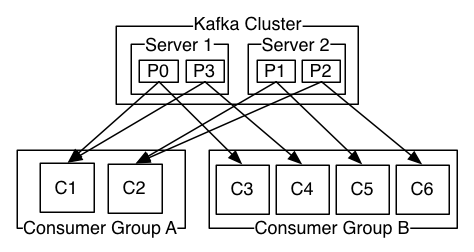

- k8s

  - 基本控件
  - 通信
- nginx 为什么要取redis的缓存
- guava chache实现原理
- **deployment和pod区别**

---

- **go服务发布线上后，发现内存泄漏，该怎么处理**

  ---

- **kafka**

  - 
  - 目标
    - 为处理实时数据提供一个统一，高吞吐，低延迟的平台。是分布式发布-订阅信息系统，是一个分布式的，可划分的，冗余备份的持久性的日志服务。
  - 基本概念
    - 以一个消息队列的形式，生产者将数据一个一个往里面放，消费者一个一个从里面取出来。
    - 提供以Pub/Sub方式的海量消息处理
    - 作为集群运行在一个或者多个服务器上
    - 集群存储的信息以topic为类别记录
    - 存储的信息为k-v键值对，k是offset偏移量，v就是信息的内容
    - topic:将信息分门别类，每一类信息是一个topic
    - broker:已发布的信息保存在一组服务器中，称之为kafka集群。集群每一个服务器都是一个代理(Broker)，消费者可以订阅一个或者多个主题(Topic)，并从Broker拉数据，从而消费这些信息。
    - 消息：kafka会保存小心知道他过期，无论是否被消费
    - producer：发布消息的对象，往某个topic中发布消息，也负责发布到topic中的那个分区
    - consumer:订阅消息并且处理发布的消息的对象
    - patition:topic是逻辑上的概念，patition是物理概念。每个topic包含一到多个partition
  - 
    - 每个分区都是按顺序的，不可变的消息队列，并且可以持续添加，producer生产的消息都会append到队列的末尾，而不是随机读写的。分区中的消息都会被分了一个序列号，这个序列号在分区内是唯一的，也就是分区内的偏移量。
  - 如何消费
    - kafka的生产者没有保持消息消费的顺序，消费的顺序是通过**偏移量**交给消费者的，消费者持有的元数据就是消息的offset，消费者通过控制offset的移动来决定读取哪里的消息。正常情况下，当消费者消费消息的时候，偏移量是线性增长的。如果消费者想要重新读取数据的时候，就需要将偏移量向前移动。
  - 如何保证分布式和冗余备份
    - 分区被分布到集群中的各个服务器中，每个服务器处理它所拥有的分区。根据配置，每个分区还可以复制到其他服务器作为备份容错。每个分区拥有一个leader，有一个或者多个follower（冗余备份的）。一个broker可以是一个分区的leader,同时也可以是别的分区的follwer，避免了所有的请求只让一个或者几个服务器处理，负载均衡。
      某个broker如果是一个分区的leader，那么它处理这个分区上的所有读写请求，而follwer分区被动的复制数据。如果leader宕机，则follwer就可以被推举为leader。

  - consumer和topic的关系
    - 
    - 该kafka集群存在两个broker(左右Server1与Server2)，而有两个消费者集群A(C1 + C2)与B(C3 + C4 + C5 + C6)。每个patition只能被一个消费者集群中的一个消费者消费。比如P0，P3等等。因为偏移量的唯一值是机遇一个分区内的，producer生产的信息按照一定的算法分配到不同的分区，在各个分区内部，偏移量都是线性增长的，所以在一个分区内消费消息都是可以保持顺序的。但是如果topic里有多个partition的话，那么不能保证全局的消息是顺序的。

  ---

  - **如何对目前的系统做到微服务架构，如何进行服务的拆分，拆分的规则是什么**

  - **微服务的架构，框架的实现，服务治理，分布式一致性的问题**
