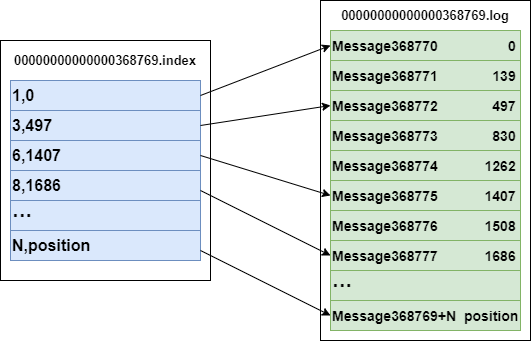

## nginx

### 1介绍

- nginx是一个开源，高效，高可靠的Web和反向代理服务器。
- 使用场景
  - 静态资源服务：通过本地文件系统提供服务
  - 反向代理服务：衍生出包括缓存，负载均衡
  - API服务：OpenResty

### 2相关概念

#### 2.1简单请求和非简单请求

- 简单请求
  - 只发送一次
- 非简单请求
  - 发送两次，第一次询问允许的请求方法，头信息字段，域名是否在服务器许可名单内。

#### 2.2跨域

- 浏览器上当前访问的网站想另一个网站发送请求获取数据的过程。

#### 2.3正向代理和反向代理

- **正向代理**
  - 一般的访问流程是客户端直接向目标服务器发送请求并获取内容，使用正向代理后，**客户端改为向代理服务器发送请求**，并指定目标服务器（原始服务器），然后**由代理服务器和原始服务器通信**，转交请求并获得的内容，再返回给客户端。**正向代理隐藏了真实的客户端**，为客户端收发请求，使真实客户端对服务器不可见；
- **反向代理**
  - 与一般访问流程相比，使用反向代理后，直接**收到请求的服务器是代理服务器**，然后将请求转发给内部网络上真正进行处理的服务器，得到的结果返回给客户端。**反向代理隐藏了真实的服务器**，为服务器收发请求，使真实服务器对客户端不可见。一般在处理跨域请求的时候比较常用。现在基本上所有的大型网站都设置了反向代理。

#### 2.4负载均衡

#### 2.5动静分离

- 为了加快网站的解析速度，可以把动态页面和静态页面由不同的服务器来解析，加快解析速度，降低原来单个服务器的压力。

Nginx是master-worker模式：**对每个master控制着多个worker**，对于**每一个worker**可以同时处理多个请求。

---

- **go服务发布线上后，发现内存泄漏，该怎么处理**

  ---

- **kafka**

  - 
  - 目标
    - 为处理实时数据提供一个统一，高吞吐，低延迟的平台。是**分布式发布-订阅信息系统**，是一个分布式的，可划分的，冗余备份的持久性的日志服务。
  - 基本概念
    - 以一个消息队列的形式，**生产者将数据一个一个往里面放，消费者一个一个从里面取出来**。
    - 提供以**Pub/Sub方式的海量消息处理**
    - 作为**集群运行在一个或者多个服务器**上
    - 集群存储的信息**以topic为类别记录**
    - **存储的信息为k-v键值对**，**k是offset偏移量，v就是信息的内容**
    - topic:将信息分门别类，**每一类信息是一个topic**
    - broker:已发布的信息保存在**一组**服务器中，称之为kafka**集群**。集群**每一个服务器都是一个代理(Broker)**，消费者可以**订阅一个或者多个主题(Topic)**，并从Broker拉数据，从而消费这些信息。
    - 消息：kafka会保存消息直到他过期，无论是否被消费
    - producer：发布消息的对象，往某个topic中发布消息，也负责发布到topic中的那个分区
    - consumer:订阅消息并且处理发布的消息的对象
    - patition:**topic是逻辑上的概念**，patition是物理概念。**每个topic包含一到多个partition**
    - 
    - 每个**分区都是按顺序**的，不可变的消息队列，并且**可以持续添加**，producer生产的消息都会**append到队列的末尾**，而不是随机读写的。分区中的消息都会**被分了一个序列号**，这个序列号**在分区内是唯一**的，也就是分区内的偏移量。
  - **如何消费**
    - kafka的**生产者没有保持消息消费的顺序**，消费的顺序是通过**偏移量**交给消费者的，消费者**持有的元数据就是消息的offset**，消费者通过**控制offset的移动来决定读取哪里的消息**。正常情况下，当消费者消费消息的时候，偏移量是线性增长的。如果消费者想要重新读取数据的时候，就需要将偏移量向前移动。
  - **如何保证分布式和冗余备份**
    - 分区被分布到集群中的各个服务器中，每个服务器处理它所拥有的分区。根据配置，**每个分区还可以复制到其他服务器**作为备份容错。**每个分区拥有一个leader**，有一个或者多个follower（冗余备份的）。**一个broker可以是一个分区的leader,同时也可以是别的分区的follwer**，**避免了所有的请求只让一个或者几个服务器处理**，负载均衡。
      某个broker如果是一个分区的leader，那么它处理这个分区上的所有读写请求，而follwer分区被动的复制数据。如果leader宕机，则follwer就可以被推举为leader。
  - **consumer和topic的关系**
    - 
    - 对于一个消费组，一个分区（Partition）只能被消费组当中的一个消费者消费（有序性）。如果消费者数量大于分区数量的话，则多余的消费者将无法消费。因此消费者的数量应该小于等于分区的数量。
  - **分区副本(partition replicas)**
    - 副本数一般小于等于Brokers的数量。一般会保证每一个Broker都会有一个分区的副本。
    - 消费者与生产者直接与leader交互。follower只负责数据的同步。
    - ISR（in-sync-replicas）处于同步状态的副本。
    - follower通过pull方式获取更新。（主动）
  - **Segment文件**
    - 
    - 一个partition由多个segment文件组成。包含有.log文件以及.index文件（采取稀疏索引，并不会记录所有的信息的索引）。.log 文件包含了具体的待消费信息。.index文件则存储了这些消费信息在.log文件当中的索引。
  - **磁盘拷贝细节**
    - 一般从文件到socket的路径
      - 将数据从磁盘写入内核空间页缓存中
      - 应用将数据从内核页缓存读入用户空间缓存
      - 应用将数据写回到内核的socket缓存当中
      - 操作系统将数据从内核socket缓存写入到网卡缓存当中。
    - Kafka 使用Linux系统提供的`sendFile()`
      - 操作系统直接讲数据从页缓存发送到网络上。
      - 将数据从磁盘写入内核空间的页缓存当中
      - 然后操作系统直接讲数据从内核写入到网卡缓存当中。
  - **Zookeeper在kafka中的作用**
    - 任何一个Broker都有可能成为Controller， 这将由ZK来保证。
      - Controller的作用
        - Broker的上下线处理。
        - 新创建的topic或者已有的topic的分区扩容，处理分区副本的分配，leder的选举。
        - topic的删除，副本迁移，leader的切换。
        - 管理所有副本的状态机，处理状态机的变换事件。
      - Broker启动的时候，会尝试去ZK创建controller节点，第一个创建该节点成功的Broker将成为Controller。
    - Broker注册，每个Broker会在zk当中保存一个临时节点，里面会存储对应broker的ip以及端口信息。根路径为/brokers/ids/${brokerid}
    - Topic信息，每个topic的分区信息以及相关的broker分布情况都会保存在zk当中。根结点路径为/brokers/topics，每个topic都会在topics下创建独立的子节点，每个子节点会包含分区以及broker的相应的信息。
    - partition信息，/brokers/topics/${topic}/partitions/[0..N]
    - Controller epoch, 该值为一个数字，每次新选举一个controller， 该值就会加一
    - controller 注册信息，注册controller所在的broker信息
    - 生产者负载均衡：当Broker启动时，会注册该Broker的信息，以及可订阅的topic信息。生产者通过注册在Broker以及Topic上的watcher动态的感知Broker以及Topic的分区情况，从而将Topic的分区动态的分配到broker上.
    - 消费者：kafka有消费者分组的概念，每个分组中可以包含多个消费者，每条消息只会发给分组中的一个消费者，且每个分组之间是相互独立互不影响的。Consumer注册信息:
      每个consumer都有一个唯一的ID(consumerId可以通过配置文件指定,也可以由系统生成),此id用来标记消费者信息./consumers/[groupId]/ids/[consumerIdString]是一个临时的znode,此节点的值为请看consumerIdString产生规则,即表示此consumer目前所消费的topic + partitions列表.
    - 消费者与分区的对应关系:对于每个消费者分组，kafka都会为其分配一个全局唯一的Group ID,分组内的所有消费者会共享该ID,kafka还会为每个消费者分配一个consumer ID,通常采用hostname:uuid的形式。在kafka的设计中规定，对于topic的每个分区，最多只能被一个消费者进行消费，也就是消费者与分区的关系是一对多的关系。消费者与分区的关系也被存储在zookeeper中节点的路劲为 /consumers/[group_id]/owners/[topic]/[broker_id-partition_id],该节点的内容就是消费者的Consumer ID
    - 消费者负载均衡:消费者服务启动时，会创建一个属于消费者节点的临时节点，节点的路径为 /consumers/[group_id]/ids/[consumer_id],该节点的内容是该消费者订阅的Topic信息。每个消费者会对/consumers/[group_id]/ids节点注册Watcher监听器，一旦消费者的数量增加或减少就会触发消费者的负载均衡。消费者还会对/brokers/ids/[brokerid]节点进行监听，如果发现服务器的Broker服务器列表发生变化，也会进行消费者的负载均衡

  ---

  - **如何对目前的系统做到微服务架构，如何进行服务的拆分，拆分的规则是什么**

  

  # 微服务架构

  ## 服务描述

  - RPC Server
    - 启动的时候，根据发布文件中的配置信息，向Registry注册自身服务，并且向Registry定期发送心跳回报存货状态。
  - RPC Client
    - 在启动时，根据服务引用文件中的配置信息，向Registry订阅服务，把Registry返回的服务节点列表缓存本地内存中，并与RPC Server建立连接。
  - Registry
    - RPC Server节点发生变更时，Registry会同步变更。RPC Client感知后会刷新本地内存中缓存的服务节点列表。
    - 提供主要API
      - 服务注册
      - 服务注销
      - 心跳
      - 服务订阅
      - 服务变更查询
      - 服务查询接口
      - 服务修改接口
    - 集群部署
      - 作为中间者，需要维护其稳定性
    - 白名单
    - 服务状态健康检查
    - 服务状态变更通知

  ## 服务框架

  - 基于何种网络通信协议进行数据传输，TCP / HTTP
  - 基于何种方式进行数据传输，同步还是异步，单链接还是多链接
  - 数据采用什么方式进行编码以及压缩：JSON，Protobuf

  ## 服务监控

  - 一旦服务消费者与服务提供者之间能够正常发起服务调用，你就需要**对调用情况进行监控**，以了解服务是否正常。一般包括三个流程：
    - **指标收集**
      - 就是要把每一次服务调用的请求耗时以及成功与否收集起来，并上传到集中的数据处理中心
    - **数据处理**
      - 有了每次调用的请求耗时以及成功与否等信息，就可以计算每秒服务请求量、平均耗时以及成功率等指标
    - **数据展示**
      - 需要以友好的方式对外展示，才能发挥价值。通常都是将数据展示在Dashboard面板上，并且每隔10s等间隔自动刷新，用作业务监控和报警等。

  ## 服务追踪

  - 由于微服务的调用链比较的复杂，所以就需要**trace服务调用链**
    - 在服务消费者发起调用前，会在本地**按照一定的规则生成一个request id**，发起调用后，requestid**当作请求参数的一部分，传递给服务提供者**。
    - 服务提供者接收到请求后，**记录下本次请求request id**，然后处理请求，如果服务提供者继续请求其他服务，会在本地**再生成一个自己的request id**，然后将**两个request id同时继续向下传递**。

  ## 服务治理

  保证服务再出现问题的时候能够正常的运作

  - **节点管理**
    - 问题出现原因：1⃣️服务方自身原因，服务宕机，重启，自身bug。2⃣️调用链上的网络问题。
    - 解决方法：
      - **注册中心主动摘除机制**
        - 要求服务定时汇报心跳，若隔**一定的时间没有收到心跳**，则认定服务出现问题，并且**把节点从集群中找出，并且把最近可用的服务节点列表推送给服务消费者**。
      - **服务消费摘除机制**
        - 如果出现网络问题，按照注册中心主动摘除机制可能会将所有的节点下掉，导致服务调用方没有可用的服务节点调用。将存活探测机制用到服务消费者方更为的合理，如果**服务消费者调用服务提供者节点失败，则将节点从内存中保存的可用服务提供者节点列表中移除**。
  - **负载均衡**
    - 随机
    - 最少活跃
    - 一致性Hash
    - 轮询
  - **服务路由**
    - 对于服务的消费方，可以**选择内存中的那个服务节点列表不仅仅由负载均衡决定**，**还由路由规则**确定。
    - 服务路由出现的原因：
      - **灰度发布的要求**
      - 多机房**就近访问的需求**
        - 机房之间可能相隔的物理距离太大，导致的时间延迟可能对于对时间比较敏感的服务调用方不能接受，所以尽量的将服务调用选择在用一个IDC内部的节点。
    - 服务路由配置的方法
      - 静态配置
      - 动态配置
        - 路由规则在注册中心，服务消费者需要定时请求保持同步。
  - **服务容错**
    - 需要有手段自动恢复服务，保证调用的成功
    - 常用的手段
      - **FailOver**：**失败自动切换**。就是服务消费者发现调用失败或者超时后，自动从可用的服务节点列表总选择下一个节点**重新发起调用**，也可以设置重试的次数。这种策略要求服务调用的操作必须是**幂等**的，也就是说无论调用多少次，只要是同一个调用，返回的结果都是相同的，一般适合服务调用是读请求的场景。
      - **FailBack**：**失败通知**。就是服务消费者调用失败或者超时后，**不再重试**，而是**根据失败的详细信息，来决定后续的执行策略**。比如对于**非幂等**的调用场景，如果调用失败后，不能简单地重试，而是应该查询服务端的状态，看调用到底是否实际生效，如果已经生效了就不能再重试了；如果没有生效可以再发起一次调用。
      - **FailCache**：**失败缓存**。就是服务消费者调用失败或者超时后，**不立即发起重试**，**而是隔一段时间后再次尝试发起调用**。比如后端服务**可能一段时间内都有问题**，如果立即发起重试，可能会加剧问题，反而不利于后端服务的恢复。如果隔一段时间待后端节点恢复后，再次发起调用效果会更好。
      -  **FailFase**：**快速失败**。就是服务消费者调用一次失败后，**不再重试**。实际在业务执行时，**一般非核心业务的调用，会采用快速失败策略**，调用失败后一般就**记录下失败日志就返回**了。

# Consul

## 介绍

Consul是基于GO语言开发的开源工具，是一个服务网格（微服务间的 TCP/IP，负责服务之间的**网络调用**、**限流**、**熔断和监控**）解决方案，它是一个分布式的，高度可用的系统，它提供了一个功能齐全的控制平面，其中包括：服务发现、健康检查、键值存储、安全服务通信、多数据中心。

## Consul特性

### 基础特性

- **服务注册/发现**
  - 类似于RPC框架当中的**Registry**
- **数据强一致性保证**
  - 采用了**一致性算法Raft**来保证**服务列表数据**在**数据中心中各Server下的强一致性**，这样能保证同一个数据中心下不管某一台Server Down了，**请求从其他Server中同样也能获取的最新的服务列表数据**。数据强一致性带来的副作用是当数据在同步或者**Server在选举Leader过程中，会出现集群不可用**。
- **多数据中心**
  - 多个数据中心之间通过Gossip协议进行数据同步。
- **健康检查**
  - 支持硬件资源方面的检查
- **Key/Value存储**
  - Consul支持Key/Value存储功能，可以将Consul作为配置中心使用，可以将一些公共配置信息配置到Consul，然后通过Consul提供的 HTTP API来获取对应Key的Value。

### 工作原理

- **服务注册方式**
  - API/ JSON
- **服务发现的方式**

# ETCD

## 主要功能

- 基于key-value存储
- 监听机制
- key的过期以及续约机制，用于监控和服务发现
- 原子CAS和CAD，用于分布式锁和leader选举

## ETCH基于RAFT的一致性

- 初始启动时，节点处于 **follower** 状态并被设定一个 **election timeout**，如果在这一时间周期内没有收到来自 **leader 的 heartbeat**，节点将**发起选举**：将**自己切换为 candidate** 之后，**向集群中其它 follower 节点发送请求**，**询问其是否选举**自己成为 leader。
- 当收到来自集群中过**半数节点的接受投票**后，节点即成为 leader，**开始接收保存 client 的数据并向其它的 follower 节点同步日志**。如果**没有达成一致**，则 candidate **随机选择一个等待间隔（150ms ~ 300ms）再次发起投票**，得到集群中**半数以上 follower 接受的 candidate 将成为 leader**
- leader 节点依靠**定时向 follower 发送 heartbeat 来保持其地位**。
- 任何时候如果其它 follower 在 election timeout 期间都没有收到来自 leader 的 heartbeat，同样会将自己的状态切换为 candidate 并发起选举。每成功选举一次**，新 leader 的任期（Term）都会比之前 leader 的任期大 1。**

## ETCD ｜｜ Zookeeper ｜｜ Consul

- Etcd 和 Zookeeper **提供的能力非常相似**，都是通用的一致性元信息存储，都提供 watch 机制用于变更通知和分发，也都**被分布式系统用来作为共享信息存储**，在软件生态中所处的位置也几乎是一样的，可以互相替代的。二者除了实现细节，语言，一致性协议上的区别，最大的区别在周边生态圈。Zookeeper 是 apache 下的，用 java 写的，提供 rpc 接口，最早从 hadoop 项目中孵化出来，在分布式系统中得到广泛使用（hadoop, solr, kafka, mesos 等）。Etcd 是 coreos 公司旗下的开源产品，比较新，以其简单好用的 rest 接口以及活跃的社区俘获了一批用户，在新的一些集群中得到使用（比如 kubernetes）。虽然 v3 为了性能也改成二进制 rpc 接口了，但其易用性上比 Zookeeper 还是好一些。etcd主要是一个用于存储关键数据的键值存储，后者是一个用于管理配置的中心化服务。
- 而 Consul 的目标则更为具体一些，Etcd 和 Zookeeper 提供的是分布式一致性存储能力，具体的业务场景需要用户自己实现，比如服务发现，比如配置变更。而 Consul 则以服务发现和配置变更为主要目标，同时附带了 kv 存储。

---

# Zookeeper

Zookeeper 是一个分布式应用程序协调服务。

- **Leader**
  - 一个zk集群只有一个leader
  - 所有写操作只能由leader来完成。当有写入操作时，leader会广播该操作，当超过半数的follower接受了该操作，则该写请求会被提交。
- **Follower**
  - follower可以接受读请求，并且会将写请求重定向到leader中。
- **Observer**
  - 无投票权。
  - 可接受Client的链接，并且将写请求转发到leader节点。防止集群Server过多，投票时延过长。

-  **ZAB（zookeeper atomic broadcast）**
  - 依赖于Paxos协议
  - 确保所有在Leader上提交的写事物会被所有的结点提交。
  - 确保在Leader上所有的提出但是没提交的写事物会被丢弃。

- 应用场景
  - **数据发布与订阅**
    - 一般用于配置管理。能够保证所有的订阅者看到的都是同一个视图。
    - kafka中的index管理就可以用于zookeeper
  - **分布通知/协调**
    - 检测系统与被检测系统之间不直接关联，实现了解耦。
  - **分布式锁**
    - zk保证了数据的强一致性。zk集群上的任意一个节点上的数据一定是相同的。
    - 保持独占：将zk中的一个节点当成一个锁。通过创建znode的方式来实现，只有一个客户端能够成功创建该锁并且占有。
  - **集群管理**