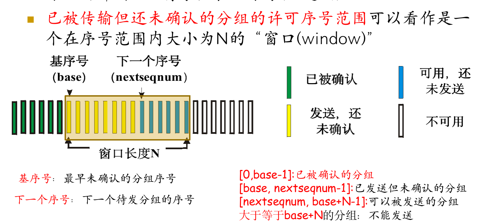
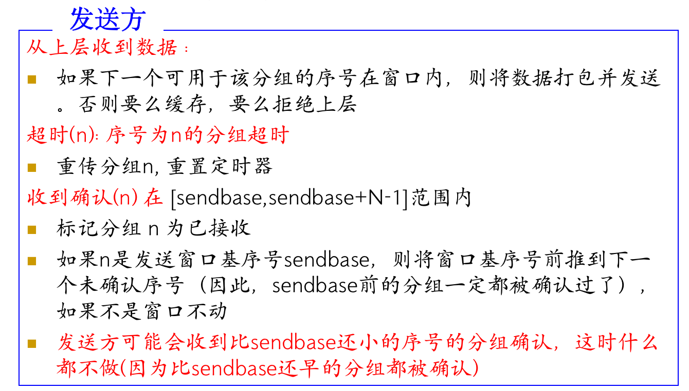
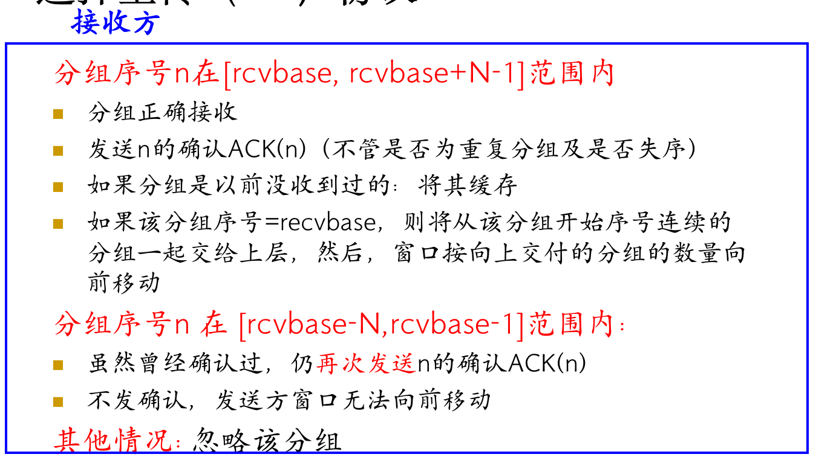
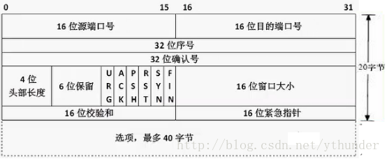
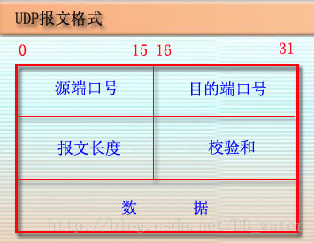

---

+ **TCP/IP模型，OSI模型**

---

+ **应用层，传输层，网络层常见的协议**
  + DNS
  + HTTP
  + FTP
  + STMP
  + SSL
  + TCP
  + UDP
  + ARP
  + IP

<!--more-->

---

+ **TCP三次握手，TCP四次挥手**

  + 为什么三，不是二？

    两次**可能**会出现**建立多个链接**的情况。例如发送方因为各种原因**没有收到**接收方的确认报文，则会**再次**向接收方发送connection请求，但是这时**上一次发送的确认报文**又被发送方收获，同时接收方相应第二次的连接请求，再次建立一个Tcp Connection。而三次握手则可以很好的避免该情况发生。

  + 四次挥手的具体内涵

    + 第一次：**客户端通知服务器**关闭链接，发送包，其中FIN = 1，seq = x.
    + 第二次：**服务器给客户端发送确认包**，表示**收到请求**，但是并**没有准备好**关闭链接 ACK = 1，ACKnum = x + 1.
    + 第三次：**服务器给客户端**发送**连接关闭请求**，FIN = 1,seq = y.
    + 第四次：客户端**收到服务端关闭连接响应**，发送确认包。其中ACK = 1，ACKnum = y + 1服务器收到确认后，关闭连接。客户端在**等待固定时间**没有收到重传报文后，自己也关闭连接。

---

- **time wait && close wait**
  - time wait： 主动关闭
    - 第四次挥手的ACK丢失，当到时间后2MSL，服务端主动断开连接。
    - 要等待2MSL才释放的原因是：防止关闭了第一次的连接后，有相同的五元组连接建立后。第一次断连的请求会干扰第二次建连的连接。2MSL可以确认报文完全被响应or丢弃。
  - close wait： 被动关闭
    - 第一次收到客户端的断连请求。发送ack后会转换为close_wait状态。如果太多的close_wait状态意味着服务器自己没有断开连接。

---

+ **TCP可靠性**

  + ARQ

    自动重传请求

  + 流量控制

    + 防止**接收方**从**缓冲区读取数据**速度慢
    + 控制发送方发送速率，防止接收方缓存溢出

  + 拥塞控制

    + 非正式定义：过多源发送过多数据，**超过网络的处理能力**

    + 不同于流量控制：会产生丢包(**路由器缓冲区溢出**)，延时长(**路由器缓冲区排队**)

    + TCP拥塞控制算法：

      + 慢启动：

        建立连接时，**ConWin = 1 MSS**。而**可用宽带 >>> 1 MSS** 以指数的速度增加发送速率，直到发生一个丢包发生为止。

      + 乘性减：

        发生丢包事件以后，ConWin **大小减半**，**门限值**设置为**当前ConWin的一半**。

      + 加性增：

        窗口**增大到门限值**以后，**线性增大**。

  + 校验和

    TCP报文拥有校验和的字段，用于校验报文端是否出错

---

+ **输入URL显示主页的过程l**
  + DNS解析URL，返回对应IP
  + 主机与对应IP服务器创建TCP链接
  + 发送HTTP请求报文
  + 服务器解析HTTP请求报文，并且发送HTTP相应
  + 接收方收到HTTP响应，并且渲染页面
  + 断开TCP链接

---

+ **HTTPS和HTTP区别**
  + HTTPS协议是SSL + HTTP协议构建的可进行加密传输，身份认证的网络协议，相较于HTTP协议更加的安全。
  + 端口号不同前者443，后者80
  + HTTPS需要到CA申请证书，一般免费的证书比较少，所以需要一定的费用
  + HTTP是明文传输，而HTTPS具有安全性的ssl的加密传输

---

+ **Cookie和Session的区别**
  + Cookie保存在客户端而Session保存在服务器端。
  + Cookie相对比较不安全，可以被分析然后用来Cookie诈骗。而Session相对来说更加的安全可靠。
  + Session由于存放在服务器端，当访问多时，影响服务器的性能。
  + 由于服务器存在着负载均衡，所以存在在访问完一个服务器以后，下一个操作请求到了另一台服务器Session就会消失。
  + 单个Cookie的大小限制是3K。

---

- **cookie session jwt**
  - cookie与token存放在客户端，而session存放在服务端
  - cookie
    - 优点
      - 简单
      - 数据持久
    - 缺点
      - 大小受限制
      - 不安全，直接裸露在浏览器中
      - 容易被csrf攻击
  - session
    - 优点
      - 存放在服务端，比较安全
      - 方便管理
    - 缺点
      - 增大服务端开销
      - 大部分的session基于cookie进行用户识别，cookie被截获的话，用户就会很容易收到跨站请求伪造的攻击
      - 如果是在分布式的机器上，负载均衡会导致session的重复申请
  - JWT(Json Web Token)
    - 优点
      - 通用
      - 有payload，可以存放业务相关的数据信息
      - 构成简单，占内存小，适合传输
      - 不需要在服务端保存
    - 缺点
      - token有效期为一小时
      - 用户主动注销

---

+ **HTTP1.0和HTTP1.1和HTTP2.0的区别**

  + HTTP1.0与HTTP1.1之间的区别

    + 长连接

      1.0默认短链接，1.1默认的长连接

    + 节约带宽

      1.0请求资源时，只能请求**资源的所有**，而对于1.1，他能够**请求资源的部分**

    + 缓存处理

    + 错误状态响应码不同

    + HOST域

      1.0默认一台主机只有一个IP地址，不需要添加hostname字段，而随着虚拟机技术的发展，一台物理机就可以对应了多台虚拟机，可以通过hostname指定虚拟机，若不指定虚拟机则会报错。

  + HTTP1.1与HTTP2.0的区别

    + 多路复用

      1.x采用keep alive 字段来解决复用TCP的问题，但是仍然存在着请求阻塞的问题。一条连接只能对应一个请求。而对于2.0，TCP链接**可以并发的发起多个请求**，且每个**请求以stream的方式传输**，每个stream有唯一的标识。

    + 数据压缩

      + 2.0支持header的压缩，而1.1不支持
      + 客户端和服务端追踪存储发送过的header，类似于map
    
    + 服务器推送
    
      服务器会顺便把一些客户端**需要的资源一起推送给客户端**，免得客户端再次创建链接发送请求到服务器端获取，方便获取各种静态资源。
    
    + 编码
    
      + 2.0采用二进制编码，而1.*采用的是文本格式。
    
  + HTTP3.0和HTTP2.0的区别
  
    + 弃用TCP，该用基于UDP协议的QUIC协议。
      + 解决的问题：由于HTTP2.0在一个TCP连接上进行多路复用，收到TCP拥塞控制的影响，少量的丢包会导致整个TCP连接上的所有流被阻塞。
    + QUIC协议（快速UDP网络连接）
      + 不需要建立连接
      + 

---

- **HTTP报文的结构**
  - HTTP请求报文
    

    - HOST：访问服务器的IP或者域名
    - User-Agent：发出请求应用名称
    - Connection：链接的相关属性
    - Accept-Charset：通知服务器可发送的编码方式
    - Accept-Encoding：通知服务器可发送的解码方式
    - Accept-Language：通知服务器可以发送的语言
  - HTTP响应报文
    - Server:服务器应用软件所使用的名称和版本
    - Conntent-Type:响应正文的类型
    - Content-Length:响应正文的长度
    - Content-Charset:响应正文的编码方式
    - Content-Encoding:响应正文的压缩方式
    - Content-Language:响应正文的语言

---

+ **get 和post的区别**
  + 参数传递
    + GET通过URL传递
    + POST通过main body传递
  + 刷新
    + GET用于**获取资源**，不改变资源的状态，**具有幂等性**。
    + POST用于**创建资源**，**不具有幂等性**，两次相同的POST请求会在服务器端创建两份资源，他们具有不同的URI。
  + 缓存问题
    + GET在浏览器中缓存。
    + POST在浏览器中不缓存
  + 安全性
    + POST比GET安全，因为GET方法所需要请求的内容的参数会暴露在URL上、
  + 理解上
    + GET为向服务器请求，例如请求baidu.com的主页面，具有幂等性，你每次请求都能得到相同的页面，但是GET也可以发送表单数据以获取新的WEB页面如搜索引擎,你可以在每次搜索之后看到URL之后带有大串的参数。
    + POST更多的是进行交互

---

+ **常见的状态码**
  + 200 OK
  + 301 Moved Permanently：请求的对象已经被移动了位置，新的位置会在报文当中说明
  + 400 Bad Request: 服务器不懂请求报文
  + 403 服务器拒绝提供服务
  + 404 Not Found: 服务器找不到请求对象
  + 505 HTTP Version Not Supported:服务器不支持请求报文使用的HTTP协议版本

---

- **ISO七层协议**

  - 应用层

    这一层为**操作系统**或网络应用程序提供访问网络服务的**接口**。

  - 表示层

    这一层主要解决**用户信息的语法表示问题**。它将欲交换的数据从适合于某一用户的抽象语法，转换为适合于OSI系统内部使用的传送语法。即提供格式化的表示和转换数据服务。数据的压缩和解压缩， 加密和解密等工作都由表示层负责。

  - 会话层

    这一层管理主机之间的会话进程，即负责建立，管理，终止进程之间的会话。会话层还利用在数据中插入检验点来实现数据的同步，访问验证和会话管理在内的建立和维护应用之间通信的机制。如服务器验证用户登录便是由会话层完成的。使通信会话在通信失效时从校验点继续恢复通信。

  - 传输层

    传输层是端对端，即主机到主机的层次。传输层负责将上册数据分段并提供端到端的，可靠或者不可靠的传输。此外还要处理端到端的差错控制与流量控制，在这一层数据称为数据报(segment)

  - 网络层

    负责子网间的数据包经行路由选择，此外还可以实现拥塞控制，网际互连等功能。在这一层，数据的单位称为数据包(packet).

  - 数据链路层

    在不可靠的物理介质上提供可靠的传输。包括物理地址寻址(mac)，数据的成帧(frame)，流量控制，数据的检错，重发等，将物理层的bit流封装成frame帧

  - 物理层

    确保原始数据能够在物理媒介上进行传输。在这一规定了激活，维持，关闭通信端点之间的机械特性，电气特性，功能特性以及过程特性，为上层协议提供了一个传输数据的物理媒体，传输bit流。

    ---

    

- **TCP & UDP**

  - TCP面向链接而UDP不是

  - TCP有拥塞控制而UDP没有

  - TCP可靠而UDP不可靠

  - TCP实时性差，而UDP实时性好

    TCP首部信息多，并且需要建立连接。

  - TCP为流模式而UDP为包模式

    - TCP只要不超过缓冲区的大小就可以连续发送数据到缓冲区上，接收端只要缓冲区上有数据就可以读取，可以一次读取多个数据包，而UDP一次只能读取一个数据包，数据包之间独立

  - 使用场景

    - TCP主要用于HTTP，HTTPS，FTP等需要保证数据能够可靠的传输，不出错
    - UDP主要用于网络通讯，对通讯质量要求不高，但是对通讯时间要求尽量快的应用。如视频传输，实时通信

---

- 拥塞控制的场景与解决方法：

  - 一般原理：发生拥塞控制的原因：资源（带宽，交换节点的缓存，处理机）的需求 > 可用资源。

  - TCP拥塞控制解决的三个问题：

    - **如何限制**发送方外发流量的速率

      设置拥塞窗口

    - 发送方**如何感知**拥塞

      - 超时
      - 三个冗余的ACK

    - 在感知到拥塞后，发送方**如何调节**发送速率。

  - 作用：防止过多的网络资源注入网络中，使得网络中的路由器或者链路不至于过载

  - **对比流量控制**，拥塞控制对于全局的网络而言，包括路由器，主机以及网络相关的所有因素，而流量控制往往是指点对点通信量的控制，是端对端的问题。

  - 慢启动：发送方首先维护一个窗口大小为1的拥塞窗口，然后每过一个RTT时间，则窗口大小翻倍，但是会设置一个门限值，当窗口大小超过门限值后，窗口线性增大。

  - 乘性减：

    - 收到三个重复的三个ACK后，快速重传

      将门限值设置为原本的一半，将窗口大小设置为新的门限值+3MSS，在线性增大拥塞窗口

    - 对超时事件

      将门限值设置为原本的一半，窗口大小设置为1，先以指数速度增大，增大到门限值以后再线性速度增大

---

- **HTTPS的加密过程（SSL）**

  ​		非对称加密算法：RSA，DSA/DSS

  ​		对称加密算法：AES，RC4，3DES

  ​		加密(明文， 公钥) = 密文

  ​		解密(密文， 密钥) = 明文
  
  ​		HASH算法：MD5，SHA1，SHA256
  
  - **非对称加密算法**用于在**握手过程**中加密生成的密码，**对称加密算法**用于对**真正传输**的数据进行加密，而**HASH算法**用于**验证数据的完整性**。由于**浏览器生成的密码是整个数据加密的关键**，因此在传输的时候**使用了非对称加密算法对其加密**。
  - 非对称加密算法有公钥和私钥，公钥(可理解为锁头)用于对数据进行加密，可以随意传输，而网站的私钥（可理解为钥匙）用于对数据进行解密。
  - 具体过程：
    - 浏览器将自己支持的一套加密规则， 生成一个随机数发送给服务器
    - 服务器从中选出一组加密算法与HASH算法，并将自己的身份信息以证书的形式发回给浏览器。证书里包含了网站网址，加密的公钥，一个随机生成的数字以及证书的颁发机构的信息。
    - 获得网站的证书以后，浏览器进行一下工作：
      - 验证证书的合法性
      - 如果证书合法，或者用户接受不可信的证书，浏览器会**生成一串随机数密码**，并**用证书的公钥对其进行加密**
      - 使用**约定好的HASH计算握手信息**，并**使用生成的随机数对信息进行加密**，之后将之前生成的所有信息发送给网站
    - 网站接收浏览器发来的数据之后要做一下的操作
      - 使用自己的私钥从公钥取出密码。然后用三次发送的随机数组合起来作为通信的公钥，然后使用该公钥进行双向通信的加解密。

---

- **大量请求如何处理**
  - 硬件上
    - 提升配置
  - 软件上
    - 减少内存的分配以及释放
    - 考虑使用持久链接(避免频繁的建立与断开链接的消耗)
    - 改进I/O，I/O涉及磁盘操作，会非常的影响速度
    - 改进服务器的并发策略

---

- **网站访问的耗时**
  - 用户输入网址，浏览器发出请求(主要是网络耗时)
  - 服务器收到请求，处理请求(服务器耗时)
  - 服务器返回请求，本地开始接受数据(网络耗时)
  - 浏览器接受数据和加载页面中的脚本(下载js脚本等耗时)
  - 浏览器下载页面的样式，图片和数据，视频等资源(下载图片等耗时)

---

- **洪泛攻击以及解决方法**
  - SYN泛洪攻击
    - 利用了tcp的三次握手机制，攻击端利用伪造的[IP](http://baike.baidu.com/view/8370.htm)地址向被攻击端发出请求，而被攻击端发出的响应报文远发送不到目的地，那么被攻击端在等待关闭这个连接的过程中消耗了资源，如果有成千上万的这种连接，主机资源将被耗尽，从而达到攻击的目的。
  - DHCP报文泛洪攻击
    - 恶意用户利用工具伪造大量DHCP报文发送服务器。一方面耗尽IP资源，使得合法用户无法获取ip资源。另一方面，如果交换机上开启了DHCP Snooping功能，会将接收到的DHCP报文上送到CPU，会使得服务器CPU高负荷运行，导致瘫痪。

---

- **优化UDP的方法**
  - 性能差的原因
    - 过多udp数据包
    - 校验失败
  - 具体原因
    - linux内核socket缓冲区太小
    - 服务器负载过高，占用了大量的cpu数据，无法及时处理linux内核socket缓冲区的数据包
      - 是否有错误的调用产生调用大片的内存
      - 需要做好压力测试
    - 磁盘IO
      - 合理降低磁盘的IO，例如本地的日志
    - 物理内存不够，出去缺页异常

---

- **负载均衡**
  - 是一种将任务分派到多个服务端进程的方法
  - 算法
    - 轮转
      - 按顺序的的选择
    - 最少链接
      - 选择当前连接最少的服务器
    - ip hash
      - 使用一致性哈希

---

- **ping的底层原理**
  - ICMP协议

---

- **滑动窗口的实现**
  - GBN (go back n-step)
    - 对第一个没有收到确认的发送包设置一个定时器，如果超时则将整个窗口的包重传
  - SR(Select Resend)
    - 对窗口内的每一个没有收到确认的包设置一个定时器，如果超时只重传执行的内容
    - 接受窗口当中，收到什么包，就发送什么ack

---

- **curl命令原理**
  - 在linux中curl是一个利用URL规则在命令行下工作的文件传输工具，可以说是一款很强大的http命令行工具。它支持文件的上传和下载，是综合传输工具，但按传统，习惯称url为下载工具。
  - curl命令使用了libcurl库来实现，libcurl库常用在C程序中用来处理HTTP请求，curlpp是libcurl的一个C++封装，这几个东西可以用在抓取网页、网络监控等方面的开发，而curl命令可以帮助来解决开发过程中遇到的问题。

---

- **输入一个网站之后，如何拿到ip之后的端口**

---

- 滑动窗口
  - 
  - 
  - 
  - 
- timewait&&closewait
  - timewait
    - 主动关闭连接，等待2MSL，约四分钟，防止最后一个ACK的丢失。由于TIME_WAIT的时间会非常长，因此server端应尽量减少主动关闭连接。
  - closewait
    - 被动关闭连接形成。服务端接收到客户端的fin，则按照tcp实现发送ack，因此进入close_wait状态。
- RESTful(REpresentation State Transfer) && RPC(Remote Procedure Call)
  - RESTful API(表现层状态转移)
    - **面向资源**
    - url表示请求资源的地址
    - REST风格的API，资源数据表现形式状态变化。
    - RESTful即为正常的GET，POST，PUT HTTP请求
  - RPC
    - **面向方法**
    - 像调用本地方法一样，调用服务器的服务(方法)。
    - 可以基于运输层协议(UDP/TCP)也可以基于应用层协议(HTTP)
    - 因为可以基于运输层协议，所以传输的数据更加的小，效率更高。
    - 通信协议大多采用二进制方式
    - 是架构微服务化的首要基础组建，降低微服务化的成本，提高调用方和服务器提供方的研发效率。
  - RPC相对于RESTful的优势
    - 传输效率
      - RPC可以基于TCP传输报文，协议的报文提及更加小，效率更高。
    - 性能消耗
      - 自带高效的序列化机制，序列化和反序列化消耗更低，序列化后的字节数通常也更小。
    - 负载均衡
      - 自带负载均衡策略，而HTTP请求要做负载均衡需要外界类似Nginx的支持
    - 服务治理
      - 下游服务新增，重启。下游能够自动通知上游使用者，而HTTP的方式需要实现通知并修改相关配置。
-  tcp粘包
  -  发送方原因
    - 发送方位了优化发送的效率，多个小的包会同时发送给接收方
  - 接收方原因
    - 接收方没有及时的接受包
  - 解决方法
    - 发送方
      - 对于发送方造成的粘包问题，可以通过关闭**Nagle算法**来解决，使用TCP_NODELAY选项来关闭算法
    - 接收方
      - 接收方没有办法来处理粘包现象，只能将问题交给应用层来处理。
  - 因为tcp是以流的形式传输数据
  - tcp发送端为了优化发送的效率，多个小的包会同时发送到接收方。
-  **tcp keep-alive**
  - 由于TCP的链接是一种纯软件层面的概念，交互双方很有可能会出现掉电，死机，异常重启等意外，为了避免没有必要的半链接状态，TCP链接会维护一个keep-alive字段，定时发送一个探测包给对方，如果收到了回应的ACK，则认为链接还存活。

---

- **负载均衡算法，ngnix如何做限流，四层LVS和七层Ngnix的区别**

---

- **TCP/UDP报文头部**

  - TCP

    - 
    - 16位源端口号和16位目的端口号。
    - 32位序号：一次TCP通信过程**中某一个传输方向上的字节流的每个字节的编号**，通过这个来确认发送的数据有序，比如现在序列号为1000，发送了1000，下一个序列号就是2000。
    - 32位确认号：用来响应TCP报文段，给收到的TCP报文段的序号加1，三握时还要携带自己的序号。
    - 4位头部长度：标识该TCP头部有多少个4字节，共表示最长15*4=60字节。同IP头部。
    - 6位保留。6位标志。URG（紧急指针是否有效）ACK（表示确认号是否有效）PSH（提示接收端应用程序应该立即从TCP接收缓冲区读走数据）RST（表示要求对方重新建立连接）SYN（表示请求建立一个连接）FIN（表示通知对方本端要关闭连接）
    - 16位窗口大小：**TCP流量控制的一个手段**，用来**告诉对端TCP缓冲区还能容纳多少字节**。
    - 16位校验和：由发送端填充，接收端对报文段**执行CRC算法以检验TCP报文段在传输中是否损坏**。
    - 16位紧急指针：一个正的偏移量，它和序号段的值相加表示最后一个紧急数据的下一字节的序号。

  - UDP

    - 

    - 
    
      